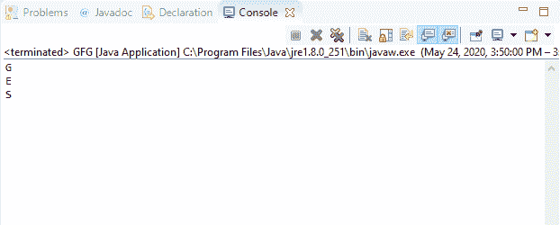
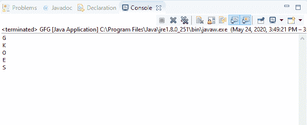

# Java 中的 BufferedReader 跳过(长)方法，示例

> 原文:[https://www . geeksforgeeks . org/bufferedeer-skip long-method-in-Java-with-examples/](https://www.geeksforgeeks.org/bufferedreader-skiplong-method-in-java-with-examples/)

Java 中**buffere reader**类的 **skip()** 方法用于跳过流中的字符。要跳过的字符数在此方法中作为参数传递。

**语法:**

```java
public long skip(long n) 
          throws IOException

```

**覆盖:**该方法覆盖**阅读器**类的 skip()方法。

**参数:**该方法接受一个参数，即 n，代表要跳过的字符数。

**返回值:**返回该方法跳过的实际字符数。

**异常:**

*   **IOException**-如果出现输入输出错误，这个方法抛出 IOException。
*   **IllegalArgumentException**–如果 n 的值为负，此方法将引发 IllegalArgumentException。/li >

下面的程序说明了 IO 包中 BufferedReader 类中的 skip()方法:

**程序 1:** 假设文件“c:/demo.txt”的存在。

```java
// Java program to illustrate
// BufferedReader skip() method

import java.io.*;

public class GFG {
    public static void main(String[] args)
    {

        // Read the stream 'demo.txt'
        // containing text "GEEKS"
        FileReader fileReader
            = new FileReader(
                "c:/demo.txt");

        // Convert fileReader to
        // bufferedReader
        BufferedReader buffReader
            = new BufferedReader(
                fileReader);

        while (buffReader.ready()) {
            System.out.println(
                (char)buffReader.read());
            // One character is to skipped
            buffReader.skip(1);
        }
    }
}
```

**Input:****Output:**

**程序 2:** 假设文件“c:/demo.txt”的存在。

```java
// Java program to illustrate
// BufferedReader skip() method

import java.io.*;

public class GFG {
    public static void main(String[] args)
    {

        // Read the stream 'demo.txt'
        // containing text "GEEKSFORGEEKS"
        FileReader fileReader
            = new FileReader(
                "c:/demo.txt");

        // Convert fileReader to
        // bufferedReader
        BufferedReader buffReader
            = new BufferedReader(
                fileReader);

        while (buffReader.ready()) {
            System.out.println(
                (char)buffReader.read());
            // Two characters are to be skipped
            buffReader.skip(2);
        }
    }
}
```

**Input:****Output:**

**参考文献:**
[https://docs . Oracle . com/javase/10/docs/API/Java/io/bufferedreader . html # skip(long)](https://docs.oracle.com/javase/10/docs/api/java/io/BufferedReader.html#skip(long))