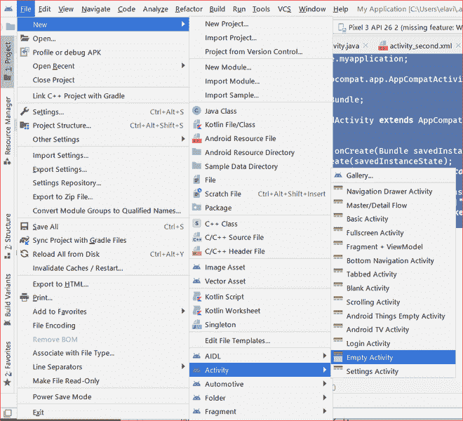

# 在安卓中捆绑示例

> 原文:[https://www . geesforgeks . org/bundle-in-Android-with-example/](https://www.geeksforgeeks.org/bundle-in-android-with-example/)

众所周知[意图](https://www.geeksforgeeks.org/what-is-intent-in-android/)在安卓系统中用于将数据从一个活动传递到另一个活动。但是还有一种方法，可以用来以更好的方式和更少的代码空间将数据从一个活动传递到另一个活动。安卓捆绑包通常用于将数据从一个活动传递到另一个活动。基本上，这里使用键值对的概念，其中想要传递的数据是映射的值，稍后可以通过使用键来检索该值。捆绑包与意图一起使用，并且以相同的方式发送和检索值，就像在[意图](https://www.geeksforgeeks.org/what-is-intent-in-android/)的情况下一样。这取决于用户想要传递什么类型的值，但是包可以保存所有类型的值(int、String、boolean、char)并将它们传递给新的活动。

**以下是传递到捆绑包或从捆绑包中检索到的主要类型:**

> 字符串键，整数值
> 
> 输入字符串(字符串键，字符串值)，获取字符串(字符串键，字符串值)
> 
> putStringArray(字符串键，字符串[]值)，getStringArray(字符串键，字符串[]值)
> 
> 字符串键，字符值)
> 
> 输入布尔值(字符串键，布尔值)，获取布尔值(字符串键，布尔值)

### 使用安卓应用中的捆绑包

该捆绑包在安卓系统中总是与 Intent 一起使用。现在使用 Bundle 在 MainActivity 中编写下面的代码。

## Java 语言(一种计算机语言，尤用于创建网站)

```
// creating a intent
Intent intent = new Intent(this, SecondActivity.class);

// creating a bundle object
Bundle bundle = new Bundle();

// storing the string value in the bundle
// which is mapped to key
bundle.putString("key1", "GFG :- Main Activity");

// passing the bundle into the intent
intent.putExtras(bundle);

// starting the intent
startActivity(intent);
```

## 我的锅

```
// creating the instance of the bundle
val bundle = Bundle()

// storing the string value in the bundle
// which is mapped to key
bundle.putString("key1", "Gfg :- Main Activity")

// creating a intent
intent = Intent(this@MainActivity, SecondActivity::class.java)

// passing a bundle to the intent
intent.putExtras(bundle)

// starting the activity by passing the intent to it.
startActivity(intent)
```

现在创建另一个名为 **SecondActivity 的空活动。**现在要检索存储在包中的数据，请在 SecondActivity 中编写以下代码。

## Java 语言(一种计算机语言，尤用于创建网站)

```
// getting the bundle back from the android
Bundle bundle = getIntent().getExtras();

// getting the string back
String title = bundle.getString("key1", "Default");
```

## 我的锅

```
// getting the bundle back from the android
val bundle = intent.extras

// performing the safety null check
var s:String? = null

// getting the string back
s = bundle!!.getString("key1", "Default"))
```

或者，如果您不想使用默认值，您可以这样做，但请记住它会给出一个例外。

> 例如:布尔 b = bundle.getBoolean(“在此传递密钥”)；

如果不存在对应于该键的映射，可能会导致 NullPointerException。因此，建议为捆绑包添加默认值。

### 例子

**第一步:创建新项目**

1.  单击文件，然后单击新建= >新建项目。
2.  选择空活动
3.  选择语言为 Java/Kotlin
4.  根据您的需要选择最小的软件开发工具包。

**步骤 2:使用 activity_main.xml 文件**

现在在应用中添加两个按钮，一个按钮将传递存储在包中的数据，另一个按钮将传递空包，即使用 **bundle.clear()** 清除包，然后将包传递给 Intent。 **activity_main.xml** 文件的完整代码如下。这里可以看到，第一个按钮用于传递非空包，而第二个按钮用于传递空包。

## 可扩展标记语言

```
<?xml version="1.0" encoding="utf-8"?>
<androidx.constraintlayout.widget.ConstraintLayout
    xmlns:android="http://schemas.android.com/apk/res/android"
    xmlns:app="http://schemas.android.com/apk/res-auto"
    xmlns:tools="http://schemas.android.com/tools"
    android:layout_width="match_parent"
    android:layout_height="match_parent"
    android:padding="10dp"
    tools:context=".MainActivity">

    <Button
        android:id="@+id/btnPassBundles"
        android:layout_width="275dp"
        android:layout_height="101dp"
        android:layout_marginTop="250dp"
        android:text="Pass Data Into Bundle"
        android:textSize="24sp"
        app:layout_constraintHorizontal_bias="0.498"
        app:layout_constraintLeft_toLeftOf="parent"
        app:layout_constraintRight_toRightOf="parent"
        app:layout_constraintTop_toTopOf="parent" />

    <Button
        android:id="@+id/btnNoPassBundle"
        android:layout_width="277dp"
        android:layout_height="92dp"
        android:layout_marginBottom="220dp"
        android:layout_marginTop="75dp"
        android:text="Pass No Data/Empty BUNDLE"
        android:textSize="24sp"
        app:layout_constraintBottom_toBottomOf="parent"
        app:layout_constraintLeft_toLeftOf="parent"
        app:layout_constraintRight_toRightOf="parent"
        app:layout_constraintTop_toBottomOf="@+id/btnPassBundles" />

</androidx.constraintlayout.widget.ConstraintLayout>
```

**第三步:创建另一个活动，并将其命名为第二个活动**

现在创建另一个名为 **SecondActivity 的空活动。**按照下图所示的步骤创建另一个活动。



**第 4 步:使用 activity_second.xml 文件**

在这个文件中添加一个[文本视图](https://www.geeksforgeeks.org/textview-widget-in-android-using-java-with-examples/)来显示第二个活动中的文本。

## 可扩展标记语言

```
<?xml version="1.0" encoding="utf-8"?>
<androidx.constraintlayout.widget.ConstraintLayout
    xmlns:android="http://schemas.android.com/apk/res/android"
    xmlns:app="http://schemas.android.com/apk/res-auto"
    xmlns:tools="http://schemas.android.com/tools"
    android:layout_width="match_parent"
    android:layout_height="match_parent"
    tools:context=".SecondActivity">

    <TextView
        android:id="@+id/txtString"
        android:layout_width="wrap_content"
        android:layout_height="wrap_content"
        android:layout_marginTop="348dp"
        android:text="String from MainActivity"
        android:textSize="40sp"
        android:textStyle="bold"
        android:gravity="center"
        android:textColor="#008000"
        app:layout_constraintHorizontal_bias="0.428"
        app:layout_constraintLeft_toLeftOf="parent"
        app:layout_constraintRight_toRightOf="parent"
        app:layout_constraintTop_toTopOf="parent" />

</androidx.constraintlayout.widget.ConstraintLayout>
```

**步骤 5:使用主活动文件**

MainActivity 的完整代码如下。添加注释是为了方便理解代码。

## Java 语言(一种计算机语言，尤用于创建网站)

```
import android.content.Intent;
import android.os.Bundle;
import android.view.View;
import android.widget.Button;
import androidx.appcompat.app.AppCompatActivity;

public class MainActivity extends AppCompatActivity implements View.OnClickListener {

    Button btnPassBundles, btnNoPassBundle;

    @Override
    protected void onCreate(Bundle savedInstanceState) {
        super.onCreate(savedInstanceState);
        setContentView(R.layout.activity_main);

        btnPassBundles = findViewById(R.id.btnPassBundles);
        btnNoPassBundle = findViewById(R.id.btnNoPassBundle);

        // one button will pass the bundle and other button
        // will not pass the bundle
        btnPassBundles.setOnClickListener(this);
        btnNoPassBundle.setOnClickListener(this);
    }

    @Override
    public void onClick(View view) {
        switch (view.getId()) {
            case R.id.btnPassBundles:
                // creating a bundle instance
                Bundle bundle = new Bundle();
                // passing the data into the bundle
                bundle.putString(
                        "key1",
                        "Passing Bundle From Main Activity to 2nd Activity");
                Intent intent = new Intent(MainActivity.this, SecondActivity.class);
                // passing the bundle to the intent
                intent.putExtras(bundle);
                // starting the activity by passing the intent
                // to it.
                startActivity(intent);
                break;

            case R.id.btnNoPassBundle:
                bundle = new Bundle();
                bundle.putString(
                        "key1",
                        "Not passing Bundle From Main Activity");
                // clearing the data stored into the bundle
                bundle.clear();
                // passing the intent to the second activity
                intent = new Intent(MainActivity.this, SecondActivity.class);
                intent.putExtras(bundle);
                startActivity(intent);
                break;
        }
    }
}
```

## 我的锅

```
import android.content.Intent
import android.os.Bundle
import android.view.View
import android.widget.Button
import androidx.appcompat.app.AppCompatActivity

class MainActivity : AppCompatActivity(), View.OnClickListener {

    var btnPassBundles: Button? = null
    var btnNoPassBundle: Button? = null

    override fun onCreate(savedInstanceState: Bundle?) {
        super.onCreate(savedInstanceState)
        setContentView(R.layout.activity_main)
        btnPassBundles = findViewById(R.id.btnPassBundles)
        btnNoPassBundle = findViewById(R.id.btnNoPassBundle)

        // one button will pass the bundle and other button
        // will not pass the bundle
        btnPassBundles?.setOnClickListener(this)
        btnNoPassBundle?.setOnClickListener(this)
    }

    override fun onClick(view: View) {
        when (view.id) {
            R.id.btnPassBundles -> {
                // creating the bundle instance
                val bundle = Bundle()
                // passing the data into the bundle
                bundle.putString("key1", "Passing Bundle From Main Activity to 2nd Activity")

                val intent = Intent(this@MainActivity, SecondActivity::class.java)
                intent.putExtras(bundle)
                startActivity(intent)
            }

            R.id.btnNoPassBundle -> {
                val bundle = Bundle()
                bundle.putString("key1", "Not passing Bundle From Main Activity")
                // clearing the bundle
                bundle.clear()
                // passing the intent to the second activity
                intent = Intent(this@MainActivity, SecondActivity::class.java)
                // passing the bundle into the intent
                intent.putExtras(bundle)
                startActivity(intent)
            }
        }
    }
}
```

**步骤 6:使用第二个活动文件**

第二个活动的完整代码如下。添加注释是为了方便理解代码。

## Java 语言(一种计算机语言，尤用于创建网站)

```
import androidx.appcompat.app.AppCompatActivity;
import android.os.Bundle;
import android.widget.TextView;

public class SecondActivity extends AppCompatActivity {

    TextView txtString;

    @Override
    protected void onCreate(Bundle savedInstanceState) {
        super.onCreate(savedInstanceState);
        setContentView(R.layout.activity_second);

        txtString = findViewById(R.id.txtString);

          // getting the bundle from the intent
        Bundle bundle = getIntent().getExtras();

        // setting the text in the textview
        txtString.setText(bundle.getString("key1", "No value from the MainActivity"));
    }
}
```

## 我的锅

```
import android.os.Bundle
import android.widget.TextView
import androidx.appcompat.app.AppCompatActivity

class SecondActivity : AppCompatActivity() {

    var txtString: TextView? = null

    override fun onCreate(savedInstanceState: Bundle?) {
        super.onCreate(savedInstanceState)
        setContentView(R.layout.activity_second)

        txtString = findViewById(R.id.txtString)
        txtBoolean = findViewById(R.id.txtBoolean)

        // getting the bundle from the intent
        val bundle = intent.extras

        // setting the text in the textview
        txtString?.setText(bundle!!.getString("key1", "No value from MainActivity :("))
    }
}
```

### **输出:在**仿真器上运行

<video class="wp-video-shortcode" id="video-488860-1" width="640" height="360" preload="metadata" controls=""><source type="video/mp4" src="https://media.geeksforgeeks.org/wp-content/uploads/20200915000723/Bundle-App-Video.mp4?_=1">[https://media.geeksforgeeks.org/wp-content/uploads/20200915000723/Bundle-App-Video.mp4](https://media.geeksforgeeks.org/wp-content/uploads/20200915000723/Bundle-App-Video.mp4)</video>