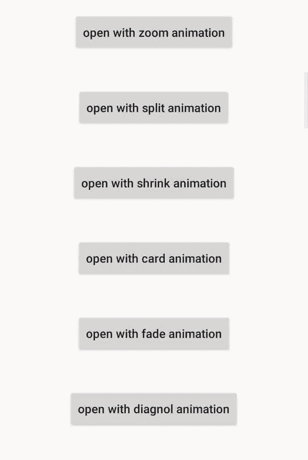

# 安卓系统中的使用示例

> 原文:[https://www . geeksforgeeks . org/bongeanimation-in-Android-with-example/](https://www.geeksforgeeks.org/bungeeanimation-in-android-with-example/)

**本格动画**是一个帮助获得用户注意力的动画库。众所周知，应用程序由许多活动组成，因此用户在应用程序的不同活动之间旅行是很常见的。通过在这些交易中添加动画，它肯定会吸引用户。活动可以不用**蹦极**切换，但是众所周知**蹦极**是一个**动画库**，动画有助于获得用户的关注，所以最好学习一下。



#### 蹦极提供的活动过渡动画有:

<figure class="table">

| **过渡动画** | 功能 |
| --- | --- |
| 使分离 | 开始活动将分为两个部分，在出路和揭示目的地活动动画。 |
| 收缩 | 目标活动将从屏幕中央出现，导致开始活动缩小 |
| 卡片 | 目标活动将从左侧出现，并添加到开始活动的顶部 |
| 进进出出 | 开始活动将出现在屏幕的左中央，而目标活动将出现在屏幕的右侧 |
| 向左滑动 | 目标活动将出现在屏幕右侧，而开始活动将消失在屏幕左侧 |
| 向右滑动 | 目标活动将出现在屏幕左侧，开始活动将消失在屏幕右侧 |
| 幻灯片向上 | 目标活动将出现在屏幕底部，开始活动将出现在屏幕顶部 |
| 滑下 | 目标活动将出现在屏幕顶部，开始活动将出现在屏幕底部 |
| 向左滑动 | 目标活动将出现在屏幕右侧，开始活动将出现在屏幕左侧 |
| 向右滑动 | 目标活动将出现在屏幕左侧，开始活动将出现在屏幕右侧 |
| 嗡嗡声 | 开始活动将出现在屏幕中央，即在中央放大，而目的地活动将出现在屏幕边界 |
| 乏味的 | 开始活动将慢慢消失，从而显示目标活动。 |
| 旋转 | 开始活动将消失，目的地活动将出现在旋转过渡的用户面前。 |
| 斜的 | 目的地活动将出现在应用程序的左上角 |
| 风车 | 开始活动将出现在屏幕的右上方，目的地活动将出现在屏幕的左上方，也就是说，这两个活动都将成为风车的粉丝 |

</figure>

#### 方法

*   **第一步:**在根 [**build.gradle**](https://www.geeksforgeeks.org/android-build-gradle/) 文件(不是你的模块 build.gradle 文件)中添加支持库。这个库 **jitpack** 是一个新颖的包存储库。它是为 JVM 而做的，这样在 [github](https://www.geeksforgeeks.org/ultimate-guide-git-github/) 和 [bigbucket](https://www.geeksforgeeks.org/bitbucket-vs-github-vs-gitlab/) 中存在的任何库都可以直接在应用程序中使用。

## 可扩展标记语言

```
allprojects {          
 repositories {          
        maven { url 'https://jitpack.io' }          
     }         
}          
```

*   **第二步:**在 [**build.gradle**](https://www.geeksforgeeks.org/android-build-gradle/) 文件中添加支持库，并在依赖项部分添加依赖项。

## 可扩展标记语言

```
implementation 'com.github.Binary-Finery:Bungee:2.0'
```

*   **第三步:**现在创建一个新的空活动(转到**app->new->activity->空活动**，并将其命名为 **SecondActivity** ，同时生成布局文件。将以下代码添加到 **activity_second.xml** 文件中。在这个文件中添加一个 [**<u>文本视图</u>**](https://www.geeksforgeeks.org/textview-in-kotlin/) 到布局中。

### activity_second.xml

## 可扩展标记语言

```
<?xml version="1.0" encoding="utf-8"?>
<androidx.constraintlayout.widget.ConstraintLayout
    xmlns:android="http://schemas.android.com/apk/res/android"
    xmlns:app="http://schemas.android.com/apk/res-auto"
    xmlns:tools="http://schemas.android.com/tools"
    android:layout_width="match_parent"
    android:layout_height="match_parent"
    tools:context=".SecondActivity">

    <TextView
        android:textStyle="bold"
        android:textAlignment="center"
        android:layout_margin="12dp"
        android:id="@+id/textView"
        android:layout_width="wrap_content"
        android:layout_height="wrap_content"
        android:textSize="30sp"
        android:textColor="@color/colorPrimary"
        android:text="GeeksForGeeks - A Computer
                    Science Portal For Geeks"
        app:layout_constraintBottom_toBottomOf="parent"
        app:layout_constraintEnd_toEndOf="parent"
        app:layout_constraintStart_toStartOf="parent"
        app:layout_constraintTop_toTopOf="parent" />
</androidx.constraintlayout.widget.ConstraintLayout>
```

*   **步骤 4:** 现在将以下代码添加到**SecondActivity.java**文件中。在这个文件中添加一个**蹦极动画**到 **onBackPressed()** 功能。所以每当用户点击后退按钮**时，就会调用 slideLeft()** 功能。

### SecondActivity.java

## 可扩展标记语言

```
package org.geeksforgeeks.gfgexcuseme;

import androidx.appcompat.app.AppCompatActivity;
import android.os.Bundle;
import spencerstudios.com.bungeelib.Bungee;

public class SecondActivity extends AppCompatActivity {

    @Override
    protected void onCreate(Bundle savedInstanceState) {
        super.onCreate(savedInstanceState);
        setContentView(R.layout.activity_second);
    }

    // whenever user taps on BackButton
    // slideLeft animation will be
    // shown to the user
    @Override
    public void onBackPressed() {
        super.onBackPressed();
        Bungee.slideLeft(this);
    }
}    
```

*   **第五步:**在 **activity_main.xml** 文件中添加以下代码。在该文件中，在布局中添加各种 [**<u>按钮</u>**](https://www.geeksforgeeks.org/button-in-kotlin/) ，当用户点击时，将打开**秒活动**并显示不同的动画。

### activity_main.xml

## C++

```
<?xml version="1.0" encoding="utf-8"?>
<LinearLayout
    xmlns:android="http://schemas.android.com/apk/res/android"
    xmlns:tools="http://schemas.android.com/tools"
    android:layout_width="match_parent"
    android:layout_height="match_parent"
    tools:context=".MainActivity"
    android:orientation="vertical">

    <Button
        android:layout_marginTop="40dp"
        android:textAllCaps="false"
        android:layout_marginBottom="20dp"
        android:layout_gravity="center"
        android:id="@+id/zoom_button"
        android:layout_width="wrap_content"
        android:layout_height="wrap_content"
        android:text="open with zoom animation"
        android:onClick="Open"
        />

    <Button
        android:textAllCaps="false"
        android:layout_margin="20dp"
        android:layout_gravity="center"
        android:id="@+id/split_button"
        android:layout_width="wrap_content"
        android:layout_height="wrap_content"
        android:text="open with split animation"
        android:onClick="Open"
        />

    <Button
        android:textAllCaps="false"
        android:layout_margin="20dp"
        android:layout_gravity="center"
        android:id="@+id/shrink_button"
        android:layout_width="wrap_content"
        android:layout_height="wrap_content"
        android:text="open with shrink animation"
        android:onClick="Open"
        />

    <Button
        android:textAllCaps="false"
        android:layout_margin="20dp"
        android:layout_gravity="center"
        android:id="@+id/card_button"
        android:layout_width="wrap_content"
        android:layout_height="wrap_content"
        android:text="open with card animation"
        android:onClick="Open"
        />

    <Button
        android:textAllCaps="false"
        android:layout_margin="20dp"
        android:layout_gravity="center"
        android:id="@+id/fade_button"
        android:layout_width="wrap_content"
        android:layout_height="wrap_content"
        android:text="open with fade animation"
        android:onClick="Open"
        />

    <Button
        android:textAllCaps="false"
        android:layout_margin="20dp"
        android:layout_gravity="center"
        android:id="@+id/diagnol_button"
        android:layout_width="wrap_content"
        android:layout_height="wrap_content"
        android:text="open with diagnol animation"
        android:onClick="Open"
        />
</LinearLayout>
```

*   **第 6 步:**在**MainActivity.java**文件中增加以下代码。现在点击任意**按钮****打开()**功能开始，相应的动画将被执行。

### MainActivity.java

## 可扩展标记语言

```
package org.geeksforgeeks.bungee        

import android.content.Intent;
import android.os.Bundle;
import android.view.View;
import androidx.annotation.Nullable;
import androidx.appcompat.app.AppCompatActivity;
import spencerstudios.com.bungeelib.Bungee;

public class MainActivity extends AppCompatActivity {

    @Override
    protected void onCreate(@Nullable Bundle savedInstanceState) {
        super.onCreate(savedInstanceState);
        setContentView(R.layout.activity_main);
    }

    // whenever user tap on any button
    // this function will get invoked
    // automatically and corresponding
    // case will be executed.
    public void Open(View v){
        switch(v.getId()){
            case R.id.zoom_button:
                startActivity(new Intent(this,
                    SecondActivity.class));
                Bungee.zoom(this);
                break;
            case R.id.split_button:
                startActivity(new Intent(this,
                    SecondActivity.class));
                Bungee.split(this);
                break;
            case R.id.shrink_button:
                startActivity(new Intent(this,
                    SecondActivity.class));
                Bungee.shrink(this);
                break;
            case R.id.card_button:
                startActivity(new Intent(this,
                    SecondActivity.class));
                Bungee.card(this);
                break;
            case R.id.fade_button:
                startActivity(new Intent(this,
                    SecondActivity.class));
                Bungee.fade(this);
                break;
            case R.id.diagnol_button:
                startActivity(new Intent(this,
                    SecondActivity.class));
                Bungee.diagonal(this);
                break;
        }

    }
}
```

#### 输出:在模拟器上运行