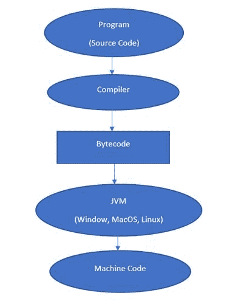

# Java 中的字节码

> 原文:[https://www.geeksforgeeks.org/byte-code-in-java/](https://www.geeksforgeeks.org/byte-code-in-java/)

### 字节码

字节码可以定义为编译器在编译源代码(JAVA Program)后生成的中间代码。这种中间代码使 Java 成为一种独立于平台的语言。

### **字节码**是如何生成的？****

编译器将源代码或 Java 程序转换成字节码(或机器码)，然后解释器在系统上执行字节码。解释器也可以称为 JVM(Java 虚拟机)。字节码是编译器(创建它)和解释器(运行它)之间的公共部分。



**让我们一步步来看这个现象**

*   假设您正在编写第一个 JAVA 程序。

## Java 语言(一种计算机语言，尤用于创建网站)

```java
/*package whatever //do not write package name here */
import java.io.*;

class GFG {
    public static void main (String[] args) {
        System.out.println("GFG!");
    }
}
```

**Output**

```java
GFG!

```

*   上面写的代码叫做 JAVA 源代码。
*   编译器编译源代码。
*   最后，解释器执行编译后的源代码。

每当我们编写任何程序时，它都不是用机器代码编写的。我们用 JAVA、C++、Python 等高级语言编写。但是计算机只理解机器代码。所以我们在执行程序的时候，首先被编译器转换成机器码或者字节码，然后被解释器执行。

**这个中间代码或字节可以在任何平台上运行，使 JAVA 成为一种独立于平台的语言。**