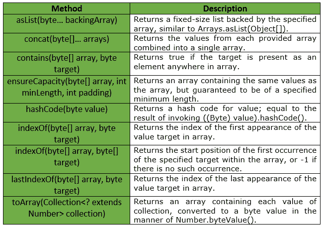

# 字节类|番石榴| Java

> 原文:[https://www.geeksforgeeks.org/bytes-class-guava-java/](https://www.geeksforgeeks.org/bytes-class-guava-java/)

**字节**是一个用于原语类型字节的实用程序类。它提供了与字节基元相关的 ***静态实用方法*** ，这些基元在字节或数组中都找不到，并且将字节解释为既无符号也无符号。专门将字节视为有符号或无符号的方法可以在**有符号字节**和**无符号字节**中找到。

**申报:**

```java
@GwtCompatible(emulated=true)
public final class Bytes
extends Object

```

下表显示了番石榴字节类提供的方法:



**异常:**

*   **确保容量:** *如果最小长度或填充值为负，则显示“异常”。*
*   **to array:***NullPointerException*如果集合或其任何元素为空。

下面给出了一些显示番石榴字节类方法实现的示例:
**示例 1 :**

```java
// Java code to show implementation
// of Guava Bytes.asList() method

import com.google.common.primitives.Bytes;
import java.util.*;

class GFG {
    // Driver method
    public static void main(String[] args)
    {
        byte arr[] = { 3, 4, 5, 6, 7 };

        // Using Bytes.asList() method which convert
        // array of primitives to array of objects
        List<Byte> myList = Bytes.asList(arr);

        // Displaying the elements
        System.out.println(myList);
    }
}
```

输出:

```java
[3, 4, 5, 6, 7]

```

**例 2 :**

```java
// Java code to show implementation
// of Guava Bytes.indexOf() method

import com.google.common.primitives.Bytes;
import java.util.*;

class GFG {
    // Driver method
    public static void main(String[] args)
    {
        byte[] arr = { 3, 4, 5, 6, 7 };

        // Displaying the index for
        // first occurrence of given target
        System.out.println(Bytes.indexOf(arr, (byte)5));
    }
}
```

输出:

```java
2

```

**例 3 :**

```java
// Java code to show implementation
// of Guava Bytes.concat() method

import com.google.common.primitives.Bytes;
import java.util.*;

class GFG {
    // Driver method
    public static void main(String[] args)
    {
        byte[] arr1 = { 3, 4, 5 };
        byte[] arr2 = { 6, 7 };

        // Using Bytes.concat() method which
        // combines arrays from specified
        // arrays into a single array
        byte[] arr = Bytes.concat(arr1, arr2);

        // Displaying the elements
        System.out.println(Arrays.toString(arr));
    }
}
```

输出:

```java
[3, 4, 5, 6, 7]

```

**例 4 :**

```java
// Java code to show implementation
// of Guava Bytes.contains() method

import com.google.common.primitives.Bytes;

class GFG {
    // Driver method
    public static void main(String[] args)
    {
        byte[] arr = { 3, 4, 5, 6, 7 };

        // Using Bytes.contains() method which
        // checks if element is present in array
        // or not
        System.out.println(Bytes.contains(arr, (byte)8));
        System.out.println(Bytes.contains(arr, (byte)7));
    }
}
```

输出:

```java
false
true

```

**例 5 :**

```java
// Java code to show implementation
// of Guava Bytes.lastIndexOf() method

import com.google.common.primitives.Bytes;

class GFG {
    // Driver method
    public static void main(String[] args)
    {
        byte[] arr = { 3, 4, 5, 6, 7, 5, 5 };

        // Using Bytes.lastIndexOf() method
        // to get last occurrence of given target
        System.out.println(Bytes.lastIndexOf(arr, (byte)5));
    }
}
```

输出:

```java
6

```

**例 6 :**

```java
// Java code to show implementation
// of Guava Bytes.lastIndexOf() method

import com.google.common.primitives.Bytes;

class GFG {
    // Driver method
    public static void main(String[] args)
    {
        byte[] arr = { 3, 4, 5, 6, 7, 5, 5 };

        // Using Bytes.lastIndexOf() method
        // to get last occurrence of given target
        // here target i.e, 9 is not present in
        // array arr, so -1 will be returned
        System.out.println(Bytes.lastIndexOf(arr, (byte)9));
    }
}
```

输出:

```java
-1

```