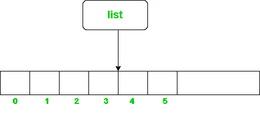
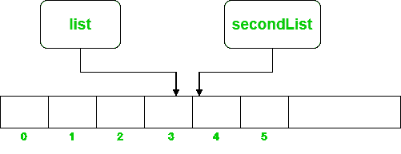

# Java 中两个变量可以引用同一个数组列表吗？

> 原文:[https://www . geesforgeks . org/can-双变量-引用相同的 java 数组列表/](https://www.geeksforgeeks.org/can-two-variables-refer-to-the-same-arraylist-in-java/)

[Java 中的 ArrayList](https://www.geeksforgeeks.org/arraylist-in-java/) 类基本上是一个可调整大小的数组，即它可以根据我们添加到其中的值动态地增长和收缩大小。它存在于 [java.util 包](https://www.geeksforgeeks.org/java-util-package-java/)中。

**语法:**

```
ArrayList<E> list = new ArrayList<>();
```

java 中的 ArrayList 可以在“new”关键字的帮助下实例化一次，并且可以被各种对象/变量引用。



上图显示了对象“列表”如何指向内存中的数组列表。现在让我们看看如何让另一个对象指向上面实例化的同一个数组列表。

**语法:**两个变量引用同一个数组列表:

```
ArrayList<Integer> secondList = list;
```



现在，当把“列表”分配给“第二列表”时，“第二列表”也开始指向内存中的同一个数组列表。请注意，这里只需创建一个新实例。现在，为了更好地理解，让我们深入代码并看几个例子。

下面是问题陈述的实现:

## Java 语言(一种计算机语言，尤用于创建网站)

```
// Java program to show how two objects can
// refer to same ArrayList in Java

import java.util.ArrayList;

public class GFG {
    public static void main(String[] args)
    {

        // Creating an ArrayList of Integer type in Java
        ArrayList<Integer> list = new ArrayList<>();

        // Creating a new ArrayList object and making it
        // refer to the first ArrayList(list)
        ArrayList<Integer> secondList = list;

        // Inserting some Integer values to the
        // arrayList using list variable/object
        list.add(17);
        list.add(10);
        list.add(1);
        list.add(33);
        list.add(2);

        // ArrayList after insertions : [17, 10, 1, 33, 2]

        // Displaying the ArrayList
        System.out.print("ArrayList after insertions: ");
        display(list);

        // Modifying the ArrayList using secondList

        // Removing element from index 0
        secondList.remove(0);

        // Inserting Integer variables
        secondList.add(51);
        secondList.add(99);

        // ArrayList after modifications using
        // secondList: [10, 1, 33, 2, 51, 99]

        // Displaying the ArrayList
        System.out.print(
            "ArrayList after modifications using secondList: ");
        display(list);
    }

    // Function to display an ArrayList
    public static void display(ArrayList<Integer> list)
    {
        for (int i = 0; i < list.size(); i++) {
            System.out.print(list.get(i) + " ");
        }
        System.out.println();
    }
}
```

**Output**

```
ArrayList after insertions: 17 10 1 33 2 
ArrayList after modifications using secondList: 10 1 33 2 51 99
```