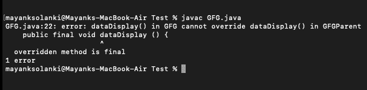

# 我们可以用 Java 扩展最终方法吗？

> 原文:[https://www . geesforgeks . org/can-we-extend-final-method-in-Java/](https://www.geeksforgeeks.org/can-we-extend-final-method-in-java/)

[Java 中的 final 方法](https://www.geeksforgeeks.org/private-and-final-methods-in-java/)是可以扩展的，但是除了要考虑的主要概念之外，extend 还意味着您可以扩展拥有 final 方法的特定类，但是您不能覆盖该 Final 方法。不能扩展最终方法的另一种情况是，包含最终方法的类也是最终类。

**接近:**

在这里，我们将讨论两种方法，以满足我们上面刚刚陈述的，以弄清楚如何扩展最终方法。

1.  没有过度骑行
2.  [带超骑](https://www.geeksforgeeks.org/overriding-in-java/)

**实施:**

*   “GFGParent”类有一个最终方法，随机命名为“dataDisplay()”，它是作为这里的最终方法创建的。
*   GFG 的类扩展了 GFGParent，但是程序执行时没有任何错误，因此我们可以扩展一个 final 方法，但是不能覆盖它。
*   在这里，如果您已经将 GFGParent 类作为 final，那么您也不会扩展 final 方法，因为我们不能继承 final 类。

**例 1**

## Java 语言(一种计算机语言，尤用于创建网站)

```
// Java Program to Illustrate Final Method Extension

// Importing input output classes
import java.io.*;

// Class 1
// Child class
// Main class
class GFG extends GFGParent {

    // Main driver method
    public static void main (String[] args) {

        // Print statement
        System.out.println("GFG!");

        // Creating an object og parent class in child class
        // inside the main() method
        GFGParent gfg = new GFGParent();

        // Calling the method created in parent class
        gfg.dataDisplay();
    }
}

// Helper class
// Parent class
class GFGParent {
    public final void dataDisplay () {
        System.out.println("Data Structure");
    }
}
```

**Output**

```
GFG!
Data Structure
```

**例 2**

我们在这里要做的唯一改变是，我们只是试图覆盖子类中的方法。

## Java 语言(一种计算机语言，尤用于创建网站)

```
// Java Program to Illustrate Final Method Extension
// Where method Overrides

// Importing input output classes
import java.io.*;

// Class 1- Parent class
class GFGParent {

    // Method inside parent class
    public final void dataDisplay()
    {
        System.out.println("Data Structure");
    }
}

// Class 2
// Child class
// Main class
class GFG extends GFGParent {

    // Method 1
    // Created in order to illustrate overridden method/s
    public final void dataDisplay()
    {

        // Print statement whenever this message is called
        System.out.println("Data Structure 2");
    }

    // Method 2
    // Main driver method
    public static void main(String[] args)
    {

        // Print statement
        System.out.println("GFG!");

        // Creating an object of parent class and
        // calling method of child class over it.
        GFGParent gfg = new GFGParent();
        gfg.dataDisplay();
    }
}
```

**输出:**它生成编译时错误。

