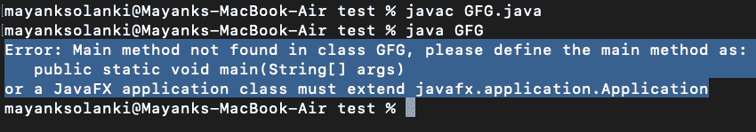

# Java 中我们可以有多个主方法吗？

> 原文:[https://www . geesforgeks . org/can-we-拥有-多个-main-methods-in-java/](https://www.geeksforgeeks.org/can-we-have-multiple-main-methods-in-java/)

Java 是一种面向对象的语言，所有的处理都在类中进行。程序的执行意味着要求 [java 虚拟机](https://www.geeksforgeeks.org/jvm-works-jvm-architecture/)加载该类，然后开始执行它的主方法。Java 的主要方法是任何 Java 程序的入口点。[公共访问修饰符](https://www.geeksforgeeks.org/access-modifiers-java/)用在主方法之前，这样 JVM 可以识别程序的执行点。如果使用其他访问修饰符而不是公共的，JVM 将看不到它。

最初，JVM 加载该类，但是没有该类的对象来调用主方法。这就是为什么主方法必须是静态的，这样 JVM 就可以加载类并调用主方法，而不需要类的对象。 [Java 主方法](https://www.geeksforgeeks.org/understanding-public-static-void-mainstring-args-in-java/)不返回任何东西，这就是为什么它的返回类型是 **void。**如果我们试图从 main 方法返回任何东西，它会给一个意外的值错误，因为它是 JVM 中预定义的签名。Java 的主方法接受字符串数组作为参数。它也称为命令行参数，可以在主方法中从命令行传递。现在让我们通过添加干净的 java 程序来实现同样的功能。

**实施:**

**例 1**

## Java 语言(一种计算机语言，尤用于创建网站)

```
// Java Program Illustrating Can we have Multiple main
// methods

// Importing input output classes
import java.io.*;

// Main class
class GFG {

    // Method 1
    // Method inside main() method
    void test()
    {

        // Print statement whenever this method is called
        System.out.print("Inside class GFG");
    }

    // Method 2
    // Main driver method
    public static void main(String[] args)
    {
        // Creating an object class inside main() method
        GFG obj = new GFG();

        // Calling the class object inside main() method
        obj.test();
    }
}
```

**Output**

```
Inside class GFG
```

> 在上面的程序中，我们只是使用 main()方法中的类对象调用 test()方法。现在让我们继续描述具有多个 main()方法的程序。

**例 2**

## Java 语言(一种计算机语言，尤用于创建网站)

```
// Java Program Illustrating Can we have
// Multiple main() Methods

// Importing input output classes
import java.io.*;

// Main class
class GFG {

    // Method  1
    void test()
    {

        // Print statement when this method is called
        System.out.print("inside test");
    }

    // Method 2
    // Main driver method
    public static void main(int i)
    {

        // Creating object later calling of class
        // inside this main() method
        GFG obj = new GFG();
        obj.test();
    }

    // Method 3
    // Main driver method
    public static void main()
    {

        // Creating object later calling of class
        // inside this main() method
        GFG obj = new GFG();
        obj.test();
    }
}
```

**输出:**



输出解释:

上面的程序由两个主方法组成，但是抛出了一个在类中找不到 main 方法的错误，请将 main 方法定义为 public static void Main(String[]args)**。**只有单个字符串数组作为参数的 main()方法才被认为是程序的入口点。JVM 只寻找以字符串数组作为参数的主方法。为了执行其他主方法，您需要从公共静态 void main(String[ ] args)内部调用它们

**例 3**

## Java 语言(一种计算机语言，尤用于创建网站)

```
// Java Program Illustrating Can we have
// Multiple main() Methods

// Importing input output classes
import java.io.*;

// Main class
class GFG {

    // Method 1
    // Main driver method
    public static void main(int i)
    {

        // Print statement for method 1
        System.out.println(i);
    }

    // Method 2
    // Main driver method
    public static void main(String s)
    {

        // Print statement for method 2
        System.out.println(s);
    }

    // Method 3
    // Main driver method
    public static void main(String[] args)
    {

        // Calling above 2 main methods
        main(1);
        main("hi");
    }
}
```

**Output**

```
1
hi
```

> 从上面的程序中，我们可以说 Java 可以有多个主方法，但是有重载的概念。应该只有一个主方法的参数为 string[ ] arg。