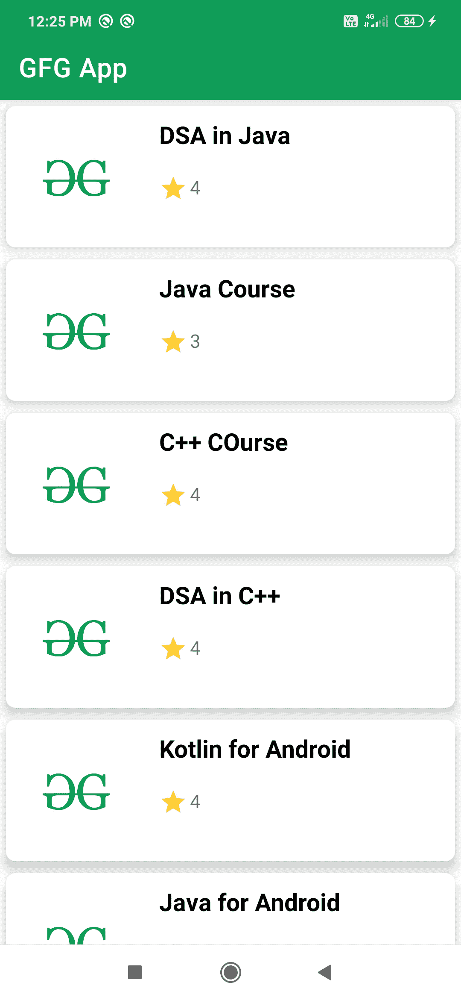

# 安卓中使用回收视图的卡片视图，示例

> 原文:[https://www . geeksforgeeks . org/card view-using-recycle view-in-Android-with-example/](https://www.geeksforgeeks.org/cardview-using-recyclerview-in-android-with-example/)

[recycle view](https://www.geeksforgeeks.org/android-recyclerview/)是 ListView 和 GridView 的扩展版本。它在视图保持器设计模式下工作。在 RecyclerView 的帮助下，我们可以向数据列表中添加许多额外的功能。在开始我们在 RecyclerView 中实现 CardView 的例子之前。我们应该知道 CardView 和 RecyclerView 是什么意思。

*   **CardView** : CardView 是 Framelayout 的扩展版，可以用来显示卡片格式里面的项目。在 CardView 的帮助下，我们可以为我们的 RecyclerView 项目添加半径和高度。CardView 为我们的数据列表提供了丰富的外观和感觉。
*   **recycle view**:recycle view 是 ListView 的扩展版。在 recycle view 中，我们可以加载大量数据，并且 recycle view 的项目可以有自定义设计。回收视图使用视图容器设计模式，因此我们必须创建一个保存回收视图数据的数据类和一个将数据设置到回收视图每个项目的视图容器类。

回收视图分为 3 个部分:

*   卡片布局。
*   模态类。
*   查看者类。

现在，我们将着手实施我们的回收视图。

## 例子

下面给出了一个示例图像，以了解我们将在本文中做什么。注意，我们将使用 **Java** 语言来实现这个项目。



因此，我们正在创建一个简单的示例，使用卡片布局在回收视图中显示 GFG 提供的各种课程。

### 逐步实施

**第一步:创建新项目**

要在安卓工作室创建新项目，请参考[如何在安卓工作室创建/启动新项目](https://www.geeksforgeeks.org/android-how-to-create-start-a-new-project-in-android-studio/)。注意选择 **Java** 作为编程语言。

**第二步:添加创建卡片视图和回收视图的依赖关系**

导航到**梯度脚本>构建.梯度(模块:应用)**，并在依赖性部分添加下面的依赖性。

> 实现' com . Google . Android . material:material:1 . 2 . 1 '

**步骤 3:创建回收新卡布局**

**卡片布局**:卡片布局用于显示数据列表。这是我们回收视图的一个单一项目的设计。要创建卡片布局，导航到**应用程序> res >布局>右键单击它>新建>布局资源文件>给它命名(此处为卡片 _ 布局)**。现在我们将为回收视图的卡片布局编写一个代码。下面是 **card_layout.xml** 文件的代码。

## 可扩展标记语言

```
<?xml version="1.0" encoding="utf-8"?>
<androidx.cardview.widget.CardView 
    xmlns:android="http://schemas.android.com/apk/res/android"
    xmlns:app="http://schemas.android.com/apk/res-auto"
    android:layout_width="match_parent"
    android:layout_height="wrap_content"
    android:layout_margin="5dp"
    app:cardBackgroundColor="@color/white"
    app:cardCornerRadius="8dp"
    app:cardElevation="8dp"
    app:cardMaxElevation="10dp"
    app:cardPreventCornerOverlap="true"
    app:cardUseCompatPadding="true">

    <!--
        In the above cardview widget
        cardelevation property will give elevation to your card view
        card corner radius will provide radius to your card view
        card background color will give background color to your card view
        card max elevation will give the cardview maximum elevation
        card prevent corner overlap will add padding to CardView on v20 and 
        before to prevent intersections between the Card content and rounded corners.
        card use compact padding will add padding in API v21+ as well to have the same
        measurements with previous versions.
    -->

    <RelativeLayout
        android:layout_width="match_parent"
        android:layout_height="wrap_content">

        <!--ImageVIew to display our Course Image-->
        <ImageView
            android:id="@+id/idIVCourseImage"
            android:layout_width="100dp"
            android:layout_height="100dp"
            android:layout_margin="10dp"
            android:contentDescription="@string/app_name"
            android:padding="5dp"
            android:src="@drawable/gfgimage" />

        <!--Text View to display Course Name-->
        <TextView
            android:id="@+id/idTVCourseName"
            android:layout_width="match_parent"
            android:layout_height="wrap_content"
            android:layout_marginStart="10dp"
            android:layout_marginTop="10dp"
            android:layout_toEndOf="@id/idIVCourseImage"
            android:text="@string/course_name"
            android:textColor="@color/black"
            android:textSize="18sp"
            android:textStyle="bold" />

        <!--Text VIew to display COurse Rating-->
        <!--Image used in present in drawable folder-->
        <TextView
            android:id="@+id/idTVCourseRating"
            android:layout_width="match_parent"
            android:layout_height="wrap_content"
            android:layout_below="@id/idTVCourseName"
            android:layout_marginStart="10dp"
            android:layout_marginTop="20dp"
            android:layout_toEndOf="@id/idIVCourseImage"
            android:drawablePadding="2dp"
            android:text="@string/course_rating"
            app:drawableStartCompat="@drawable/ic_star" />
    </RelativeLayout>
</androidx.cardview.widget.CardView>
```

**第四步:创建一个用于存储数据的模型类**

导航到**应用> java >你的应用包名称>右键点击它>新建> Java 并命名模态类(这里是 CourseModel)** 。模型类将存储我们将在回收视图中显示的数据。下面是**CourseModel.java**文件的代码。

## Java 语言(一种计算机语言，尤用于创建网站)

```
public class CourseModel {

    private String course_name;
    private int course_rating;
    private int course_image;

    // Constructor
    public CourseModel(String course_name, int course_rating, int course_image) {
        this.course_name = course_name;
        this.course_rating = course_rating;
        this.course_image = course_image;
    }

    // Getter and Setter
    public String getCourse_name() {
        return course_name;
    }

    public void setCourse_name(String course_name) {
        this.course_name = course_name;
    }

    public int getCourse_rating() {
        return course_rating;
    }

    public void setCourse_rating(int course_rating) {
        this.course_rating = course_rating;
    }

    public int getCourse_image() {
        return course_image;
    }

    public void setCourse_image(int course_image) {
        this.course_image = course_image;
    }
}
```

**第五步:创建适配器类，用于将数据设置到 RecyclerView** 的项目中

导航到**应用程序> java >您的应用程序包名称>右键单击它>新建> Java 类并命名您的适配器类(此处为** **【课程适配器】** **)** 。回收视图中的适配器类将从您的模式类中获取数据，并将该数据设置到您的回收视图项中。下面是 **【课程适配器】** **的代码。java** 文件。代码中添加了注释，以更详细地理解代码。

## Java 语言(一种计算机语言，尤用于创建网站)

```
import android.content.Context;
import android.view.LayoutInflater;
import android.view.View;
import android.view.ViewGroup;
import android.widget.ImageView;
import android.widget.TextView;
import androidx.annotation.NonNull;
import androidx.recyclerview.widget.RecyclerView;
import java.util.ArrayList;

public class CourseAdapter extends RecyclerView.Adapter<CourseAdapter.Viewholder> {

    private Context context;
    private ArrayList<CourseModel> courseModelArrayList;

    // Constructor
    public CourseAdapter(Context context, ArrayList<CourseModel> courseModelArrayList) {
        this.context = context;
        this.courseModelArrayList = courseModelArrayList;
    }

    @NonNull
    @Override
    public CourseAdapter.Viewholder onCreateViewHolder(@NonNull ViewGroup parent, int viewType) {
        // to inflate the layout for each item of recycler view.
        View view = LayoutInflater.from(parent.getContext()).inflate(R.layout.card_layout, parent, false);
        return new Viewholder(view);
    }

    @Override
    public void onBindViewHolder(@NonNull CourseAdapter.Viewholder holder, int position) {
        // to set data to textview and imageview of each card layout
        CourseModel model = courseModelArrayList.get(position);
        holder.courseNameTV.setText(model.getCourse_name());
        holder.courseRatingTV.setText("" + model.getCourse_rating());
        holder.courseIV.setImageResource(model.getCourse_image());
    }

    @Override
    public int getItemCount() {
        // this method is used for showing number
        // of card items in recycler view.
        return courseModelArrayList.size();
    }

    // View holder class for initializing of 
    // your views such as TextView and Imageview.
    public class Viewholder extends RecyclerView.ViewHolder {
        private ImageView courseIV;
        private TextView courseNameTV, courseRatingTV;

        public Viewholder(@NonNull View itemView) {
            super(itemView);
            courseIV = itemView.findViewById(R.id.idIVCourseImage);
            courseNameTV = itemView.findViewById(R.id.idTVCourseName);
            courseRatingTV = itemView.findViewById(R.id.idTVCourseRating);
        }
    }
}
```

**第 6 步:现在我们将开始创建我们的回收视图**

创建我们的回收视图。导航到**应用> res >布局> activity_main.xml** 并添加 RecyclerView，如下所示。下面是**activity _ main . XML**文件的代码。

## 可扩展标记语言

```
<?xml version="1.0" encoding="utf-8"?>
<RelativeLayout 
    xmlns:android="http://schemas.android.com/apk/res/android"
    xmlns:tools="http://schemas.android.com/tools"
    android:layout_width="match_parent"
    android:layout_height="match_parent"
    tools:context=".MainActivity">

    <androidx.recyclerview.widget.RecyclerView
        android:id="@+id/idRVCourse"
        android:layout_width="match_parent"
        android:layout_height="match_parent" />

</RelativeLayout>
```

**步骤 7:现在我们将在我们的 MainActivity.java**中初始化我们的回收视图

导航至**应用程序> java >您的应用程序包名称>MainActivity.java**并初始化您的 RecyclerView。下面是**MainActivity.java**文件的代码。代码中添加了注释，以更详细地理解代码。

## Java 语言(一种计算机语言，尤用于创建网站)

```
import android.os.Bundle;
import androidx.appcompat.app.AppCompatActivity;
import androidx.recyclerview.widget.LinearLayoutManager;
import androidx.recyclerview.widget.RecyclerView;
import java.util.ArrayList;

public class MainActivity extends AppCompatActivity {

    private RecyclerView courseRV;

    // Arraylist for storing data
    private ArrayList<CourseModel> courseModelArrayList;

    @Override
    protected void onCreate(Bundle savedInstanceState) {
        super.onCreate(savedInstanceState);
        setContentView(R.layout.activity_main);
        courseRV = findViewById(R.id.idRVCourse);

        // here we have created new array list and added data to it.
        courseModelArrayList = new ArrayList<>();
        courseModelArrayList.add(new CourseModel("DSA in Java", 4, R.drawable.gfgimage));
        courseModelArrayList.add(new CourseModel("Java Course", 3, R.drawable.gfgimage));
        courseModelArrayList.add(new CourseModel("C++ COurse", 4, R.drawable.gfgimage));
        courseModelArrayList.add(new CourseModel("DSA in C++", 4, R.drawable.gfgimage));
        courseModelArrayList.add(new CourseModel("Kotlin for Android", 4, R.drawable.gfgimage));
        courseModelArrayList.add(new CourseModel("Java for Android", 4, R.drawable.gfgimage));
        courseModelArrayList.add(new CourseModel("HTML and CSS", 4, R.drawable.gfgimage));

        // we are initializing our adapter class and passing our arraylist to it.
        CourseAdapter courseAdapter = new CourseAdapter(this, courseModelArrayList);

        // below line is for setting a layout manager for our recycler view.
        // here we are creating vertical list so we will provide orientation as vertical
        LinearLayoutManager linearLayoutManager = new LinearLayoutManager(this, LinearLayoutManager.VERTICAL, false);

        // in below two lines we are setting layoutmanager and adapter to our recycler view.
        courseRV.setLayoutManager(linearLayoutManager);
        courseRV.setAdapter(courseAdapter);
    }
}
```

现在在模拟器上运行应用程序，并查看输出。

> **注**:
> 
> 用作图像的星形存储在我们的可绘制文件夹中。使用的字符串出现在我们的 strings.xml 中。
> 
> *   **strings.xml** :导航到**应用程序> res >值> strings.xml** 在应用程序中添加各种字符串。
> *   **可绘制**:导航至**应用程序> res >可绘制**添加用于您的应用程序的图像。

### 输出:

