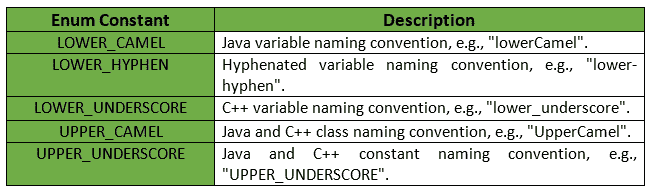
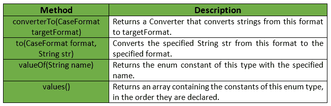

# CaseFormat 类|番石榴| Java

> 原文:[https://www.geeksforgeeks.org/caseformat-class-guava-java/](https://www.geeksforgeeks.org/caseformat-class-guava-java/)

**案例格式**是一个实用程序类，用于在各种 **ASCII** 案例格式之间进行转换。非 ASCII 输入的行为未定义。

**申报:**对**的申报为:**

```java
@GwtCompatible
public enum CaseFormat
   extends Enum

```

下表给出了枚举常量的概要及其描述:


下表给出了 CaseFormat 类的方法概要及其描述:


**例 1:**

```java
// Java code to show implementation
// of CaseFormat Class methods

import com.google.common.base.CaseFormat;

class GFG {

    // Driver code
    public static void main(String args[])
    {

        // A string variable named str
        String str = "geeks_for_geeks";
        System.out.println("Original String: "
                           + str);

        // "LOWER_UNDERSCORE" is a C++ variable
        // naming convention
        System.out.println("Lower Camel Format: "
                           + CaseFormat
                                 .LOWER_UNDERSCORE
                                 .to(CaseFormat
                                         .LOWER_CAMEL,
                                     str));
        // "UPPER_UNDERSCORE" is a Java and
        // C++ constant naming convention
        System.out.println("Upper Camel Format: "
                           + CaseFormat
                                 .UPPER_UNDERSCORE
                                 .to(CaseFormat
                                         .UPPER_CAMEL,
                                     str));
    }
}
```

**Output:**

```java
Original String: geeks_for_geeks
Lower Camel Format: geeksForGeeks
Upper Camel Format: GeeksForGeeks

```

**例 2:**

```java
// Java code to show implementation
// of CaseFormat Class methods

import com.google.common.base.CaseFormat;
import java.util.*;

class GFG {

    // Driver code
    public static void main(String args[])
    {

        // Get the enum constants with the
        // help of values() method
        System.out.println("The Enum constants "
                           + "of CaseFormat Class are:\n"
                           + Arrays
                                 .toString(CaseFormat
                                               .values()));
    }
}
```

**Output:**

> CaseFormat 类的枚举常量有:
> 【下连字符，下下划线，下骆驼，上骆驼，上下划线】

**参考:**T2】谷歌番石榴