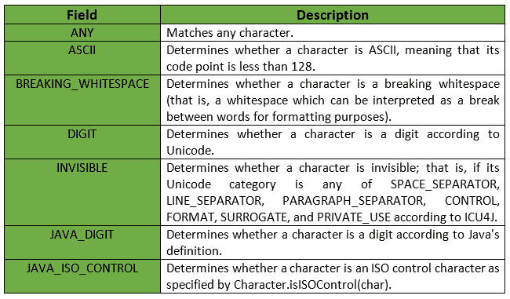
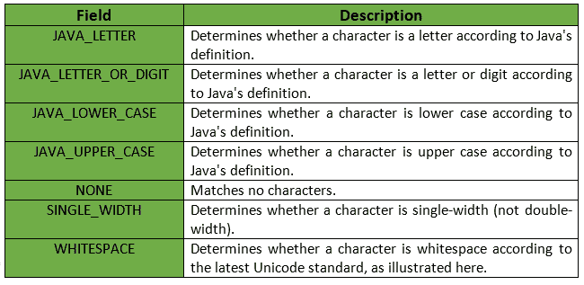
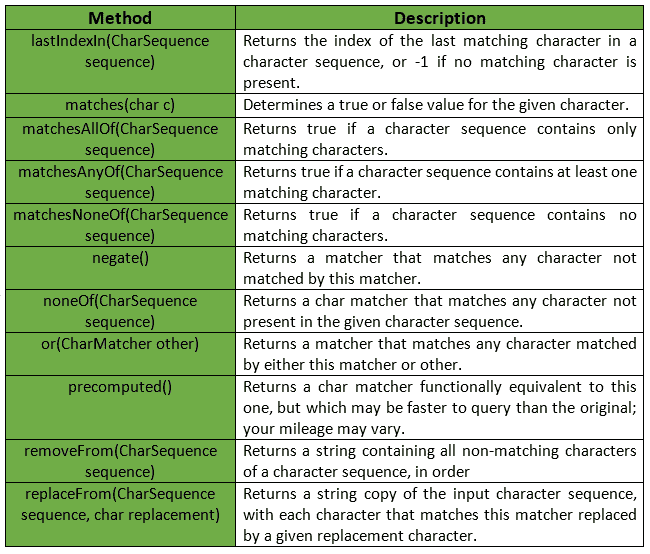
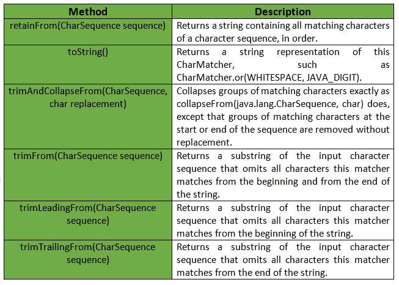

# CharMatcher 类|番石榴|爪哇

> 原文:[https://www.geeksforgeeks.org/charmatcher-class-guava-java/](https://www.geeksforgeeks.org/charmatcher-class-guava-java/)

**CharMatcher** 为任何 Java 字符值确定一个*真*或*假*值。这个类提供了各种方法来处理各种 Java 类型的字符值。

**申报:**对**的申报为:**

```
@GwtCompatible(emulated = true)
public final class CharMatcher
   extends Object

```

有 2 种方法可以获得 CharMatcher 实例:

*   **Using constants:** CharMatcher class provides following constants to obtain CharMatcher instance.

    

    **注意:**这个类只处理字符值。它不理解 0x10000 到 0x10FFFF 范围内的补充 Unicode 代码点。这样的逻辑字符使用代理项对被编码到一个字符串中，CharMatcher 将这些字符视为两个独立的字符。

    

*   **使用 CharMatcher 类提供的方法:**可以使用以下方法获取 CharMatcher 类的实例。
    T3】

**例 1:**

```
// Java code to get number of matching
// characters in given sequence
// and display them using countIn()

import com.google.common.base.CharMatcher;

class GFG {

    // Driver code
    public static void main(String args[])
    {

        // "anyOf" method returns a char matcher
        // that matches any character present in
        // the given character sequence.
        CharMatcher matcher = CharMatcher.anyOf("aeiou");

        String str = "Hello GeeksforGeeks, What's up ?";

        // "countIn" returns the number of matching
        // characters found in a character sequence.
        int vowels = matcher.countIn(str);

        // To display the number of vowels in
        // character sequence
        System.out.println("Number of vowels in '"
                           + str + "' are "
                           + vowels);
    }
}
```

**Output:**

```
Number of vowels in 'Hello GeeksforGeeks, What's up ?' are 9

```

CharMatcher 类的其他一些方法有:



**例 2:**

```
// Java code to get the index
// of matching character

import com.google.common.base.CharMatcher;

class GFG {

    // Driver code
    public static void main(String args[])
    {

        // "anyOf" method returns a char matcher
        // that matches any character present in
        // the given character sequence.
        CharMatcher matcher = CharMatcher.anyOf("aeiou");

        String str = "Hello GeeksforGeeks, What's up ?";

        // To return the index of first matching
        // character in given input sequence.
        int firstIndex = matcher.indexIn(str);

        // To Return the index of first matching
        // character in given input sequence,
        // from given starting index.
        int nextIndex = matcher.indexIn(str, firstIndex + 1);

        // To return the index of the last matching
        // character in a character sequence
        int lastIndex = matcher.lastIndexIn(str);

        System.out.println("First Index is " + firstIndex);
        System.out.println("Next Index is " + nextIndex);
        System.out.println("Last Index is " + lastIndex);
    }
}
```

**Output:**

```
First Index is 1
Next Index is 4
Last Index is 28

```

CharMatcher 类的其他一些方法有:



**例 3:**

```
// Java code to remove all digits 
// from a  given string

import com.google.common.base.CharMatcher;

class GFG {

    // Driver code
    public static void main(String args[])
    {

        // Determines whether a character is
        // a digit according to Unicode.
        CharMatcher matcher = CharMatcher.DIGIT;

        String str = "12345Hello GeeksforGeeks1287 What's 9886up";
        System.out.println("Original String : " + str);

        // To remove all matching characters
        // from given string.
        String result = matcher.removeFrom(str);

        // To display the string which
        // doesn't contain digit
        System.out.println("After digit removal : " + result);
    }
}
```

**Output:**

```
Original String : 12345Hello GeeksforGeeks1287 What's 9886up
After digit removal : Hello GeeksforGeeks What's up

```

**参考:**T2】谷歌番石榴