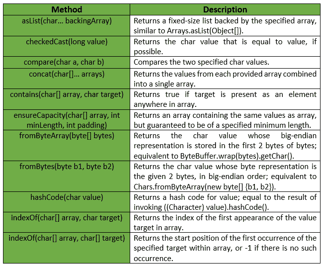
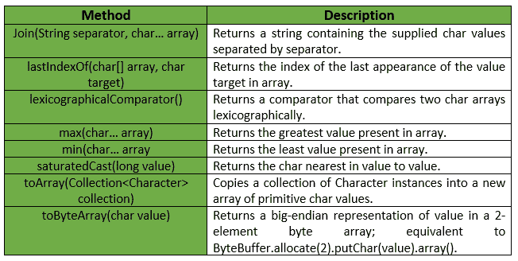

# Chars Class |番石榴| Java

> 原文:[https://www.geeksforgeeks.org/chars-class-guava-java/](https://www.geeksforgeeks.org/chars-class-guava-java/)

**Chars** 是一个用于原语类型 char 的实用程序类。它提供了关于字符原语的 ***静态实用方法*** ，这些原语在字符或数组中都找不到。这个类中的所有操作都严格按照数字处理字符值，即它们既不支持 Unicode，也不依赖于区域设置。

**申报:**

```
@GwtCompatible(emulated=true)
public final class Chars
extends Object

```

下表显示了番石榴字符类的字段摘要:


番石榴 Chars 类提供的方法有:

**例外:**

*   如果值大于字符，则**检查演播:** *非法文档异常*。最大值或小于字符。最小值
*   **min:***IllegalArgumentException*若阵为空。
*   **max:***IllegalArgumentException*如果数组为空。
*   **from bytearray:***IllegalArgumentException*如果字节少于 2 个元素。
*   **确保容量:** *如果最小长度或填充值为负，则显示“异常”。*
*   **to array:***NullPointerException*如果集合或其任何元素为空。

下表显示了番石榴 Chars 类提供的一些其他方法:

下面给出了一些示例，显示了番石榴 Chars 类的方法的实现:
**示例 1 :**

```
// Java code to show implementation
// of Guava Chars.asList() method

import com.google.common.primitives.Chars;
import java.util.*;

class GFG {
    // Driver method
    public static void main(String[] args)
    {
        char arr[] = { 'g', 'e', 'e', 'k', 's' };

        // Using Chars.asList() method which
        // converts array of primitives
        // to array of objects
        List<Character> myList = Chars.asList(arr);

        // Displaying the elements
        System.out.println(myList);
    }
}
```

输出:

```
[g, e, e, k, s]

```

**例 2 :**

```
// Java code to show implementation
// of Guava Chars.toArray() method

import com.google.common.primitives.Chars;
import java.util.*;

class GFG {
    // Driver method
    public static void main(String[] args)
    {
        List<Character> myList = Arrays.asList('g', 'e', 'e', 'k', 's');

        // Using Chars.toArray() method which
        // converts a List of Chars to an
        // array of char
        char[] arr = Chars.toArray(myList);

        // Displaying the elements
        System.out.println(Arrays.toString(arr));
    }
}
```

输出:

```
[g, e, e, k, s]

```

**例 3 :**

```
// Java code to show implementation
// of Guava Chars.concat() method

import com.google.common.primitives.Chars;
import java.util.*;

class GFG {
    // Driver method
    public static void main(String[] args)
    {
        char[] arr1 = { 'g', 'e', 'e' };
        char[] arr2 = { 'k', 's' };

        // Using Chars.concat() method which
        // combines arrays from specified
        // arrays into a single array
        char[] arr = Chars.concat(arr1, arr2);

        // Displaying the elements
        System.out.println(Arrays.toString(arr));
    }
}
```

输出:

```
[g, e, e, k, s]

```

**例 4 :**

```
// Java code to show implementation
// of Guava Chars.contains() method

import com.google.common.primitives.Chars;

class GFG {
    // Driver method
    public static void main(String[] args)
    {
        char[] arr = { 'g', 'e', 'e', 'k', 's' };

        // Using Chars.contains() method which
        // checks if element is present in array
        // or not
        System.out.println(Chars.contains(arr, 'g'));
        System.out.println(Chars.contains(arr, 'm'));
    }
}
```

输出:

```
true
false

```

**例 5 :**

```
// Java code to show implementation
// of Guava Chars.min() method

import com.google.common.primitives.Chars;

class GFG {
    // Driver method
    public static void main(String[] args)
    {
        char[] arr = { 'g', 'e', 'e', 'k', 's' };

        // Using Chars.min() method
        System.out.println(Chars.min(arr));
    }
}
```

输出:

```
e

```

**例 6 :**

```
// Java code to show implementation
// of Guava Chars.max() method

import com.google.common.primitives.Chars;

class GFG {
    // Driver method
    public static void main(String[] args)
    {
        char[] arr = { 'g', 'e', 'e', 'k', 's' };

        // Using Chars.max() method
        System.out.println(Chars.max(arr));
    }
}
```

输出:

```
s

```