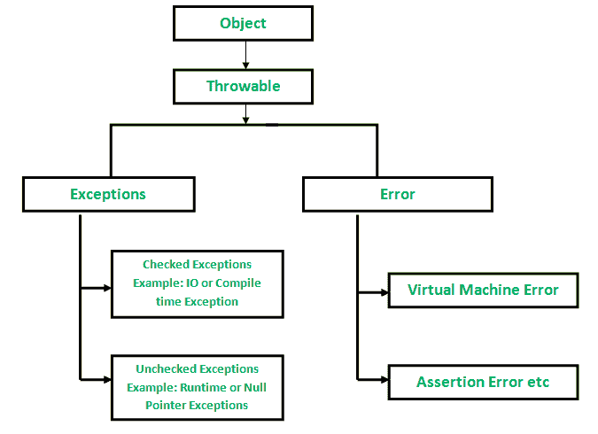
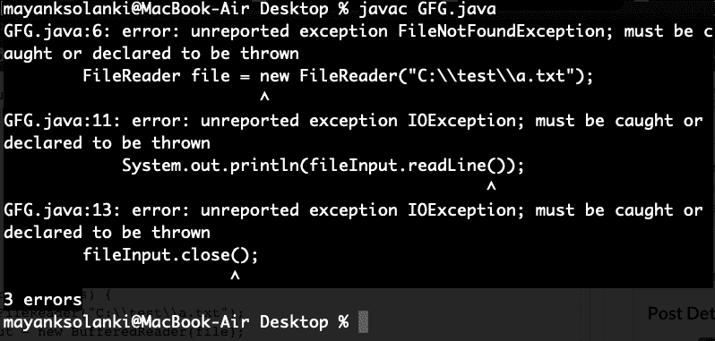

# Java 中已检查与未检查的异常

> 原文:[https://www . geesforgeks . org/checked-vs-unchecked-异常-in-java/](https://www.geeksforgeeks.org/checked-vs-unchecked-exceptions-in-java/)

异常是指在程序执行期间(即运行时)发生的不必要或意外的事件，它会中断程序指令的正常流动。在 Java 中，有两种类型的异常:

2.  未检查的异常



## 选中的例外

这些是编译时检查的异常。如果一个方法中的某些代码抛出了一个选中的异常，那么这个方法要么必须处理这个异常，要么必须使用 [*抛出*关键字](https://www.geeksforgeeks.org/throw-throws-java/)来指定这个异常。

例如，考虑下面的 Java 程序，它在位置“C:\test\a.txt”打开文件并打印它的前三行。程序不编译，因为函数 main()使用 FileReader()，FileReader()抛出一个选中的异常 *FileNotFoundException* 。它还使用了 readLine()和 close()方法，这些方法也抛出了选中异常 *IOException*

**示例:**

## Java 语言(一种计算机语言，尤用于创建网站)

```
// Java Program to Illustrate Checked Exceptions
// Where FileNotFoundException occured

// Importing I/O classes
import java.io.*;

// Main class
class GFG {

    // Main driver method
    public static void main(String[] args)
    {

        // Reading file from path in local directory
        FileReader file = new FileReader("C:\\test\\a.txt");

        // Creating object as one of ways of taking input
        BufferedReader fileInput = new BufferedReader(file);

        // Printing first 3 lines of file "C:\test\a.txt"
        for (int counter = 0; counter < 3; counter++)
            System.out.println(fileInput.readLine());

        // Closing file connections
        // using close() method
        fileInput.close();
    }
}
```

**输出:**



为了修复上面的程序，我们要么需要使用抛出指定一个异常列表，要么需要使用 try-catch 块。我们在下面的程序中使用了抛出。由于 *FileNotFoundException* 是 *IOException* 的子类，我们只需在抛出列表中指定 *IOException* ，就可以让上面的程序编译器无错。

**示例:**

## Java 语言(一种计算机语言，尤用于创建网站)

```
// Java Program to Illustrate Checked Exceptions
// Where FileNotFoundException does not occur

// Importing I/O classes
import java.io.*;

// Main class
class GFG {

    // Main driver method
    public static void main(String[] args)
        throws IOException
    {

        // Creating a file and reading from local repository
        FileReader file = new FileReader("C:\\test\\a.txt");

        // Reading content inside a file
        BufferedReader fileInput = new BufferedReader(file);

        // Printing first 3 lines of file "C:\test\a.txt"
        for (int counter = 0; counter < 3; counter++)
            System.out.println(fileInput.readLine());

        // Closing all file connections
        // using close() method
        // Good practice to avoid any memory leakage
        fileInput.close();
    }
}
```

**输出:**

```
First three lines of file "C:\test\a.txt"
```

## 未检查的异常

这些是编译时不检查的异常。在 C++中，所有异常都是未检查的，因此编译器不会强制处理或指定异常。这取决于程序员是否文明，并指定或捕捉异常。在 Java 中*错误*和*运行时异常*类下的异常是未检查的异常，可抛出类下的所有其他东西都是检查过的。

考虑下面的 Java 程序。它编译良好，但运行时会抛出*算术异常*。编译器允许它编译，因为*算术异常*是一个未检查的异常。

**示例:**

## Java 语言(一种计算机语言，尤用于创建网站)

```
// Java Program to Illustrate Un-checked Exceptions

// Main class
class GFG {

    // Main driver method
    public static void main(String args[])
    {
        // Here we are dividing by 0
        // which will not be caught at compile time
        // as there is no mistake but caught at runtime
        // because it is mathematically incorrect
        int x = 0;
        int y = 10;
        int z = y / x;
    }
}
```

**输出:**

```
Exception in thread "main" java.lang.ArithmeticException: / by zero
    at Main.main(Main.java:5)
Java Result: 1
```

如果您发现任何不正确的地方，或者您想分享关于上面讨论的主题的更多信息，请写评论