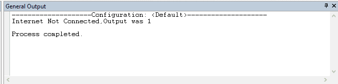
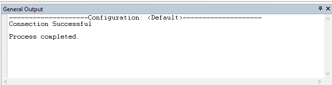

# 使用 Java 检查互联网连接

> 原文:[https://www . geesforgeks . org/checking-internet-connectivity-use-Java/](https://www.geeksforgeeks.org/checking-internet-connectivity-using-java/)

使用 Java 检查互联网连接可以使用 2 种方法完成:
1)使用 java Runtime 类的 getRuntime()方法。
2)通过使用 java URL 和 URLConnection 类的方法。

**#java Runtime 类:**该类用于与运行应用程序的 Java 运行时环境(Java 虚拟机)进行交互。它提供方法/函数来执行一个进程或命令，调用垃圾收集器，获取 JVM 中的全部和空闲内存等。

**# getRuntime():**java Runtime 类的这个方法返回与当前 Java 应用相关联的 runtime 对象。
您可以在这里了解更多关于本课程[的信息](https://www.geeksforgeeks.org/java-lang-runtime-class-in-java/)

**#Java URL 类:**这个类提供了返回 URL 的协议、主机名、文件名、端口号等各种信息的方法。

**#Java URLConnection 类:**它表示 URL 和应用程序之间的链接，可用于向 URL 引用的指定资源读写数据。

**# openConnection():**Java URL connection 类的这个方法打开到指定 URL 的连接。
您可以在这里和这里[了解更多关于这些课程的信息](https://www.geeksforgeeks.org/reading-url-using-urlconnection-class/)

**注意:**提供的方法应该在本地机器上运行，而不是在在线编译器上运行。
**方法 1:**
该方法输出如果连接互联网则为 0，如果未连接互联网则为 1。

```
// Java program for Checking Internet connectivity
import java.util.*;
import java.io.*;

class checking_internet_connectivity {
    public static void main(String args[]) throws Exception
    {
        Process process = java.lang.Runtime.getRuntime().exec("ping www.geeksforgeeks.org");
        int x = process.waitFor();
        if (x == 0) {
            System.out.println("Connection Successful, "
                               + "Output was " + x);
        }
        else {
            System.out.println("Internet Not Connected, "
                               + "Output was " + x);
        }
    }
}
```

**输出:**


**方法 2:**
如果互联网没有连接，它将抛出一个异常，catch 将执行打印相应的消息。

```
// Java program for checking Internet connectivity
import java.util.*;
import java.io.*;
import java.net.URL;
import java.net.URLConnection;

class checking_internet_connectivity {
    public static void main(String args[])
    {
        try {
            URL url = new URL("https://www.geeksforgeeks.org/");
            URLConnection connection = url.openConnection();
            connection.connect();

            System.out.println("Connection Successful");
        }
        catch (Exception e) {
            System.out.println("Internet Not Connected");
        }
    }
}
```

**输出:**
