# Java 10 中的类数据共享

> 原文:[https://www . geesforgeks . org/class-data-sharing-in-Java-10/](https://www.geeksforgeeks.org/class-data-sharing-in-java-10/)

在这里，我们将讨论在 Java10 中作为一种疾病引入的特性之一。本文描述了**类数据共享**特性，这些特性有助于减少 Java 应用程序的启动时间和内存占用。

类数据共享(CDS)功能有助于减少多个 [Java 虚拟机(JVM)](https://www.geeksforgeeks.org/jvm-works-jvm-architecture/) 之间的启动时间和内存占用，这在这里是一大进步。当您使用安装程序安装 Oracle Java 运行时环境(JRE)时，安装程序会将系统 Java Archive (JAR)文件中的一组默认类加载到一个私有内部表示中，并将该表示转储到一个名为**共享归档的文件中。**如果没有使用 JRE 安装程序，那么可以手动生成共享档案。当 JVM 启动时，共享存档是内存映射的，以允许在多个 JVM 进程之间共享这些类的只读 JVM 元数据。因为访问共享存档比加载类更快，所以启动时间减少了。

G1、串行、并行和[并行垃圾收集器支持类数据。共享字符串功能(类数据共享的一部分)仅支持 64 位非 Windows 平台上的 G1 垃圾收集器。将 CDS 包含在 Java SE 中的主要动机是减少启动时间。相对于核心类的数量，应用程序越小，节省的启动时间就越多。](https://www.geeksforgeeks.org/types-of-jvm-garbage-collectors-in-java-with-implementation-details/)

> 如果使用安装程序安装了 JRE，并转到路径 JRE/bin/[服务器或客户端]，您将看到一个文件 classes.jsa

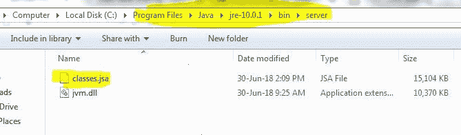

**为什么共享存档文件(classes.jsa)很重要？**

该文件很重要，因为它包含许多系统类的转换形式的转储。因为这些 java 类是每次 JVM 启动时都会加载的一些 System 类，它们的内容不会改变，这与您自己的应用程序代码不同。这些类的转储在您安装 JRE 时进行一次，并转换为易于加载的形式，并被一次又一次地使用，从而缩短了 JVM 启动时间，绕过了通常类加载的许多步骤，这些步骤在每次启动 JVM 时都会一次又一次地发生。

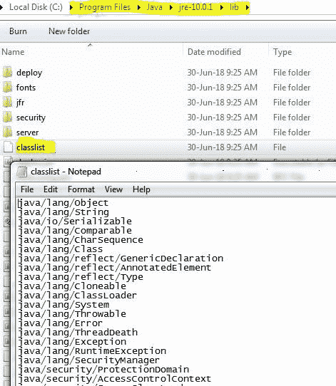

**自己创建共享存档文件:**假设 classes.jsa 文件不存在，可以使用命令 **java -Xshare:dump** 自己创建。该命令将转到 classlist 文件，检查要加载哪些类，并创建一个转储。可以尝试删除 jre/bin/[client 或 server]/class . jsa 文件，并使用命令 java_Xshare:dump 重新创建它。

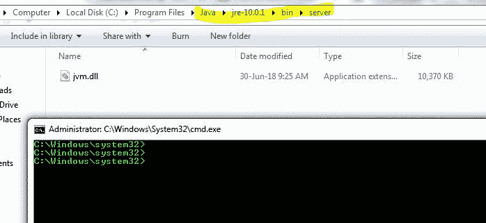

在下面的快照类中. jsa 文件已经被删除，接下来，我们使用 **java-Xshare:dump** 重新创建它

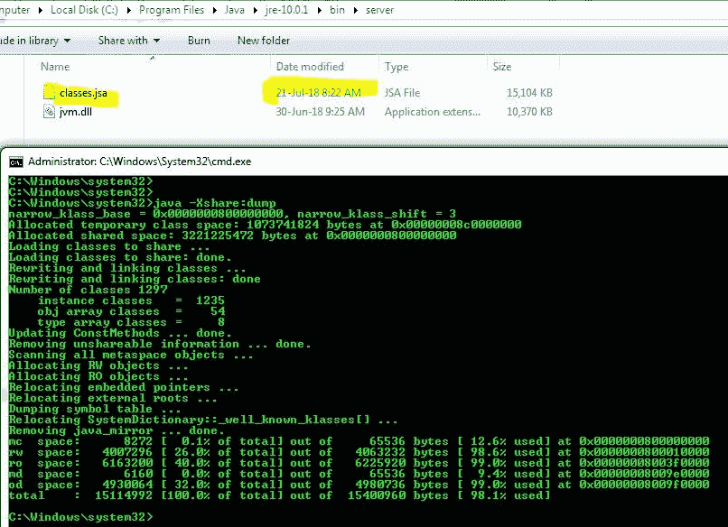

如果我们删除 JRE/lib/classlist 文件，这个过程会给出一个错误，因为它不知道加载和转储什么类。在下面的快照中，我们已经更改了类列表文件的名称，并尝试进行转储，这将引发一个错误

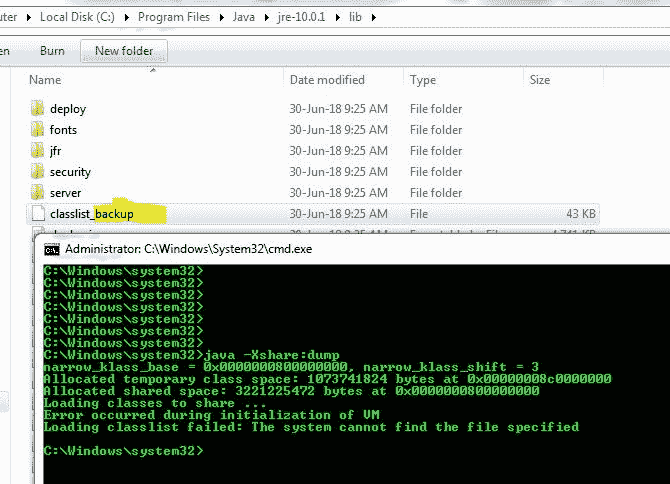

**如何检查类是从共享存档文件还是 jar 文件加载的？**

我们将运行一个简单的程序来查看从***Class . jsa***文件加载的类，而不是从它们各自的 jar 中加载的类，我将向我的程序提供的 VM 参数将是:-**verbose-Xshare:on**(-Xshare:on 表示打开类数据共享)。我创建了下面这个简单的程序，并用上面的参数运行它。

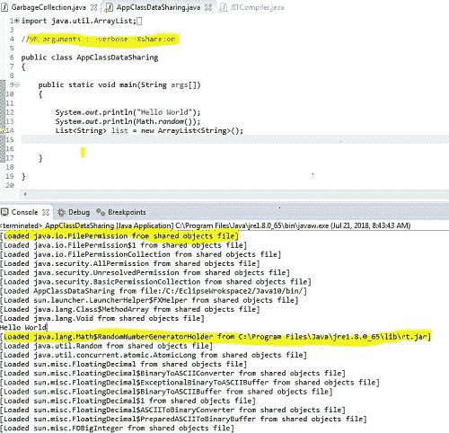

您可以看到许多系统类从共享对象文件中加载。我还在代码中添加了简单的 [*Math.random()*](https://www.geeksforgeeks.org/java-math-random-method-examples/) 来展示一个类 Java . lang . math $ randomnumbergenerationholder，它不是从共享对象文件中加载的，因为它不是 Shared Archive 的一部分，而是从 rt.jar 中加载的。

如果我们使用 args**-verbose–Xshare:off**，这意味着类数据共享的切换，那么得到的结果如下:

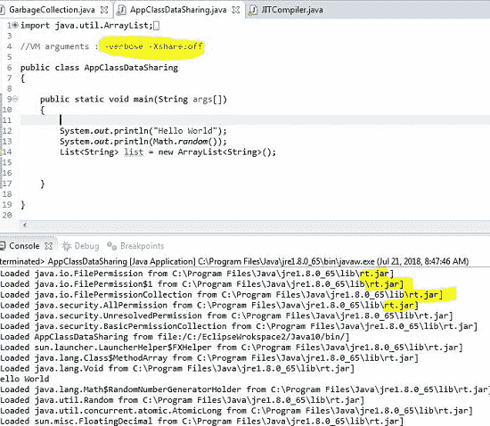

**什么是‘应用’类数据共享？**

在上面的例子中，我们看到像 Math $ randomnumbergenerator holder 这样的类是从实际的源代码中加载的，我们自己的独立类 AppClassDataSharing.java 也是从实际的源代码中加载的。如果我们也可以将它们转储到共享存档中，并在将来使用该共享存档，这将改善我们的应用程序的运行时，会怎么样。这就是应用程序类数据共享，我们也可以使用应用程序类的光盘。

**程序:**这包括 3 个步骤:

1.  在第一个文件中记录使用应用程序时加载的所有类。
2.  为这些类创建一个共享转储文件。
3.  稍后在启动应用程序时使用该共享转储。

**第一步:**记录所有课程

上面的类在一个可运行的 jar AppCDS.jar 中命名为“***【AppClassDataSharing.java】***”(因为 AppCDS 不转储平面类)。所以要创建最后一个文件，我将使用下面的**命令如下:**

```
java -XX:+UnlockCommercialFeatures-XX:+UseAppCDS -XX:DumpLoadedClassList=LoadedClasses.1st -jar AppCDS.jar
```

该文件是在自定义目录下创建的，所以这里我们不干扰 JRE 文件。

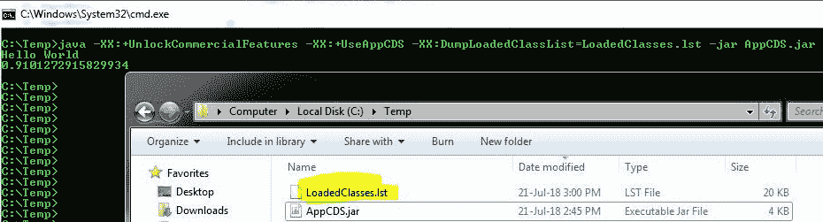

在上面的快照中，我们可以看到一个新创建的文件加载了类。首先，我们也可以在下面的快照中看到，它也有自己的类“T2”应用程序类数据共享“T3”

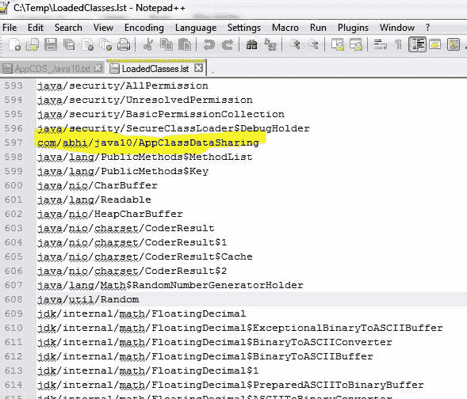

**步骤 2:** 为上述类创建共享转储文件

使用第一个文件，我们将在相同的位置创建转储，下面是创建自定义共享归档文件的命令和参数:

> Java-xx:+unlock commercial features-xshare:dump-xx:+useappcds-xx:sharedclasslistfile = loaded classes . 1st-xx:shared archive = custom shared archive . jsa-CP appcds . jar

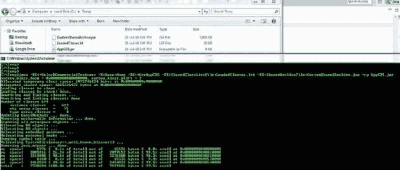

> **注意:** CustomSharedArchive.jsa 文件已经创建，接下来我们将在启动应用程序时使用它从其中加载类。

**步骤 3:** 启动应用程序时使用共享转储。

我们将使用下面的命令和参数启动我们的应用程序，以使用 CustomSharedArchive.jsa 文件'

> Java-XX:unlock commercial features-verbose-XShare:on-XX:+useppcds-XX:SharedArchiveFile = customsharedarchiver . jsa-jar appcds . jar

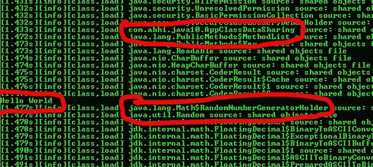

> 我们可以看到 RandomNumberGeneratorHolder 和 AppClassDataSharing 这两个文件现在都是从共享对象文件加载的。您可以使用–Xshare:off 尝试上面的命令来查看结果。

我们可以使用 ***时间命令*** (只需在命令前面加上时间前缀)来看看使用 _Xshare:on vs -Xshare:off 时的区别。

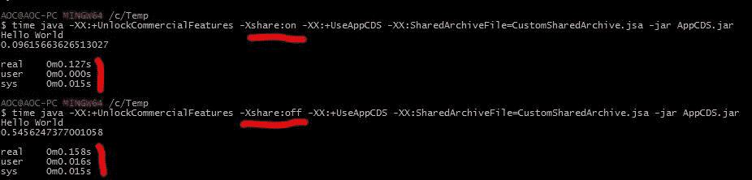

因此，通过应用程序类数据共享，我们可以减少应用程序的占用空间和运行时间。