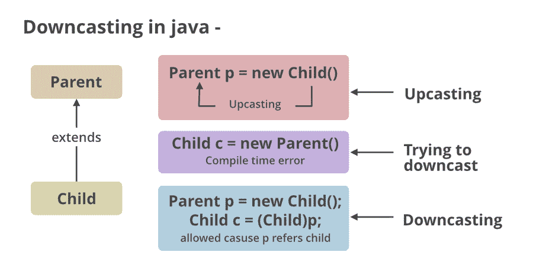

# Java 中的类类型铸造

> 原文:[https://www.geeksforgeeks.org/class-type-casting-in-java/](https://www.geeksforgeeks.org/class-type-casting-in-java/)

类型转换是对一种原始数据类型到另一种类型的值的评估。在 java 中，有两种类型的转换，即上转换和下转换，如下所示:

1.  [向上投射](https://www.geeksforgeeks.org/upcasting-vs-downcasting-in-java/)是将一个子类型向上投射到继承树的一个超类型。这是一个自动过程，在子类对象被超类引用变量引用的情况下，不需要为此付出努力。人们可以把它与动态多态性联系起来。
    *   隐式转换是指由编译器在没有转换语法的情况下完成的类类型转换。
    *   显式转换是指由程序员用转换语法完成的类类型转换。
2.  [向下转换](https://www.geeksforgeeks.org/upcasting-vs-downcasting-in-java/)是指子类类型引用父类对象时的过程，称为向下转换。如果直接执行，编译器会给出一个错误，因为在运行时会抛出 [ClassCastException](https://www.geeksforgeeks.org/built-exceptions-java-examples/) 。只有使用操作符的[实例才能实现已经上变换的对象，该对象只能进行下变换。](https://www.geeksforgeeks.org/java-instanceof-and-its-applications/)

为了执行类类型转换，我们必须遵循以下两条规则:

1.  类必须是“一种关系”
2.  对象必须具有要在其中进行转换的类的属性。

**实施:**

**(A)** 上播

**例 1**

## Java 语言(一种计算机语言，尤用于创建网站)

```
// Importing input output classes
import java.io.*;

// Class 1
// Parent class
class Parent
{

  // Function
  void show()
  {

    // Print message for this class
    System.out.println("Parent show method is called");
  }
} 

// Class 2
// Child class
class Child extends Parent
  {

    // Overriding existing method of Parent class
    @Override

    // Same Function which will override
    // existing Parent class function
    void show()
    {

    // Print message for this class
    System.out.println("Child show method is called");
    }

  }

// Class3
// Main class
class GFG
{

    // Main driver method
    public static void main(String[] args)
    {
      // Creating a Parent class object
      // but referencing it to a Child class
       Parent obj = new Child();

      // Calling the show() method to execute
       obj.show();
    }
}
```

**Output**

```
Child show method is called
```

输出解释:在这里，父类对象被调用，但引用子类对象。因此，人们可以将此与动态多态或函数重写联系起来。

**(B)** 下降



**例 2**

## Java 语言(一种计算机语言，尤用于创建网站)

```
// Java Program to illustrate Downcasting

// Importing input output classes
import java.io.*;

// Class 1
// Parent class
class Vehicles {
}

// Class 2
// Child class
class Car extends Vehicles {
    static void method(Vehicles v)
    {

        //
        if (v instanceof Car) {

            // Downcasting
            Car c = (Car)v;

            // Display message
            System.out.println("Downcasting performed");
        }
    }
    // Main driver method
    public static void main(String[] args)
    {
        // Creating an object of Vehicle class
        // and referring it to Car class
        Vehicles v = new Car();
        Car.method(v);
    }
}
```

**Output**

```
Downcasting performed
```