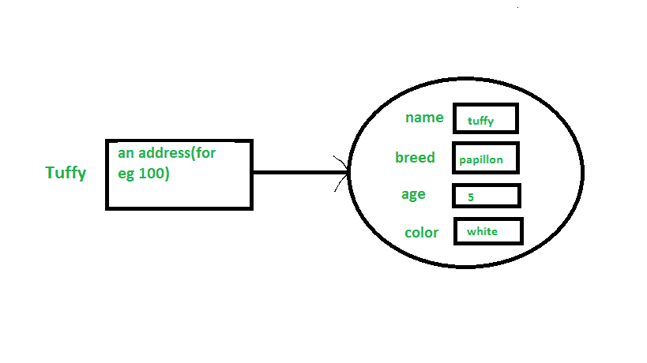

# Java 中的类和对象

> 原文:[https://www.geeksforgeeks.org/classes-objects-java/](https://www.geeksforgeeks.org/classes-objects-java/)

类和对象是面向对象编程的基本概念，它围绕着现实生活中的实体。

### 班级

类是用户定义的蓝图或原型，从中创建对象。它表示一种类型的所有对象共有的一组属性或方法。一般来说，类声明可以包含这些组件，顺序如下:

1.  **修饰符**:类可以是公共的，也可以是默认访问的(详见[本](https://www.geeksforgeeks.org/access-specifiers-for-classes-or-interfaces-in-java/))。
2.  **class 关键字:** class 关键字用于创建类。
3.  **类名:**名称应以首字母(按惯例大写)开头。
4.  **超类(如果有的话):**类的父类(超类)的名称，如果有的话，前面加关键字 extends。一个类只能扩展(子类)一个父类。
5.  **接口(如果有):**类实现的以逗号分隔的接口列表(如果有)，前面有关键字 implements。一个类可以实现多个接口。
6.  **Body:** 大括号包围的类体，{ }。

构造函数用于初始化新对象。字段是提供类及其对象状态的变量，方法用于实现类及其对象的行为。
实时应用中使用的类有多种类型，如[嵌套类](https://www.geeksforgeeks.org/inner-class-java/)、[匿名类](https://www.geeksforgeeks.org/anonymous-inner-class-java/)、 [lambda 表达式](https://www.geeksforgeeks.org/lambda-expressions-java-8/)。

### 目标

它是面向对象编程的基本单元，代表现实生活中的实体。一个典型的 Java 程序会创建许多对象，正如您所知，这些对象通过调用方法进行交互。一个对象包括:

1.  **状态**:用一个对象的属性来表示。它还反映了对象的属性。
2.  **行为**:用一个对象的方法来表示。它还反映了一个对象与其他对象的反应。
3.  **身份**:为一个对象赋予唯一的名称，使一个对象能够与其他对象进行交互。

一个物体的例子:狗


物体与现实世界中发现的事物相对应。例如，图形程序可以具有诸如“圆形”、“正方形”、“菜单”之类的对象。在线购物系统可能有“购物车”、“顾客”和“产品”等对象。

### 声明对象(也称为实例化类)

当一个类的对象被创建时，这个类被称为**实例化**。所有实例共享类的属性和行为。但是这些属性值，即状态对于每个对象都是唯一的。一个类可以有任意数量的实例。

示例:


就像我们声明变量一样(类型名；).这将通知编译器，我们将使用名称来引用类型为 type 的数据。对于一个原始变量，这个声明也为变量保留了适当的内存量。所以对于引用变量，类型必须是严格的具体类名。一般来说，我们**不能**创建抽象类或者接口的对象。

```java
Dog tuffy;
```

如果我们像这样声明引用变量(tuffy)，它的值将是未确定的(null)，直到一个对象被实际创建并分配给它。简单地声明一个引用变量不会创建一个对象。

### 初始化对象

新运算符通过为新对象分配内存并返回对该内存的引用来实例化一个类。新运算符还调用类构造函数。

## Java 语言(一种计算机语言，尤用于创建网站)

```java
// Class Declaration

public class Dog
{
    // Instance Variables
    String name;
    String breed;
    int age;
    String color;

    // Constructor Declaration of Class
    public Dog(String name, String breed,
                   int age, String color)
    {
        this.name = name;
        this.breed = breed;
        this.age = age;
        this.color = color;
    }

    // method 1
    public String getName()
    {
        return name;
    }

    // method 2
    public String getBreed()
    {
        return breed;
    }

    // method 3
    public int getAge()
    {
        return age;
    }

    // method 4
    public String getColor()
    {
        return color;
    }

    @Override
    public String toString()
    {
        return("Hi my name is "+ this.getName()+
               ".\nMy breed,age and color are " +
               this.getBreed()+"," + this.getAge()+
               ","+ this.getColor());
    }

    public static void main(String[] args)
    {
        Dog tuffy = new Dog("tuffy","papillon", 5, "white");
        System.out.println(tuffy.toString());
    }
}
```

**输出:**

```java
Hi my name is tuffy.
My breed,age and color are papillon,5,white
```

*   这个类包含一个构造函数。我们可以识别构造函数，因为它的声明使用与类相同的名称，并且没有返回类型。Java 编译器根据参数的数量和类型来区分构造函数。 *Dog* 类中的构造函数接受四个参数。下面的语句为这些参数提供了“tuffy”、“papillon”、5、“white”作为值:

```java
Dog tuffy = new Dog("tuffy","papillon",5, "white");
```

*   执行该语句的结果可以说明如下:



**注意:**所有职业至少有**一个**建造师。如果一个类没有显式声明任何，Java 编译器会自动提供一个无参数构造函数，也称为默认构造函数。这个默认构造函数调用类父级的无参数构造函数(因为它只包含一个语句，即 super()；)，或者如果类没有其他父类，则为*对象*类构造函数(因为对象类是所有类的直接或间接的父类)。

### 创建类对象的方法

用 java 创建对象有四种方法。严格来说只有一种方式(通过使用*新增*关键字)，其余内部使用*新增*关键字。

*   **使用 new 关键字:**是 java 中创建对象最常见、最通用的方式。示例:

```java
// creating object of class Test
Test t = new Test();
```

*   **使用 Class.forName(String className)方法:**Java . lang 包中有一个预定义的类，名字为 Class。方法返回与给定字符串名称的类相关联的类对象。我们必须给出一个类的完全限定名。在对此类对象调用新的 Instance()方法时，将返回具有给定字符串名称的类的新实例。

```java
// creating object of public class Test
// consider class Test present in *com.p1* package
Test obj = (Test)Class.forName("com.p1.Test").newInstance();
```

*   **使用克隆()方法:**克隆()方法存在于对象类中。它创建并返回对象的副本。

```java

// creating object of class Test
Test t1 = new Test();

// creating clone of above object
Test t2 = (Test)t1.clone();
```

*   **反序列化:**反序列化是从文件中保存的状态读取对象的技术。请参考 java 中的[序列化/反序列化](https://www.geeksforgeeks.org/serialization-in-java/)

```java

FileInputStream file = new FileInputStream(filename);
ObjectInputStream in = new ObjectInputStream(file);
Object obj = in.readObject();
```

### 仅通过一种类型创建多个对象(很好的做法)

*   在实时中，我们需要一个类的不同对象在不同的方法中。创建大量引用来存储它们不是一个好的做法，因此我们声明一个静态引用变量，并在需要时使用它。在这种情况下，内存浪费较少。不再被引用的对象将被 java 的[垃圾收集器](https://www.geeksforgeeks.org/garbage-collection-java/)销毁。示例:

```java

Test test = new Test();
test = new Test();
```

*   在继承系统中，我们使用父类引用变量来存储子类对象。在这种情况下，我们可以使用相同的引用变量切换到不同的子类对象。示例:

```java
class Animal {}

class Dog extends Animal {}
class Cat extends Animal {}

public class Test
{
    // using Dog object
    Animal obj = new Dog();

    // using Cat object
    obj = new Cat();
}       
```

### 匿名对象

匿名对象是实例化但不存储在引用变量中的对象。

*   它们用于立即方法调用。
*   它们将在方法调用后被销毁。
*   它们被广泛用于不同的图书馆。例如，在 AWT 库中，它们用于在捕获事件时执行一些操作(例如按键)。
*   在下面的例子中，当一个键是按钮(由 btn 引用)被按下时，我们只是简单地为仅仅调用 handle 方法创建了 EventHandler 类的匿名对象。

```java
btn.setOnAction(new EventHandler()
{
    public void handle(ActionEvent event)
    {
        System.out.println("Hello World!");
    }
});
```

本文由**高拉夫·米格拉尼**供稿。如果你喜欢 GeeksforGeeks 并想投稿，你也可以使用[write.geeksforgeeks.org](https://write.geeksforgeeks.org)写一篇文章或者把你的文章邮寄到 review-team@geeksforgeeks.org。看到你的文章出现在极客博客主页上，帮助其他极客。
如果你发现任何不正确的地方，或者你想分享更多关于上面讨论的话题的信息，请写评论。