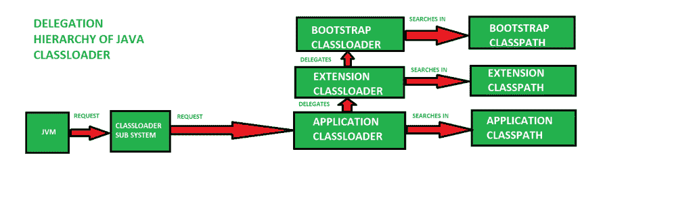

# Java 中的类加载器

> 原文:[https://www.geeksforgeeks.org/classloader-in-java/](https://www.geeksforgeeks.org/classloader-in-java/)

**Java 类加载器**是 [**Java 运行时环境**](https://www.geeksforgeeks.org/differences-jdk-jre-jvm/) 的一部分，它将 Java 类动态加载到 [**Java 虚拟机**](https://www.geeksforgeeks.org/jvm-works-jvm-architecture/) 中。由于类加载器，Java 运行时系统不需要知道文件和文件系统。

[Java 类](https://www.geeksforgeeks.org/classes-objects-java/)不会一次全部加载到内存中，而是在应用程序需要时加载。此时， **Java 类加载器**被 **JRE** 调用，这些类加载器将类动态加载到内存中。

**Java 中类装入器的类型**

 **不是所有的类都是由一个类加载器加载的。根据类的类型和类的路径，决定加载特定类的类加载器。要知道加载一个类的类加载器使用***[getclass loader()](https://www.geeksforgeeks.org/java-lang-class-class-java-set-1/)*T5】方法。所有类都是根据它们的名称加载的，如果没有找到这些类中的任何一个，那么它会返回一个[**noclassedeffounderror**](https://www.geeksforgeeks.org/classnotfoundexception-vs-noclassdeffounderror-java/)或[**class notfoundexception**](https://www.geeksforgeeks.org/classnotfoundexception-vs-noclassdeffounderror-java/)。**

一个 Java 类加载器有三种类型:

1.  **引导类加载器:**引导类加载器是一个机器代码，当 JVM 调用它时，它会强制启动操作。它不是 java 类。它的工作是加载第一个纯 Java 类加载器。引导类加载器从位置 ***rt.jar*** 加载类。引导类加载器没有任何父类加载器。它也被称为**初始类加载器**。
2.  **扩展类加载器:**扩展类加载器是 Bootstrap 类加载器的子级，从各自的 JDK 扩展库中加载核心 java 类的扩展。它从 ***jre/lib/ext*** 目录或系统属性 ***所指向的任何其他目录加载文件。***
3.  **系统类加载器:**应用程序类加载器也称为系统类加载器。它加载在环境变量 ***类路径中找到的应用程序类型类，-classpath 或-cp 命令行选项*** 。应用程序类加载器是扩展类加载器的子类。

**注意**:类加载器委托层次模型总是按照应用类加载器- >扩展类加载器- >引导类加载器的顺序运行。引导类加载器总是被赋予较高的优先级，接下来是扩展类加载器，然后是应用程序类加载器。

[](https://media.geeksforgeeks.org/wp-content/uploads/jvmclassloader.jpg)

**Java 类加载器的功能原理**

**功能性原则是一组规则或特性，Java 类加载器就是基于这些规则或特性工作的。功能性有**三原则**，它们是:**

1.  ****Delegation Model**: The Java Virtual Machine and the Java ClassLoader use an algorithm called the **Delegation Hierarchy Algorithm** to Load the classes into the Java file.

    类加载器基于委托模型给出的一组操作工作。它们是:

    *   类加载器始终遵循**委托层次原则**。
    *   每当 JVM 遇到一个类时，它都会检查该类是否已经加载。
    *   如果类已经加载到方法区域，那么 JVM 继续执行。
    *   如果该类不在方法区域，那么 JVM 要求 Java 类加载器子系统加载该特定类，然后类加载器子系统将控制权移交给**应用程序类加载器**。
    *   然后，应用程序类加载器将请求委托给扩展类加载器，而**扩展类加载器**又将请求委托给**引导类加载器**。
    *   引导类加载器将在引导类路径(JDK/JRE/LIB)中搜索。如果该类可用，则加载它，如果不可用，则请求被委托给扩展类加载器。
    *   扩展类加载器在扩展类路径(JDK/JRE/LIB/EXT)中搜索该类。如果该类可用，则加载该类，否则将请求委托给应用程序类加载器。
    *   应用程序类加载器在应用程序类路径中搜索该类。如果该类可用，则加载该类，如果不可用，则生成**类未找到异常**异常。

    [](https://media.geeksforgeeks.org/wp-content/uploads/20190417144207/java_classloader.png)** 
2.  ****可见性原则**:**可见性原则**规定父类加载器加载的类对于子类加载器是可见的，但是子类加载器加载的类对于父类加载器是不可见的。假设扩展类加载器已经加载了一个类 GEEKS.class，那么这个类只对扩展类加载器和应用程序类加载器可见，而对引导类加载器不可见。如果再次尝试使用引导类加载器加载该类，它会给出一个异常***Java . lang . class notfoundexception***。**
3.  ****唯一性属性**:**唯一性属性**保证类是唯一的，不存在类的重复。这也确保了父类加载器加载的类不会被子类加载器加载。如果父类加载器找不到类，那么只有当前实例会自己尝试这样做。**

****Java.lang.ClassLoader 的方法****

****在 JVM 请求类之后，需要遵循一些步骤来加载一个类。类是根据委托模型加载的，但是有几个重要的方法或函数在加载类中起着至关重要的作用。****

1.  ******loadClass(字符串名称，布尔解析)**:这个方法用来加载 JVM 引用的类。它将类的名称作为参数。这是 loadClass 类型(字符串，布尔值)。****
2.  ******defineClass()**:defineClass()方法是*最终*方法，不能被覆盖。此方法用于将字节数组定义为类的实例。如果该类无效，则抛出**类格式错误**。****
3.  ******findClass(字符串名称)**:此方法用于查找指定的类。此方法只查找但不加载类。****
4.  ******findloaddclass(字符串名称)**:这个方法用来验证 JVM 引用的类之前是否加载过。****
5.  ******Class.forName(字符串名称，布尔初始化，ClassLoader loader)** :这个方法既用来加载类，也用来初始化类。该方法还提供了选择任何一个类加载器的选项。如果类加载器参数为空，则使用引导类加载器。****

******示例:**在加载类之前执行以下代码:****

```java
**protected synchronized Class<?>
loadClass(String name, boolean resolve)
    throws ClassNotFoundException
{
    Class c = findLoadedClass(name);
    try {
        if (c == NULL) {
            if (parent != NULL) {
                c = parent.loadClass(name, false);
            }
            else {
                c = findBootstrapClass0(name);
            }
        }
        catch (ClassNotFoundException e)
        {
            System.out.println(e);
        }
    }
}**
```

******注**:如果已经加载了一个类，则返回。否则，它会将新类的搜索委托给父类加载器。如果父类加载器没有找到该类， **loadClass()** 调用方法 **findClass()** 查找并加载该类。如果类没有被父级**类加载器**找到，则 **findClass()** 方法在当前的**类加载器**中搜索该类。******