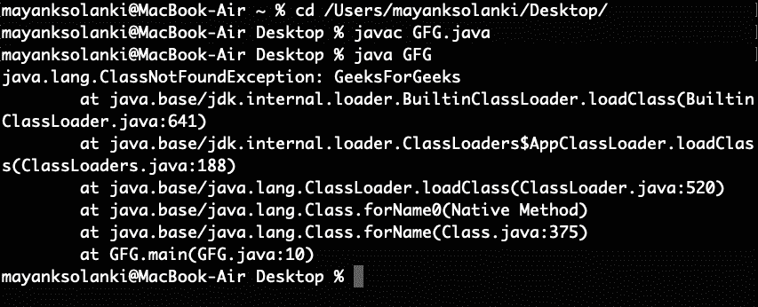

# class notfounindexception vs noclasdeffounderor in Java

> 哎哎哎:# t0]https://www . geeksforgeeks . org/class notfoundationxception-vs-noclasdeffounderor-Java/

**两个异常都是类未找到异常**和**类未找到异常**发生在运行时找不到类的时候。它们与 Java 类路径相关。

[**【class notfounindexception】**](https://www.geeksforgeeks.org/how-to-solve-java-lang-classnotfoundexception-in-java/)

**ClassNotFoundException** 发生在您试图在运行时使用 **Class.forName()** 或 **loadClass()** 方法加载一个类时，并且在类路径中找不到请求的类。大多数情况下，当您试图运行一个应用程序而没有用 JAR 文件更新类路径时，就会出现这种异常。这个异常是一个从 **java.lang.Exception** 类派生的**选中异常**，需要为其提供**显式处理**。当您有两个类加载器时，如果一个类加载器试图访问由 Java 中的另一个类加载器加载的类，也会出现这种异常。你一定想知道 Java 中什么是类加载器。 **Java 类加载器**是 Java 运行时环境的一部分，在 JVM(Java 虚拟机)中动态加载 Java 类。Java 运行时系统不需要知道文件和文件系统，因为有类加载器。

**例**

## Java 语言(一种计算机语言，尤用于创建网站)

```java
// Java Program to Illustrate ClassNotFoundException
public class GFG {

    // Main driver method
    public static void main(String args[])
    {

        // Try block to check for exceptions
        try {

            Class.forName("GeeksForGeeks");
        }

        // Catch block to handle exceptions
        catch (ClassNotFoundException ex) {

            // Displaying exceptions on console along with
            // line number using printStackTrace() method
            ex.printStackTrace();
        }
    }
}
```

**输出:**



> ClassNotFoundException 在上面的程序中引发，因为类“GeeksForGeeks”在类路径中找不到。

现在来看下一个异常 NoClassDefFoundError，当类在编译时出现，程序编译和链接成功，但类在运行时不出现时，就会出现这个异常。这是一个源自**链接错误**的错误。当一个类对另一个类有一些依赖关系，而后者在前一个类编译后发生变化时，就会出现链接错误。NoClassFoundError 是**隐式加载**类的结果，因为调用了该类的方法或访问了该类的变量。此错误更难调试，也更难找到发生此错误的原因。所以在这种情况下，你应该总是检查依赖于这个类的类。为了说明，让我们首先为 java 程序创建任意两个类，并将它们链接起来。

**例**

## Java 语言(一种计算机语言，尤用于创建网站)

```java
// Java Program to Illustrate NoClassDefFoundError Exception

// Class 1
// Helper class
class GeeksForGeeks {

    // Method
    void greeting()
    {
        // Print statement whenever method is called
        System.out.println("hello!");
    }
}

// Class 2
// Main class
class GFG {

    // Main driver method
    public static void main(String args[])
    {
        // Creating object of class 1
        // inside main() in class2
        GeeksForGeeks geeks = new GeeksForGeeks();

        // Calling method of above class
        geeks.greeting();
    }
}
```

**Output**

```java
hello!

```

输出解释:

上面的程序将成功编译并生成两个类*“GeeksForGeeks.class”*和*“GFG.class”*现在移除 geeksforgeeks . class 文件并运行 gfg . class 当我们看到在 Java 运行时**noclassedeffounderror**将被抛出。

[**【class notfoundation vs noclassforfounder】**](https://www.geeksforgeeks.org/classnotfoundexception-vs-noclassdeffounderror-java/)

*   顾名思义，ClassNotFoundException 是一个异常，而 NoClassDefFoundError 是一个错误。
*   ClassNotFoundException 发生在类路径没有用所需的 JAR 文件更新时，而错误发生在运行时所需的类定义不存在时。