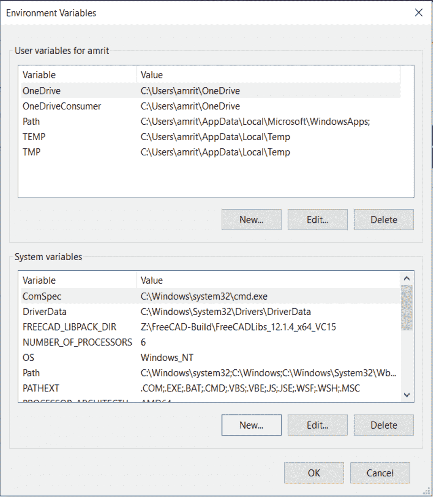

# Java 中的类路径

> 原文:[https://www.geeksforgeeks.org/classpath-in-java/](https://www.geeksforgeeks.org/classpath-in-java/)

Java 中的 Package 是封装一组类、子包和接口的机制。包用于:

*   防止命名冲突。例如，在两个包中可以有两个名为 Employee 的类，college.staff.cse.Employee 和 college.staff.ee.Employee
*   使类、接口、枚举和注释的搜索/定位和使用更加容易
*   提供受控访问:受保护和默认具有包级访问控制。同一包及其子类中的类可以访问受保护的成员。默认成员(没有任何访问说明符)只能由同一包中的类访问。

包可以被认为是数据封装(或数据隐藏)。在这里，我们将讨论在用 Java 编程时，类路径环境变量的职责，随着我们的前进，我们肯定会很快需要使用导入语句。

插图:

```
 import org.company.Menu 
```

这个进口是什么意思？它使菜单类在包 org.company 中对我们当前的类可用。这样当我们调用如下命令时:

```
Menu menu = new Menu();   
```

**例**

## Java 语言(一种计算机语言，尤用于创建网站)

```
// Java Program to Illustrate Usage of importing
// Classes from packages and sub-packages

// Here we are importing all classes from
// java.io (input-output package)
import java.io.*;

// Main class
class GFG {

    // Main driver method
    public static void main(String[] args)
    {

        // Print statement
        System.out.println("I/O classes are imported from java.io package");
    }
}
```

**Output**

```
I/O classes are imported from java.io package
```

这个包通过数据流、序列化和文件系统提供系统输入和输出。除非另有说明，否则将 null 参数传递给此包中任何类或接口中的构造函数或方法将导致引发 NullPointerException。这里列出的所有类都是导入的，或者如果我们想要导入一个特定的类，那么请按照下面的说明使用它。

```
import java.util.Scanner ;
```

> JVM 知道在哪里可以找到类 ***菜单*** 。那么，JVM 如何知道这个位置呢？

对它来说，浏览系统中的每个文件夹并搜索它是不切实际的。因此，使用 CLASSPATH 变量，我们为它提供了我们希望它出现的位置。我们将目录和 jar 放在 CLASSPATH 变量中。

假设上面的包位于目录*目录*中。*菜单*类文件的完整路径是*目录/组织/公司/菜单。*我们将在类路径变量中只指定目录 *dir* ，因为关于路径的其余信息由 import 语句提供。与 jar 类似，如果您创建一个 jar 并在变量中提到它的路径，虚拟机将在 jar 文件中查找并找到该类。

[一个人应该知道如何设置类路径](https://www.geeksforgeeks.org/how-to-set-classpath-when-class-files-are-in-jar-file-in-java/)如果在配置 JDK 之后没有按照操作系统去做，以便看到它或对它进行操作，并一起玩多个 IDE、版本的游戏。一个人必须对它有绝对清晰的认识。



本文由 [**ekta1994**](https://auth.geeksforgeeks.org/profile.php?user=Ekta Goel) 供稿。如果你喜欢 GeeksforGeeks 并想投稿，你也可以使用[write.geeksforgeeks.org](https://write.geeksforgeeks.org)写一篇文章或者把你的文章邮寄到 review-team@geeksforgeeks.org。看到你的文章出现在极客博客主页上，帮助其他极客。如果你发现任何不正确的地方，或者你想分享更多关于上面讨论的话题的信息，请写评论。