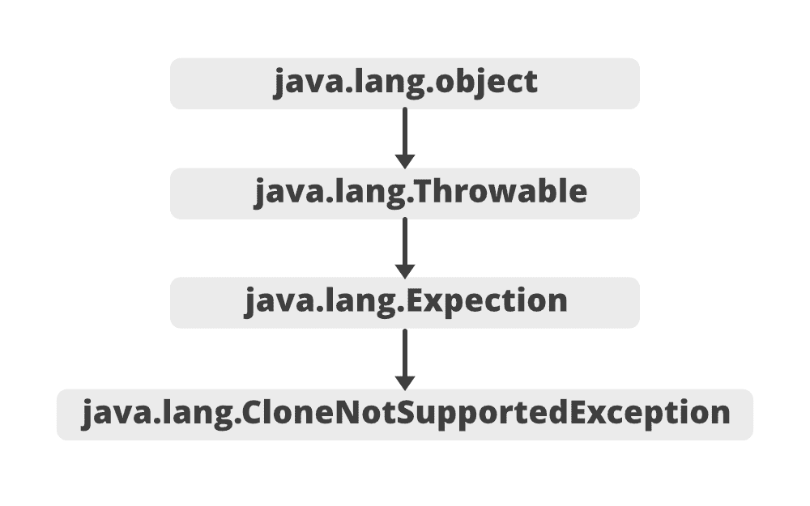
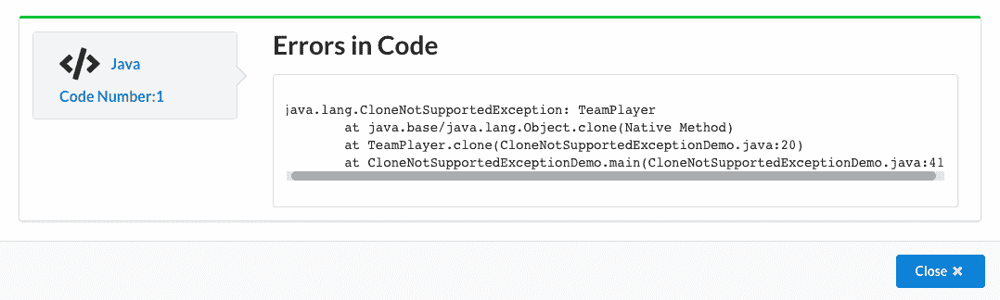

# Java 中的克隆支持异常，示例

> 原文:[https://www . geeksforgeeks . org/cloenotsupportdexception-in-Java-with-examples/](https://www.geeksforgeeks.org/clonenotsupportedexception-in-java-with-examples/)

**cloneotsupportedexception**被抛出，表示已经调用了 Object 类中的克隆方法来克隆一个对象，但是该对象的类没有实现**可克隆接口。**

**等级:**



那些覆盖了 clone 方法的应用程序也可能抛出这种类型的异常来指示一个对象不能或者不应该被克隆。

**语法:**

```java
public class CloneNotSupportedException extends Exception
```

**克隆支持异常示例:**

## Java 语言(一种计算机语言，尤用于创建网站)

```java
// Java program to demonstrate CloneNotSupportedException

class TeamPlayer {

    private String name;

    public TeamPlayer(String name)
    {
        super();
        this.name = name;
    }

    @Override public String toString()
    {
        return "TeamPlayer[Name= " + name + "]";
    }

    @Override
    protected Object clone()
        throws CloneNotSupportedException
    {
        return super.clone();
    }
}

public class CloneNotSupportedExceptionDemo {

    public static void main(String[] args)
    {

        // creating instance of class TeamPlayer

        TeamPlayer t1 = new TeamPlayer("Piyush");
        System.out.println(t1);

        // using try catch block
        try {

             // CloneNotSupportedException will be thrown
             // because TeamPlayer class not implemented
             // Cloneable interface.

            TeamPlayer t2 = (TeamPlayer)t1.clone();
            System.out.println(t2);
        }

        catch (CloneNotSupportedException a) {
            a.printStackTrace();
        }
    }
}
```

**输出:**

