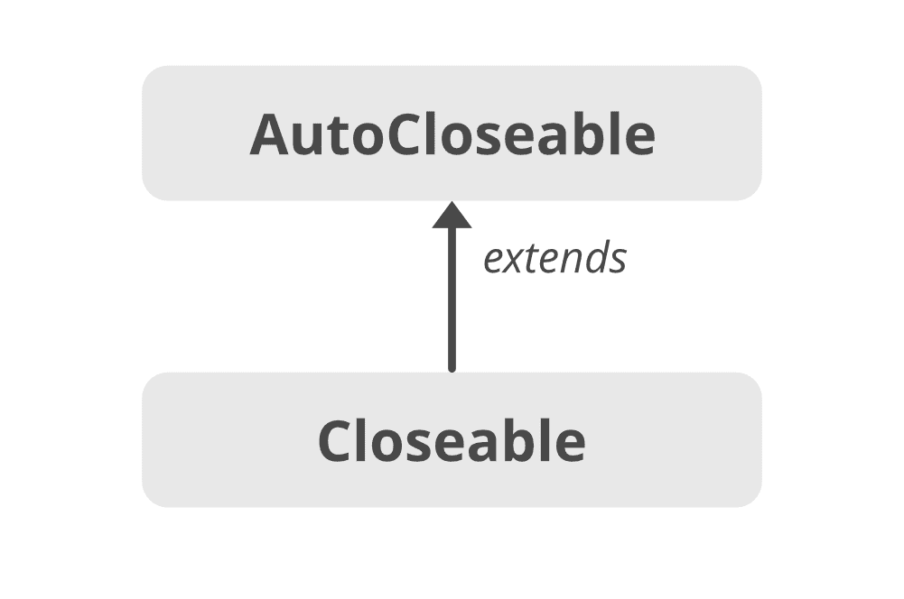

# Java 中的可关闭界面

> 原文:[https://www.geeksforgeeks.org/closeable-interface-in-java/](https://www.geeksforgeeks.org/closeable-interface-in-java/)

A **可关闭**是需要关闭的数据的来源或目的地。当我们需要释放由对象(如打开的文件)持有的资源时，调用 **close()** 方法。它是流类的重要接口之一。可关闭界面在 **JDK 5** 中引入，并在 **java.io** 中定义。从 **JDK 7+** 开始，我们应该使用自动锁定界面。可关闭接口是一个较旧的接口，引入它是为了保持向后兼容性。

**可关闭界面的层次结构**



可关闭的接口扩展了**可自动关闭的**接口，因此任何实现可关闭的类也实现了可自动关闭。

**申报**

```java
public interface Closeable extends AutoCloseable 
{
    public void close() throws IOException;
}
```

**实现** **可关闭界面**

```java
import java.io.Closeable;
import java.io.IOException;

public class MyCustomCloseableClass implements Closeable {

    @Override
    public void close() throws IOException {
        // close resource
 System.out.println("Closing");
    }
}
```

**关闭可关闭界面的()方法**

调用 **close()方法**来释放对象持有的资源。如果流已经关闭，那么调用 close 方法不会有任何影响。

**语法**

```java
public void close() throws IOException
```

> **注意:** Closeable 为**幂等，**表示多次调用 close()方法没有副作用。

**可关闭界面的限制**

Closeable 只抛出 **IOException** ，不破坏遗留代码是无法更改的。因此，**自动锁定**被引入，因为它可以抛出异常。

**可闭合的超界面:**

*   可自动锁定

**可关闭的子接口:**

*   异步字节通道
*   异步信道
*   字节通道
*   频道
*   ImageInputStream
*   ImageOutputStream
*   多播频道

**实现类:**

*   抽象选择频道
*   抽象选择器
*   缓冲恐惧者
*   BufferedWriter
*   BufferedInputStream
*   BufferedOutputStream
*   检查输入流
*   检查输出流

**可关闭与可自动关闭**

1.  可关闭是由 **JDK 5** 推出的，而可自动关闭是由 **JDK 7+推出的。**
2.  可关闭**扩展了可自动关闭**，可关闭主要针对输入输出流。
3.  可关闭扩展**异常**，而可自动关闭扩展**异常。**
4.  可关闭的接口是**幂等的**(多次调用 close()方法没有任何副作用)，而 AutoCloseable 不提供这个功能。
5.  AutoCloseable 是专门为处理**资源试用**语句而引入的。由于 Closeable 实现了 AutoCloseable，因此任何实现 Closeable 的类也实现了 AutoCloseable 接口，并且可以使用 try-with 资源来关闭文件。

```java
try(FileInputStream fin = new FileInputStream(input)) {
    // Some code here
}
```

**可关闭试配块的使用**

由于 Closeable 继承了 AutoCloseable 接口的属性，因此实现 Closeable 的类也可以使用 try-with-resources 块。在资源尝试块中可以使用多个资源，并自动关闭它们。在这种情况下，资源将以它们在括号内创建的相反顺序关闭。

## Java 语言(一种计算机语言，尤用于创建网站)

```java
// Java program to illustrate
// Automatic Resource Management
// in Java with multiple resource

import java.io.*;
class Resource {
    public static void main(String s[])
    {
        // note the order of opening the resources
        try (Demo d = new Demo(); Demo1 d1 = new Demo1()) {
            int x = 10 / 0;
            d.show();
            d1.show1();
        }
        catch (ArithmeticException e) {
            System.out.println(e);
        }
    }
}

// custom resource 1
class Demo implements Closeable {
    void show() { System.out.println("inside show"); }
    public void close()
    {
        System.out.println("close from demo");
    }
}

// custom resource 2
class Demo1 implements Closeable {
    void show1() { System.out.println("inside show1"); }
    public void close()
    {
        System.out.println("close from demo1");
    }
}
```

**Output**

```java
close from demo1
close from demo
java.lang.ArithmeticException: / by zero
```

#### **可关闭界面的方法**

<figure class="table">

| 

方法

 | 

描述

 |
| --- | --- |
| 关闭() | 关闭此流并释放与其关联的任何系统资源。 |

</figure>