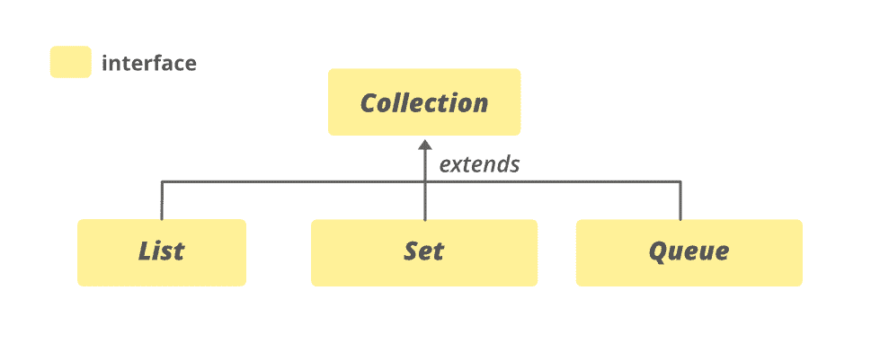

# Java 中的集合接口，示例

> 原文:[https://www . geesforgeks . org/collection-interface-in-Java-with-examples/](https://www.geeksforgeeks.org/collection-interface-in-java-with-examples/)

**集合**接口是 [Java 集合框架](https://www.geeksforgeeks.org/collections-in-java-2/)的成员。它是 **java.util** 包的一部分。它是集合层次结构的根接口之一。集合接口不是由任何类直接实现的。但是，它是通过其子类型或子接口间接实现的，如[列表](https://www.geeksforgeeks.org/list-interface-java-examples/)、[队列](https://www.geeksforgeeks.org/queue-interface-java/)、[设置](https://www.geeksforgeeks.org/set-in-java/)。

**例如，**[HashSet](https://www.geeksforgeeks.org/hashset-in-java/#:~:text=Last%20Updated%3A%2009%2D09%2D,class%20permits%20the%20null%20element.)类实现了 Set 接口，它是 Collection 接口的子接口。如果一个集合实现没有实现一个特定的操作，它应该定义相应的方法来抛出**UnsupportedOperationException**。

**集合的层次结构**



实现**可迭代<E>T1】接口。Collection 的子界面有 **BeanContext** 、 **BeanContextServices** 、[blocking eque<E>](https://www.geeksforgeeks.org/blockingdeque-in-java/)、[blocking Queue<E>T9】、](https://www.geeksforgeeks.org/blockingqueue-interface-in-java/) [Deque < E >](https://www.geeksforgeeks.org/deque-interface-java-example/) 、 **EventSet** 、 [List < E >](https://www.geeksforgeeks.org/list-interface-java-examples/) 、[navigableet<E](https://www.geeksforgeeks.org/navigableset-java-examples/)**

**采集接口的子接口**

收集框架的所有类都实现了收集接口的子接口。集合接口的所有方法也包含在其子接口中。这些子接口有时被称为集合的**集合类型**或**子类型。**包括以下内容:

**列表**:这是采集界面的子界面。这个接口专用于列表类型的数据，我们可以在其中存储对象的所有有序集合。这也允许重复数据出现在其中。该列表接口由[数组列表](https://www.geeksforgeeks.org/arraylist-in-java/)、[向量](https://www.geeksforgeeks.org/java-util-vector-class-java/)、[堆栈](https://www.geeksforgeeks.org/stack-class-in-java/)等各种类实现。因为所有子类都实现了列表，所以我们可以用这些类中的任何一个实例化一个列表对象。例如，

> 列表 <t>al =新数组列表<>()；</t>
> 
> 列表 <t>ll =新链接列表<>()；</t>
> 
> 列表 <t>v =新向量<>()；</t>
> 
> 其中 T 是对象的类型

**集合**:集合是对象的无序集合，其中不能存储重复的值。当我们希望避免对象的重复并且希望只存储唯一的对象时，使用这个集合。该集合接口由 [HashSet](https://www.geeksforgeeks.org/hashset-in-java/) 、 [TreeSet](https://www.geeksforgeeks.org/treeset-in-java-with-examples/) 、 [LinkedHashSet](https://www.geeksforgeeks.org/linkedhashset-in-java-with-examples/) 等各种类实现。因为所有子类都实现了集合，所以我们可以用这些类中的任何一个来实例化集合对象。例如，

> 设置 <t>hs =新 HashSet<>()；</t>
> 
> Set <t>lhs = new LinkedHashSet <> （）;</t>
> 
> set<t>ts = new TreeSet<>()；</t>
> 
> 其中 T 是对象的类型。

**SortedSet** :这个界面和设置界面很像。唯一的区别是这个接口有额外的方法来维护元素的顺序。排序集合接口扩展了集合接口，用于处理需要排序的数据。实现这个接口的类是[树集合](https://www.geeksforgeeks.org/treeset-in-java-with-examples/)。由于这个类实现了 SortedSet，我们可以用这个类实例化一个 SortedSet 对象。例如，

> sort dset<t>ts =新 tree set<>()；</t>
> 
> 其中 T 是对象的类型。

**队列**:顾名思义，一个队列接口维护着 FIFO(先进先出)的顺序，类似于现实世界中的队列行。这个接口专用于存储所有元素，其中元素的顺序很重要。例如，每当我们试图预订一张票时，票都是以先到先得的方式出售的。因此，请求最先到达队列的人将获得票证。有[优先级队列](https://www.geeksforgeeks.org/priority-queue-class-in-java-2/)、[德清](https://www.geeksforgeeks.org/deque-set-1-introduction-applications/)、[队列](https://www.geeksforgeeks.org/arraydeque-in-java/)等各种类。因为所有这些子类都实现了队列，所以我们可以用这些类中的任何一个实例化一个队列对象。例如，

> 队列 <t>pq =新优先级队列<>()；</t>
> 
> Queue <t>ad =新阵列 deqo<>()；</t>
> 
> 其中 T 是对象的类型。

**德格**:这是[队列数据结构](https://www.geeksforgeeks.org/queue-data-structure/)的一个非常细微的变化。[de quee](https://www.geeksforgeeks.org/deque-set-1-introduction-applications/)，也称为双端队列，是一种数据结构，我们可以在其中添加和删除队列两端的元素。这个接口扩展了队列接口。实现这个接口的类是 [ArrayDeque](https://www.geeksforgeeks.org/arraydeque-in-java/) 。因为这个类实现了 deque，所以我们可以用这个类实例化一个 deque 对象。例如，

> Deque <t>ad =新阵列 deque<>()；</t>
> 
> 其中 T 是对象的类型。

**申报:**

```java
public interface Collection<E> extends Iterable<E>
```

这里， **E** 是集合中存储的元素类型。

**示例:**

## Java 语言(一种计算机语言，尤用于创建网站)

```java
// Java program to illustrate Collection interface

import java.io.*;
import java.util.*;

public class CollectionDemo {
    public static void main(String args[])
    {

        // creating an empty LinkedList
        Collection<String> list = new LinkedList<String>();

        // use add() method to add elements in the list
        list.add("Geeks");
        list.add("for");
        list.add("Geeks");

        // Output the present list
        System.out.println("The list is: " + list);

        // Adding new elements to the end
        list.add("Last");
        list.add("Element");

        // printing the new list
        System.out.println("The new List is: " + list);
    }
}
```

**Output**

```java
The list is: [Geeks, for, Geeks]
The new List is: [Geeks, for, Geeks, Last, Element]
```

### 实现类

集合接口由[抽象集合](https://www.geeksforgeeks.org/abstractcollection-in-java-with-examples/)、[抽象列表](https://www.geeksforgeeks.org/abstractlist-in-java-with-examples/#:~:text=The%20AbstractList%20class%20in%20Java,interface%20and%20the%20AbstractCollection%20class.&text=To%20implement%20an%20unmodifiable%20list,and%20the%20size()%20methods.)、[抽象队列](https://www.geeksforgeeks.org/abstractqueue-in-java-with-examples/)、[抽象顺序列表](https://www.geeksforgeeks.org/abstractsequentiallist-in-java-with-examples/#:~:text=The%20AbstractSequentialList%20class%20in%20Java,and%20the%20size()%20methods.)、[抽象集合](https://www.geeksforgeeks.org/abstractset-class-in-java-with-examples/)、[数组锁定队列](https://www.geeksforgeeks.org/arrayblockingqueue-class-in-java/)、[数组列表](https://www.geeksforgeeks.org/arraydeque-in-java/#:~:text=The%20ArrayDeque%20in%20Java%20provides,Ended%20Queue%20or%20Array%20Deck.&text=as%20a%20stack.-,ArrayDeque%20class%20is%20likely%20to%20be%20faster,when%20used%20as%20a%20queue.)、[数组列表](https://www.geeksforgeeks.org/arraylist-in-java/)、**属性列表**、**bean contextservice support**、**bean 实现 KeySetView、[ConcurrentLinkedQueue](https://www.geeksforgeeks.org/concurrentlinkeddeque-in-java-with-examples/)、 [ConcurrentLinkedQueue](https://www.geeksforgeeks.org/concurrentlinkedqueue-in-java-with-examples/) 、[concurrentskiplist](https://www.geeksforgeeks.org/concurrentskiplistset-in-java-with-examples/)、[copy onwriterarraylist](https://www.geeksforgeeks.org/copyonwritearraylist-in-java/)、[copy onwriterarrayset](https://www.geeksforgeeks.org/copyonwritearrayset-in-java/)、 [DelayQueue](https://www.geeksforgeeks.org/delayqueue-class-in-java-with-example/) 、 [EnumSet](https://www.geeksforgeeks.org/enumset-class-java/) 、 [HashSet](https://www.geeksforgeeks.org/hashset-in-java/) 、**jobstatements**、**

**语法:**

```java
Collection<E> objectName = new ArrayList<E>();
```

这里， **E** 是集合中存储的元素类型。

**注意:**在上面的语法中，如果任何类实现了 Collection 接口，我们可以用 ArrayList 替换该类。

### 基本操作

**1。添加元素**

可以使用 Collection 提供的[add(E E)](https://www.geeksforgeeks.org/collection-add-method-in-java-with-examples/)[addAll(Collection c)](https://www.geeksforgeeks.org/collection-addall-method-in-java-with-examples/)方法添加元素。

## Java 语言(一种计算机语言，尤用于创建网站)

```java
// Java code to illustrate adding
// elements to the Collection

import java.io.*;
import java.util.*;

public class AddingElementsExample {
    public static void main(String[] args)
    {

        // create an empty array list with an initial
        // capacity
        Collection<Integer> list1 = new ArrayList<Integer>(5);

        // use add() method to add elements in the list
        list1.add(15);
        list1.add(20);
        list1.add(25);

        // prints all the elements available in list
        for (Integer number : list1) {
            System.out.println("Number = " + number);
        }

        // Creating an empty ArrayList
        Collection<Integer> list2 = new ArrayList<Integer>();

        // Appending the collection to the list
        list2.addAll(list1);

        // displaying the modified ArrayList
        System.out.println("The new ArrayList is: " + list2);
    }
}
```

**Output**

```java
Number = 15
Number = 20
Number = 25
The new ArrayList is: [15, 20, 25]
```

**2。拆卸元件**

**移除(E e)** 和**移除所有(集合 c)** 方法可用于从集合中移除特定元素或元素集合。

## Java 语言(一种计算机语言，尤用于创建网站)

```java
// Java program to demonstrate removing
// elements from a Collection

import java.util.*;

public class RemoveElementsExample {
    public static void main(String[] argv) throws Exception
    {

        // Creating object of HashSet<Integer>
        Collection<Integer> set1 = new HashSet<Integer>();

        // Populating arrset1
        set1.add(1);
        set1.add(2);
        set1.add(3);
        set1.add(4);
        set1.add(5);

        // print set1
        System.out.println("Initial set1 : " + set1);

          // remove a particular element
          set1.remove(4);

          // print modified set1
        System.out.println("set1 after removing 4 : " + set1);

        // Creating another object of HashSet<Integer>
        Collection<Integer> set2 = new HashSet<Integer>();
        set2.add(1);
        set2.add(2);
        set2.add(3);

        // print set2
        System.out.println("Collection Elements to be removed : " + set2);

        // Removing elements from set1
        // specified in set2
        // using removeAll() method
        set1.removeAll(set2);

        // print arrset1
        System.out.println("set 1 after removeAll() operation : " + set1);
    }
}
```

**Output**

```java
Initial set1 : [1, 2, 3, 4, 5]
set1 after removing 4 : [1, 2, 3, 5]
Collection Elements to be removed : [1, 2, 3]
set 1 after removeAll() operation : [5]
```

**3。迭代**

为了迭代集合的元素，我们可以使用**迭代器()**方法。

## Java 语言(一种计算机语言，尤用于创建网站)

```java
// Java code to illustrate iterating
// over a Collection

import java.util.*;

public class IteratingExample {

    public static void main(String[] args)
    {
        // Create and populate the list
        Collection<String> list = new LinkedList<>();

        list.add("Geeks");
        list.add("for");
        list.add("Geeks");
        list.add("is");
        list.add("a");
        list.add("CS");
        list.add("Students");
        list.add("Portal");

        // Displaying the list
        System.out.println("The list is: " + list);

        // Create an iterator for the list
        // using iterator() method
        Iterator<String> iter = list.iterator();

        // Displaying the values after iterating
        // through the list
        System.out.println("\nThe iterator values" + " of list are: ");
        while (iter.hasNext()) {
            System.out.print(iter.next() + " ");
        }
    }
}
```

**Output**

```java
The list is: [Geeks, for, Geeks, is, a, CS, Students, Portal]

The iterator values of list are: 
Geeks for Geeks is a CS Students Portal
```

### 收集方法

<figure class="table">

| 

方法

 | 

描述

 |
| --- | --- |
| [加(E e)](https://www.geeksforgeeks.org/collection-add-method-in-java-with-examples/) | 确保此集合包含指定的元素(可选操作)。 |
| [addAll(收藏<？延伸 E > c)](https://www.google.com/url?client=internal-element-cse&cx=009682134359037907028:tj6eafkv_be&q=https://www.geeksforgeeks.org/collection-addall-method-in-java-with-examples/&sa=U&ved=2ahUKEwj2kvL3ypDsAhWLyzgGHebcCqQQFjAJegQIARAC&usg=AOvVaw1FcRDwFOLz51AegAx0Xepb) | 将指定集合中的所有元素添加到此集合中(可选操作)。 |
| [晴()](https://www.geeksforgeeks.org/collection-clear-method-in-java-with-examples/) | 从此集合中移除所有元素(可选操作)。 |
| [包含(对象 o)](https://www.geeksforgeeks.org/collection-contains-method-in-java-with-examples/) | 如果此集合包含指定的元素，则返回 true。 |
| 包含所有(集合> c) | 如果此集合包含指定集合中的所有元素，则返回 true。 |
| 等于(对象 0) | 将指定的对象与此集合进行比较，看是否相等。 |
| hashCode() | 返回此集合的哈希代码值。 |
| [【isempty()](https://www.google.com/url?client=internal-element-cse&cx=009682134359037907028:tj6eafkv_be&q=https://www.geeksforgeeks.org/collection-isempty-method-in-java-with-examples/&sa=U&ved=2ahUKEwiHudyFy5DsAhU2zjgGHRHlDE84KBAWMAF6BAgJEAI&usg=AOvVaw1rPgxw1I3ESYyWXlSrhOtI) | 如果此集合不包含元素，则返回 true。 |
| 迭代器() | 返回集合中元素的迭代器。 |
| 并行流() | 以此集合为源返回一个可能并行的流。 |
| 移除(对象 o) | 从该集合中移除指定元素的单个实例(如果存在)(可选操作)。 |
| 移除所有(集合> c) | 移除此集合中也包含在指定集合中的所有元素(可选操作)。 |
| 移除 If(谓词 super E>过滤器) | 移除此集合中满足给定谓词的所有元素。 |
| 零售(集合> c) | 仅保留此集合中包含在指定集合中的元素(可选操作)。 |
| 大小() | 返回此集合中的元素数量。 |
| 拆分器() | 在此集合中的元素上创建拆分器。 |
| 流() | 返回以此集合为源的顺序流。 |
| toarray() | 返回包含此集合中所有元素的数组。 |
| toArray (IntFunction <t>生成器)</t> | 使用提供的生成器函数分配返回的数组，返回包含此集合中所有元素的数组。 |
| toaarray(t[]a) | 返回包含此集合中所有元素的数组；返回数组的运行时类型是指定数组的运行时类型。 |

</figure>

### 在接口 java.lang.Iterable 中声明的方法

<figure class="table">

| 

方法

 | 

描述

 |
| --- | --- |
| [forEach(消费者<？超 T >动作)](https://www.geeksforgeeks.org/iterable-foreach-method-in-java-with-examples/#:~:text=One%20of%20them%20is%20forEach,the%20elements%20inside%20the%20collection.) | 对 Iterable 的每个元素执行给定的操作，直到所有元素都被处理完或者该操作引发异常。 |

</figure>

**参考:**[https://docs . Oracle . com/en/Java/javase/11/docs/API/Java . base/Java/util/collection . html](https://docs.oracle.com/en/java/javase/11/docs/api/java.base/java/util/Collection.html)