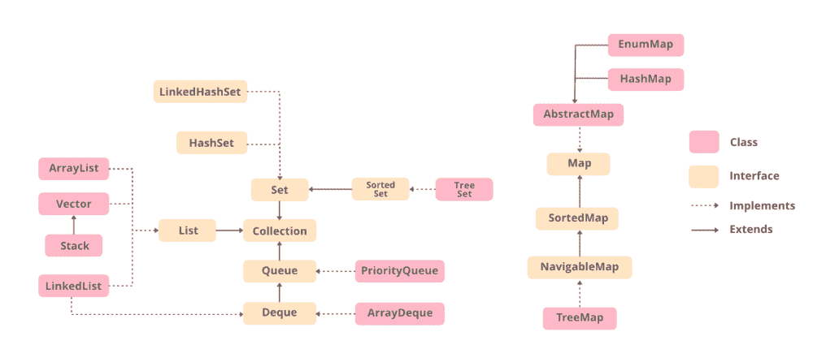

# Java 中的集合

> 原文:[https://www.geeksforgeeks.org/collections-in-java-2/](https://www.geeksforgeeks.org/collections-in-java-2/)

表示为一个单元的任何一组单个对象称为对象的集合。在 Java 中，在 JDK 1.2 中定义了一个名为*“集合框架”*的独立框架，其中包含了所有的集合类和接口。

Collection 接口( **java.util.Collection** )和 Map 接口( **java.util.Map** )是 Java collection 类的两个主要“根”接口。

**什么是框架？**

框架是一组[类](https://www.geeksforgeeks.org/classes-objects-java/)和[接口](https://www.geeksforgeeks.org/interfaces-in-java/)，它们提供了一个现成的架构。为了实现新的特性或类，不需要定义框架。然而，一个最优的面向对象设计总是包括一个包含一组类的框架，这样所有的类都执行相同类型的任务。

**需要单独的收集框架**

在 Collection Framework 推出之前(或 JDK 1.2 之前)，对 Java 对象(或集合)进行分组的标准方法是[](https://www.geeksforgeeks.org/introduction-to-arrays/)**或 [**向量**](https://www.geeksforgeeks.org/java-util-vector-class-java/) 或 [**哈希表**](https://www.geeksforgeeks.org/hashtable-in-java/) 。所有这些集合都没有公共接口。因此，尽管所有集合的主要目的是相同的，但是所有这些集合的实现是独立定义的，并且它们之间没有相关性。此外，用户很难记住每个集合类中存在的所有不同的[](https://www.geeksforgeeks.org/methods-in-java/)**、语法和 [**构造函数**](https://www.geeksforgeeks.org/constructors-in-java/) 。****

****让我们通过一个在哈希表和向量中添加元素的例子来理解这一点。****

## ****Java 语言(一种计算机语言，尤用于创建网站)****

```
**// Java program to demonstrate
// why collection framework was needed
import java.io.*;
import java.util.*;

class CollectionDemo {

    public static void main(String[] args)
    {
        // Creating instances of the array,
        // vector and hashtable
        int arr[] = new int[] { 1, 2, 3, 4 };
        Vector<Integer> v = new Vector();
        Hashtable<Integer, String> h = new Hashtable();

        // Adding the elements into the
        // vector
        v.addElement(1);
        v.addElement(2);

        // Adding the element into the
        // hashtable
        h.put(1, "geeks");
        h.put(2, "4geeks");

        // Array instance creation requires [],
        // while Vector and hastable require ()
        // Vector element insertion requires addElement(),
        // but hashtable element insertion requires put()

        // Accessing the first element of the
        // array, vector and hashtable
        System.out.println(arr[0]);
        System.out.println(v.elementAt(0));
        System.out.println(h.get(1));

        // Array elements are accessed using [],
        // vector elements using elementAt()
        // and hashtable elements using get()
    }
}**
```

******输出:******

```
**1
1
geeks**
```

****正如我们所观察到的，这些集合(数组、向量或哈希表)都没有实现标准的成员访问接口，程序员很难编写适用于所有类型集合的算法。另一个缺点是大多数“向量”方法是最终的，这意味着我们不能扩展“向量”类来实现类似的集合。因此，Java 开发人员决定提出一个通用接口来处理上述问题，并在 JDK 1.2 帖子中引入了集合框架，其中遗留向量和哈希表都被修改以符合集合框架。****

******收集框架的优点:**由于缺乏收集框架导致了上述一系列缺点，以下是收集框架的优点。****

1.  ******一致 API:**API 有一套基本的[接口](https://www.geeksforgeeks.org/interfaces-in-java/)像*集合*、*集合*、*列表*或者*映射*，所有实现这些接口的类([数组列表](https://www.geeksforgeeks.org/arraylist-in-java/)、[链表](https://www.geeksforgeeks.org/data-structures/linked-list/)、Vector 等)都有*一些*常用的方法集。**** 
2.  ******减少编程工作量:**程序员不必担心 Collection 的设计，而是可以专注于它在程序中的最佳用途。因此，面向对象编程(即抽象)的基本概念已经成功实现。**** 
3.  ******提高程序速度和质量:**通过提供有用数据结构和算法的高性能实现来提高性能，因为在这种情况下，程序员不需要考虑特定数据结构的最佳实现。他可以简单地使用最佳实现来大幅提升他的算法/程序的性能。****

## ****收集框架的层次结构****

****实用程序包(java.util)包含集合框架所需的所有类和接口。集合框架包含一个名为 iterable 接口的接口，它提供迭代器来遍历所有集合。该接口由主集合接口扩展，主集合接口充当集合框架的根。所有的集合都扩展了这个集合接口，从而扩展了迭代器的属性和这个接口的方法。下图说明了集合框架的层次结构。****

********

****在了解上述框架中的不同组件之前，让我们先了解一个类和一个接口。****

*   ****[**类**](https://www.geeksforgeeks.org/classes-objects-java/) **:** 类是用户定义的蓝图或原型，从中创建对象。它表示一种类型的所有对象共有的一组属性或方法。**** 
*   ****[**接口**](https://www.geeksforgeeks.org/interfaces-in-java/) **:** 像类一样，接口可以有方法和变量，但是接口中声明的方法默认是抽象的(只有方法签名，没有主体)。接口指定类必须做什么，而不是如何做。它是班级的蓝图。****

## ****收集接口的方法****

****这个接口包含各种方法，这些方法可以被实现这个接口的所有集合直接使用。它们是:****

<figure class="table"> ****| 

方法

 | 

描述

 |
| --- | --- |
| [**添加(对象)**](https://www.geeksforgeeks.org/collection-add-method-in-java-with-examples/) | This method is used to add an object to the collection. |
| [**addAll(集合 c)**](https://www.geeksforgeeks.org/collections-addall-method-in-java-with-examples/) | This method adds all elements in a given collection to this collection. |
| [**晴()**](https://www.geeksforgeeks.org/collection-clear-method-in-java-with-examples/) | This method removes all elements from this collection. |
| [**包含(对象 o)**](https://www.geeksforgeeks.org/collection-contains-method-in-java-with-examples/) | This method returns true if the collection contains the specified element. |
| **包含所有(集合 c)** | This method returns true if the collection contains all the elements in the given collection. |
| **等于(对象 o)** | This method compares the specified object with this collection to see if it is equal. |
| **hashCode()** | This method is used to return the hash value of this collection. |
| [**【isempty()**](https://www.geeksforgeeks.org/collection-isempty-method-in-java-with-examples/) | If this collection contains no elements, this method returns true. |
| **Iterator ()** | This method returns the iterator of the elements in this collection. |
| [**【max()**](https://www.geeksforgeeks.org/collections-max-method-in-java-with-examples/)
 | This method is used to return the maximum value that exists in the collection. |
| **平行流()** | This method returns a parallel Stream from this collection. |
| **移除(对象 o)** | This method is used to remove the given object from the collection. If there are duplicate values, this method removes the first match of the object. |
| **移除所有(集合 c)** | This method is used to remove all objects mentioned in a given collection from the collection. |
| **Remove If (predicate filter)** | This method is used to remove all elements in this collection that satisfy the given predicate of [.](https://www.geeksforgeeks.org/mathematic-logic-predicates-quantifiers/) |
| **保留全部(集合 c)** | This method is only used to preserve the elements in this collection that are contained in the specified collection. |
| **尺寸()** | This method is used to return the number of elements in a collection. |
| **splitter ()** | This method is used to create a [splitter](https://www.geeksforgeeks.org/java-program-to-convert-iterator-to-spliterator/) on the elements in this collection. |
| **溪流()** | This method is used to return the sequential Stream with this collection as the source. |
| **到数组()** | This method is used to return an array containing all the elements in this collection. |**** </figure>

## ****扩展集合接口的接口****

****收集框架包含多个接口，其中每个接口都用于存储特定类型的数据。以下是框架中存在的接口。****

******1。Iterable Interface:** 这是整个集合框架的根接口。集合接口扩展了可迭代接口。因此，本质上，所有的接口和类都实现了这个接口。这个接口的主要功能是为集合提供一个迭代器。因此，这个接口只包含一个抽象方法，即迭代器。它返回**** 

> ****迭代器迭代器()；****

******2。集合接口:**该接口扩展了可迭代接口，由集合框架中的所有类实现。这个接口包含了每个集合所具有的所有基本方法，比如向集合中添加数据、移除数据、清除数据等等。所有这些方法都是在这个接口中实现的，因为这些方法是由所有的类实现的，而不管它们的实现风格如何。此外，在这个接口中拥有这些方法可以确保方法的名称对于所有集合都是通用的。因此，简而言之，我们可以说这个接口为实现集合类奠定了基础。****

******3。** [**列表界面:**](https://www.geeksforgeeks.org/list-interface-java-examples/) 这是收藏界面的子界面。这个接口专用于列表类型的数据，我们可以在其中存储对象的所有有序集合。这也允许重复数据出现在其中。该列表接口由[数组列表](https://www.geeksforgeeks.org/arraylist-in-java/)、[向量](https://www.geeksforgeeks.org/java-util-vector-class-java/)、[堆栈](https://www.geeksforgeeks.org/stack-class-in-java/)等各种类实现。因为所有子类都实现了列表，所以我们可以用这些类中的任何一个实例化一个列表对象。例如**** 

> ****列表 <t>al =新数组列表<>()；
> 列表< T > ll =新链接列表<>()；
> 列表< T > v =新向量<>()；</t>****
> 
>  ****其中 T 是对象的类型****

*******实现列表界面的类如下:*******

******a .**[**ArrayList:**](https://www.geeksforgeeks.org/arraylist-in-java/)ArrayList 为我们提供了 Java 中的动态数组。尽管它可能比标准数组慢，但在需要对数组进行大量操作的程序中会很有帮助。如果从集合中移除对象，则当集合增大或缩小时，数组列表的大小会自动增大。Java ArrayList 允许我们随机访问列表。ArrayList 不能用于[原语类型](https://www.geeksforgeeks.org/primitive-data-type-vs-object-data-type-in-java-with-examples/)，如 int、char 等。对于这种情况，我们需要一个[包装类](https://www.geeksforgeeks.org/wrapper-classes-java/)。让我们用下面的例子来理解数组列表:****

## ****Java 语言(一种计算机语言，尤用于创建网站)****

```
**// Java program to demonstrate the
// working of ArrayList
import java.io.*;
import java.util.*;

class GFG {

      // Main Method
    public static void main(String[] args)
    {

        // Declaring the ArrayList with
        // initial size n
        ArrayList<Integer> al = new ArrayList<Integer>();

        // Appending new elements at
        // the end of the list
        for (int i = 1; i <= 5; i++)
            al.add(i);

        // Printing elements
        System.out.println(al);

        // Remove element at index 3
        al.remove(3);

        // Displaying the ArrayList
        // after deletion
        System.out.println(al);

        // Printing elements one by one
        for (int i = 0; i < al.size(); i++)
            System.out.print(al.get(i) + " ");
    }
}**
```

******Output:** 

```
[1, 2, 3, 4, 5]
[1, 2, 3, 5]
1 2 3 5
```**** 

******b .**[**linked list:**](https://www.geeksforgeeks.org/linked-list-in-java/)linked list 类是 [LinkedList 数据结构](https://www.geeksforgeeks.org/data-structures/linked-list/)的实现，这是一个线性数据结构，其中元素不存储在连续的位置，每个元素都是一个单独的对象，有数据部分和地址部分。这些元素使用指针和地址进行链接。每个元素都被称为一个节点。让我们用下面的例子来理解链接列表:****

## ****Java 语言(一种计算机语言，尤用于创建网站)****

```
**// Java program to demonstrate the
// working of LinkedList
import java.io.*;
import java.util.*;

class GFG {

      // Main Method
    public static void main(String[] args)
    {

        // Declaring the LinkedList
        LinkedList<Integer> ll = new LinkedList<Integer>();

        // Appending new elements at
        // the end of the list
        for (int i = 1; i <= 5; i++)
            ll.add(i);

        // Printing elements
        System.out.println(ll);

        // Remove element at index 3
        ll.remove(3);

        // Displaying the List
        // after deletion
        System.out.println(ll);

        // Printing elements one by one
        for (int i = 0; i < ll.size(); i++)
            System.out.print(ll.get(i) + " ");
    }
}**
```

******Output:** 

```
[1, 2, 3, 4, 5]
[1, 2, 3, 5]
1 2 3 5
```**** 

******c .**[**Vector:**](https://www.geeksforgeeks.org/java-util-vector-class-java/)一个 Vector 在 Java 中为我们提供了动态数组。尽管它可能比标准数组慢，但在需要对数组进行大量操作的程序中会很有帮助。就实现而言，这与数组列表相同。然而，向量和数组列表之间的主要区别在于向量是同步的，而数组列表是非同步的。让我们用一个例子来理解向量:****

## ****Java 语言(一种计算机语言，尤用于创建网站)****

```
**// Java program to demonstrate the
// working of Vector
import java.io.*;
import java.util.*;

class GFG {

      // Main Method
    public static void main(String[] args)
    {

        // Declaring the Vector
        Vector<Integer> v = new Vector<Integer>();

        // Appending new elements at
        // the end of the list
        for (int i = 1; i <= 5; i++)
            v.add(i);

        // Printing elements
        System.out.println(v);

        // Remove element at index 3
        v.remove(3);

        // Displaying the Vector
        // after deletion
        System.out.println(v);

        // Printing elements one by one
        for (int i = 0; i < v.size(); i++)
            System.out.print(v.get(i) + " ");
    }
}**
```

******Output:** 

```
[1, 2, 3, 4, 5]
[1, 2, 3, 5]
1 2 3 5
```**** 

******D.** [**栈**](https://www.geeksforgeeks.org/stack-class-in-java/) **:** 栈类模型并实现[栈数据结构](https://www.geeksforgeeks.org/stack-data-structure/)。该类基于*后进先出*的基本原理。除了基本的推送和弹出操作，该类还提供了空、搜索和查看三个功能。这个类也可以称为 Vector 的子类。让我们用一个例子来理解堆栈:****

## ****Java 语言(一种计算机语言，尤用于创建网站)****

```
**// Java program to demonstrate the
// working of a stack
import java.util.*;
public class GFG {

      // Main Method
    public static void main(String args[])
    {
        Stack<String> stack = new Stack<String>();
        stack.push("Geeks");
        stack.push("For");
        stack.push("Geeks");
        stack.push("Geeks");

        // Iterator for the stack
        Iterator<String> itr = stack.iterator();

        // Printing the stack
        while (itr.hasNext()) {
            System.out.print(itr.next() + " ");
        }

        System.out.println();

        stack.pop();

        // Iterator for the stack
        itr = stack.iterator();

        // Printing the stack
        while (itr.hasNext()) {
            System.out.print(itr.next() + " ");
        }
    }
}**
```

******Output:** 

```
Geeks For Geeks Geeks 
Geeks For Geeks
```**** 

******注意:** Stack 是 Vector 的一个子类，也是一个遗留类。它是线程安全的，这在不需要线程安全的环境中可能是开销。堆栈的一个替代方法是使用[数组队列](https://www.geeksforgeeks.org/arraydeque-in-java/)，它不是线程安全的，并且有更快的数组实现。****

******4。** [**队列接口**](https://www.geeksforgeeks.org/queue-interface-java/) **:** 顾名思义，队列接口保持类似于现实世界队列行的 FIFO(先进先出)顺序。这个接口专用于存储所有元素，其中元素的顺序很重要。例如，每当我们试图预订一张票时，票都是以先到先得的方式出售的。因此，请求最先到达队列的人将获得票证。有[优先级队列](https://www.geeksforgeeks.org/priority-queue-class-in-java-2/)、[队列](https://www.geeksforgeeks.org/arraydeque-in-java/)等各种类。因为所有这些子类都实现了队列，所以我们可以用这些类中的任何一个实例化一个队列对象。例如**** 

> ****队列 <t>pq =新优先级队列<>()；
> 伫列< T > ad =新 array deque<T6】()；</t>****
> 
> ****其中 T 是对象的类型。****

*******队列接口最常用的实现是 PriorityQueue。***

[**优先级队列:**](https://www.geeksforgeeks.org/priority-queue-class-in-java-2/) 当对象应该根据优先级进行处理时，使用优先级队列。众所周知，队列遵循先进先出算法，但有时队列的元素需要根据优先级进行处理，在这些情况下使用该类。优先级队列基于优先级堆。优先级队列的元素根据自然顺序进行排序，或者通过在队列构建时提供的[比较器](https://www.geeksforgeeks.org/comparator-interface-java/)进行排序，这取决于使用的构造器。让我们用一个例子来理解优先级队列:****

## ****Java 语言(一种计算机语言，尤用于创建网站)****

```
**// Java program to demonstrate the working of
// priority queue in Java
import java.util.*;

class GfG {

      // Main Method
    public static void main(String args[])
    {
        // Creating empty priority queue
        PriorityQueue<Integer> pQueue = new PriorityQueue<Integer>();

        // Adding items to the pQueue using add()
        pQueue.add(10);
        pQueue.add(20);
        pQueue.add(15);

        // Printing the top element of PriorityQueue
        System.out.println(pQueue.peek());

        // Printing the top element and removing it
        // from the PriorityQueue container
        System.out.println(pQueue.poll());

        // Printing the top element again
        System.out.println(pQueue.peek());
    }
}**
```

******Output:** 

```
10
10
15
```**** 

******5。** [**德清接口**](https://www.geeksforgeeks.org/deque-interface-java-example/) **:** 这是[队列数据结构](https://www.geeksforgeeks.org/queue-data-structure/)的一个非常细微的变化。[dequee](https://www.geeksforgeeks.org/deque-set-1-introduction-applications/)又称双端队列，是一种我们可以在队列两端添加和删除元素的数据结构。这个接口扩展了队列接口。实现这个接口的类是 [ArrayDeque](https://www.geeksforgeeks.org/arraydeque-in-java/) 。由于 ArrayDeque 类实现了 Deque 接口，我们可以用这个类实例化一个 Deque 对象。例如**** 

> ****Deque <t>ad =新阵列 deque<>()；</t>****
> 
> ****其中 T 是对象的类型。****

*******实现德客接口的类是 ArrayDeque。**T3】*****

****[**ArrayDeque:**](https://www.geeksforgeeks.org/arraydeque-in-java/) 在集合框架中实现的 ArrayDeque 类为我们提供了一种应用可调整大小的-array 的方法。这是一种特殊的数组，它不断增长，允许用户在队列的两端添加或删除元素。阵列数据区没有容量限制，可以根据需要增长以支持使用。让我们用一个例子来理解 ArrayDeque:**** 

## ****Java 语言(一种计算机语言，尤用于创建网站)****

```
**// Java program to demonstrate the
// ArrayDeque class in Java

import java.util.*;
public class ArrayDequeDemo {
    public static void main(String[] args)
    {
        // Initializing an deque
        ArrayDeque<Integer> de_que = new ArrayDeque<Integer>(10);

        // add() method to insert
        de_que.add(10);
        de_que.add(20);
        de_que.add(30);
        de_que.add(40);
        de_que.add(50);

        System.out.println(de_que);

        // clear() method
        de_que.clear();

        // addFirst() method to insert the
        // elements at the head
        de_que.addFirst(564);
        de_que.addFirst(291);

        // addLast() method to insert the
        // elements at the tail
        de_que.addLast(24);
        de_que.addLast(14);

        System.out.println(de_que);
    }
}**
```

******Output:** ****

```
**[10, 20, 30, 40, 50]
[291, 564, 24, 14]**
```