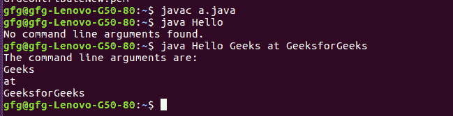

# Java 中的命令行参数

> 原文:[https://www . geesforgeks . org/命令行参数-in-java/](https://www.geeksforgeeks.org/command-line-arguments-in-java/)

如果我们通过编写命令“**Java Hello Geeks At Geeks forgeeks**”来运行一个 Java 程序，其中类的名称是“Hello”，那么它将运行到 Hello。这是一个到“你好”的命令，然后是“极客在极客那里”，这些是命令行参数。
当命令行参数被提供给 JVM 时，JVM 包装这些参数并将其提供给 args[]。通过使用 args.length
检查 args 的长度，可以确认它们实际上被包装在 args 数组中

## Java 语言（一种计算机语言，尤用于创建网站）

```
// Program to check for command line arguments
class Hello
{
    public static void main(String[] args)
    {
        // check if length of args array is
        // greater than 0
        if (args.length > 0)
        {
            System.out.println("The command line"+
                               " arguments are:");

            // iterating the args array and printing
            // the command line arguments
            for (String val:args)
                System.out.println(val);
        }
        else
            System.out.println("No command line "+
                               "arguments found.");
    }
}
```

**输出:**



本文由**闪烁泰亚吉**供稿。如果你喜欢 GeeksforGeeks 并想投稿，你也可以使用[write.geeksforgeeks.org](https://write.geeksforgeeks.org)写一篇文章或者把你的文章邮寄到 review-team@geeksforgeeks.org。看到你的文章出现在极客博客主页上，帮助其他极客。
如果你发现任何不正确的地方，或者你想分享更多关于上面讨论的话题的信息，请写评论。