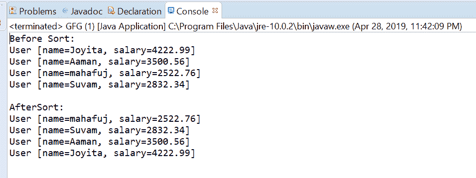
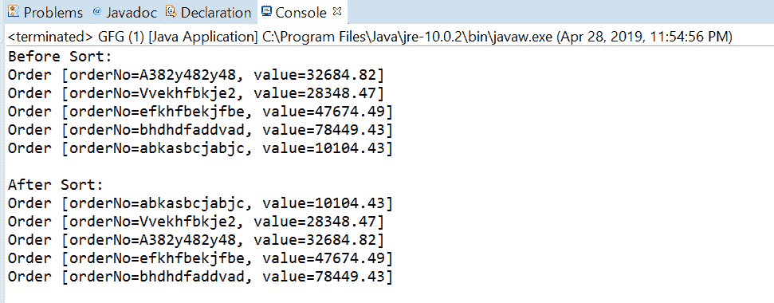

# 比较器用示例比较 Java 中的 Double()方法

> 原文:[https://www . geesforgeks . org/comparator-comparing double-method-in-Java-with-examples/](https://www.geeksforgeeks.org/comparator-comparingdouble-method-in-java-with-examples/)

java 中[比较器接口](https://www.geeksforgeeks.org/comparator-interface-java/)的**comparabindouble([Java . util . function . to doublefunction](https://www.geeksforgeeks.org/todoublefunction-interface-in-java-with-examples/))**方法接受一个函数作为参数，该函数从类型 T 中提取一个双排序键，并返回一个按该排序键进行比较的比较器。如果指定的函数也是可序列化的，则返回的比较器是可序列化的。

**语法:**

```
static <T> Comparator<T> comparingDouble(
    ToDoubleFunction <T> keyExtractor)

```

**参数:**该方法接受单个参数**键提取器**，该函数用于提取双排序键。

**返回值:**该方法返回一个比较器，通过提取的键进行比较

**异常:**如果参数为空，此方法将引发 NullPointerException。

下面的程序说明了 comparing double(Java . util . function . to doublefunction)方法:
**程序 1:**

```
// Java program to demonstrate Comparator
// comparingDouble(ToDoubleFunction)  method

import java.util.Arrays;
import java.util.Collections;
import java.util.Comparator;
import java.util.List;

public class GFG {
    public static void main(String[] args)
    {

        // create some user objects
        User u1 = new User("Aaman", 3500.56);
        User u2 = new User("Joyita", 4222.99);
        User u3 = new User("Suvam", 2832.34);
        User u4 = new User("mahafuj", 2522.76);

        // before sort
        List<User> list = Arrays.asList(u2, u1, u4, u3);
        System.out.println("Before Sort:");
        list.forEach(user -> System.out.println(user));

        Collections.sort(list,
                         Comparator.comparingDouble(User::getSalary));
        System.out.println("\nAfterSort:");
        list.forEach(user -> System.out.println(user));
    }
}

class User implements Comparable<User> {
    public String name;
    public double salary;

    public User(String name, double d)
    {
        this.name = name;
        this.salary = d;
    }

    public int compareTo(User u1)
    {
        return name.compareTo(u1.name);
    }

    public String getName()
    {
        return name;
    }

    public void setName(String name)
    {
        this.name = name;
    }

    public double getSalary()
    {
        return salary;
    }

    public void setSalary(double salary)
    {
        this.salary = salary;
    }

    @Override
    public String toString()
    {
        return "User [name=" + name
            + ", salary="
            + salary + "]";
    }
}
```

打印在集成开发环境控制台上的输出如下所示。
**输出:**


**程序 2:**

```
// Java program to demonstrate Comparator
// comparingDouble(ToDoubleFunction)  method

import java.util.Arrays;
import java.util.Collections;
import java.util.Comparator;
import java.util.List;

public class GFG {
    public static void main(String[] args)
    {

        // before sort
        List<Order> list = Arrays.asList(
            new Order("A382y482y48", 32684.82),
            new Order("Vvekhfbkje2", 28348.47),
            new Order("efkhfbekjfbe", 47674.49),
            new Order("bhdhdfaddvad", 78449.43),
            new Order("abkasbcjabjc", 10104.43));

        System.out.println("Before Sort:");
        list.forEach(order -> System.out.println(order));

        Collections.sort(list,
                         Comparator.comparingDouble(Order::getValue));
        System.out.println("\nAfter Sort:");
        list.forEach(order -> System.out.println(order));
    }
}

class Order implements Comparable<Order> {
    public String orderNo;
    public double value;

    public int compareTo(Order o1)
    {
        return orderNo.compareTo(o1.orderNo);
    }

    public Order(String orderNo, double value)
    {
        super();
        this.orderNo = orderNo;
        this.value = value;
    }

    @Override
    public String toString()
    {
        return "Order [orderNo=" + orderNo
            + ", value=" + value + "]";
    }

    public String getOrderNo()
    {
        return orderNo;
    }

    public void setOrderNo(String orderNo)
    {
        this.orderNo = orderNo;
    }

    public double getValue()
    {
        return value;
    }

    public void setValue(double value)
    {
        this.value = value;
    }
}
```

控制台上打印的输出如下所示。
**输出:**


**参考文献:**T2