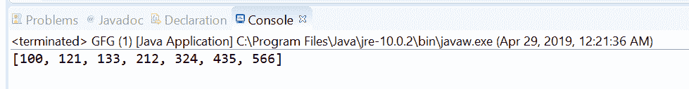
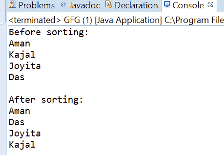

# Java 中的比较器 naturalOrder()方法，带示例

> 原文:[https://www . geesforgeks . org/comparator-natural order-method-in-Java-with-examples/](https://www.geeksforgeeks.org/comparator-naturalorder-method-in-java-with-examples/)

Java 中[比较器接口](https://www.geeksforgeeks.org/comparator-interface-java/)的 **naturalOrder()** 方法返回一个比较器，用于以自然顺序比较可比对象。这个方法返回的比较器是可序列化的，在比较 null 时抛出 [NullPointerException](https://www.geeksforgeeks.org/null-pointer-exception-in-java/) 。

**语法:**

```java
static <T extends Comparable<T>> 
    Comparator<T> naturalOrder()

```

**参数:**此方法不接受任何内容。

**返回值:**该方法返回一个比较器，该比较器对可比对象进行自然排序。

以下程序说明了自然顺序()方法:
**程序 1:**

```java
// Java program to demonstrate
// Comparator.naturalOrder()  method

import java.util.Arrays;
import java.util.Comparator;
import java.util.List;

public class GFG {
    public static void main(String... args)
    {

        List<Integer> values
            = Arrays.asList(212, 324,
                            435, 566,
                            133, 100, 121);

        // naturalOrder is a static method
        values.sort(Comparator.naturalOrder());

        // print sorted number based on natural order
        System.out.println(values);
    }
}
```

打印在集成开发环境控制台上的输出如下所示。
**输出:**


**程序 2:**

```java
// Java program to demonstrate
// Comparator.naturalOrder()  method

import java.util.Arrays;
import java.util.Comparator;
import java.util.List;

public class GFG {
    public static void main(String... args)
    {

        List<String> stringList
            = Arrays.asList("Aman", "Kajal",
                            "Joyita", "Das");

        System.out.println("Before sorting:");
        stringList.forEach(System.out::println);

        stringList.sort(Comparator.naturalOrder());
        System.out.println("\nAfter sorting:");
        stringList.forEach(System.out::println);
    }
}
```

控制台上打印的输出如下所示。
**输出:**


**参考文献:**[https://docs . Oracle . com/javase/10/docs/API/Java/util/comparator . html # natural order()](https://docs.oracle.com/javase/10/docs/api/java/util/Comparator.html#naturalOrder())