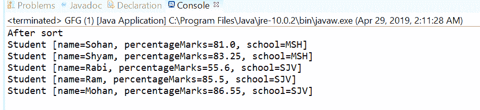
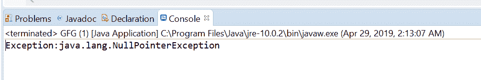

# 比较器然后用示例比较 Java 中的 Double()方法

> 原文:[https://www . geesforgeks . org/comparator-then comparing double-method-in-Java-with-examples/](https://www.geeksforgeeks.org/comparator-thencomparingdouble-method-in-java-with-examples/)

java 中的[比较器接口](https://www.geeksforgeeks.org/comparator-interface-java/)的**thecomparising double([Java . util . function . to double function](https://www.geeksforgeeks.org/todoublefunction-interface-in-java-with-examples/))**方法返回一个字典顺序比较器，该比较器带有一个提取双排序键的函数。如果要对比较方法中相等的值应用另一个比较，则在比较方法之后应用此方法。

**语法:**

```
default Comparator <T> thenComparingDouble(
    ToDoubleFunction <T> keyExtractor)

```

**参数:**该方法接受**键提取器**，这是用于提取双排序键的函数。

**返回值:**这个方法返回一个字典顺序比较器，由这个和 Double 排序键组成。

**异常:**如果参数为空，此方法将引发 NullPointerException。

下面的程序说明了方法:
**程序 1:**

```
// Java program to demonstrate Comparator
// thenComparingDouble(ToDoubleFunction) method

import java.util.Arrays;
import java.util.Collections;
import java.util.Comparator;
import java.util.List;

public class GFG {

    public static void main(String[] args)
    {
        List<Student> list = getStudentList();

        Comparator<Student> comparator
            = Comparator
                  .comparing(Student::getSchool)
                  .thenComparingDouble(Student::getpercentageMarks);

        Collections.sort(list, comparator);
        System.out.println("After sort");
        list.forEach(s -> System.out.println(s));
    }

    public static List<Student> getStudentList()
    {

        Student s1 = new Student("Ram", 85.5, "SJV");
        Student s2 = new Student("Shyam", 83.25, "MSH");
        Student s3 = new Student("Mohan", 86.55, "SJV");
        Student s4 = new Student("Sohan", 81.00, "MSH");
        Student s5 = new Student("Rabi", 55.6, "SJV");
        List<Student> list = Arrays.asList(s1, s2, s3, s4, s5);

        return list;
    }
}

class Student {

    private String name;
    private double percentageMarks;
    private String school;

    public Student(String name,
                   double percentageMarks,
                   String school)
    {
        this.name = name;
        this.percentageMarks = percentageMarks;
        this.school = school;
    }

    public String getName()
    {
        return name;
    }

    public void setName(String name)
    {
        this.name = name;
    }

    public double getpercentageMarks()
    {
        return percentageMarks;
    }

    public void setpercentageMarks(int percentageMarks)
    {
        this.percentageMarks = percentageMarks;
    }

    public String getSchool()
    {
        return school;
    }

    public void setSchool(String school)
    {
        this.school = school;
    }

    @Override
    public String toString()
    {
        return "Student [name=" + name + ", 
            percentageMarks
            = " + percentageMarks 
              + ", school=" + school + "]";
    }
}
```

打印在集成开发环境控制台上的输出如下所示。
**输出:**

*在示例中可以看到，首先排序是在学校方面进行的，如果学校相同，则 percentageMarks wise。*

**程序 2:**

```
// Java program to demonstrate Comparator
// thenComparingDouble(ToDoubleFunction)  method

import java.util.Arrays;
import java.util.Comparator;
import java.util.List;

public class GFG {

    public static void main(String... args)
    {

        List<Integer> list
            = Arrays.asList(1, 2, 3, 4, 5, 6);

        try {

            // apply thenComparingDouble
            Comparator.comparing(list::get)
                .thenComparingDouble(null);
        }
        catch (Exception e) {

            System.out.printf("Exception:" + e);
        }
    }
}
```

控制台上打印的输出如下所示。
**输出:**


**参考文献:**T2