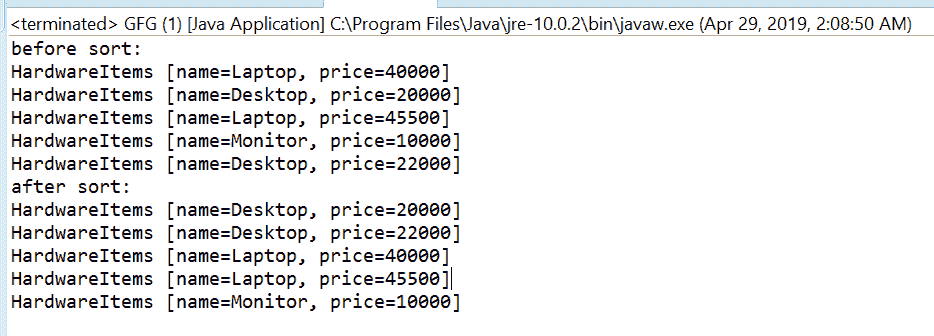

# 比较器然后用示例比较 Java 中的方法

> 原文:[https://www . geesforgeks . org/comparator-then comparingint-method-in-Java-with-examples/](https://www.geeksforgeeks.org/comparator-thencomparingint-method-in-java-with-examples/)

java 中[比较器接口](https://www.geeksforgeeks.org/comparator-interface-java/)的**thecomparingInt([Java . util . function . to intfunction](https://www.geeksforgeeks.org/tointfunction-interface-in-java-with-examples/))**方法返回一个字典顺序比较器，该比较器带有一个提取 int 排序关键字的函数。

**语法:**

```java
default Comparator <T> 
    thenComparingInt(ToIntFunction <T> keyExtractor)

```

**参数:**该方法接受**键提取器**，这是用于提取 Int 排序键的函数。

**返回值:**这个方法返回一个字典顺序比较器，由这个和 Int 排序键组成。

**异常:**如果参数为空，此方法将引发 NullPointerException。

下面的程序说明了方法:
**程序 1:**

```java
// Java program to demonstrate Comparator
// thenComparingInt(ToIntFunction) method

import java.util.Arrays;
import java.util.Collections;
import java.util.Comparator;
import java.util.List;

public class GFG {
    public static void main(String... args)
    {

        List<HardwareItems> list = getItems();
        System.out.println("before sort:");
        list.forEach(System.out::println);

        // Apply sorting and
        // also apply thenComparingInt()
        Collections
            .sort(
                list,
                Comparator
                    .comparing(HardwareItems::getName)
                    .thenComparingInt(HardwareItems::getPrice));

        System.out.println("after sort:");
        list.forEach(System.out::println);
    }

    private static List<HardwareItems> getItems()
    {
        return Arrays.asList(
            new HardwareItems("Laptop", 40000),
            new HardwareItems("Desktop", 20000),
            new HardwareItems("Laptop", 45500),
            new HardwareItems("Monitor", 10000),
            new HardwareItems("Desktop", 22000));
    }

    private static class HardwareItems {
        private String name;
        private int price;

        public HardwareItems(String name, int price)
        {
            this.name = name;
            this.price = price;
        }

        public String getName()
        {
            return name;
        }

        public int getPrice()
        {
            return price;
        }

        @Override
        public String toString()
        {
            return "HardwareItems [name="
                + name
                + ", price="
                + price + "]";
        }
    }
}
```

打印在集成开发环境控制台上的输出如下所示。
**输出:**

*您可以在示例中看到，首先按名称排序，如果名称相同，则按价格排序，这是 int 类型。*

**程序 2:**

```java
// Java program to demonstrate Comparator
// thenComparingInt(ToIntFunction)  method

import java.util.Arrays;
import java.util.Comparator;
import java.util.List;

public class GFG {

    public static void main(String... args)
    {

        List<Double> list
            = Arrays.asList(1.12, 2.4, 3.43,
                            4.343, 5.434);

        try {

            // apply thenComparingInt
            Comparator.comparing(list::get)
                .thenComparingInt(null);
        }
        catch (Exception e) {

            System.out.printf("Exception:" + e);
        }
    }
}
```

控制台上打印的输出如下所示。
**输出:**


**参考文献:**T2