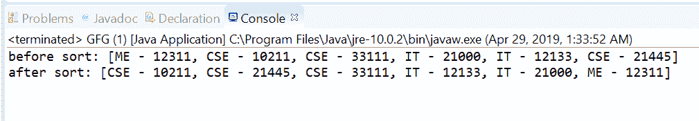
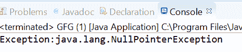

# 比较器然后用示例比较 Java 中的 Long()方法

> 原文:[https://www . geesforgeks . org/comparator-then comparing-long-method-in-Java-with-examples/](https://www.geeksforgeeks.org/comparator-thencomparinglong-method-in-java-with-examples/)

java 中的[比较器接口](https://www.geeksforgeeks.org/comparator-interface-java/)的**then comparising Long([Java . util . function . Tolongfunction](https://www.geeksforgeeks.org/tolongfunction-interface-in-java-with-examples/))**方法返回一个字典顺序比较器，该比较器带有一个提取 Long 排序关键字的函数。

**语法:**

```
default Comparator <T> thenComparingLong(
    ToLongFunction <T> keyExtractor)

```

**参数:**该方法接受**键提取器**，该函数用于提取长排序键。

**返回值:**这个方法返回一个字典顺序比较器，由这个和 Long 排序键组成。

**异常:**如果参数为空，此方法将引发 NullPointerException。

下面的程序说明了方法:
**程序 1:**

```
// Java program to demonstrate Comparator
// thenComparingLong(ToLongFunction) method

import java.util.Arrays;
import java.util.Collections;
import java.util.Comparator;
import java.util.List;

public class GFG {
    public static void main(String... args)
    {
        List<Users> list = createUsers();
        System.out.printf("before sort: %s%n", list);
        Collections.sort(list,
                         Comparator
                             .comparing(Users::getDepartment)
                             .thenComparingLong(Users::getId));
        System.out.printf("after sort: %s%n", list);
    }

    private static List<Users> createUsers()
    {
        return Arrays.asList(
            new Users(12311, "ME"),
            new Users(10211, "CSE"),
            new Users(33111, "CSE"),
            new Users(21000, "IT"),
            new Users(12133, "IT"),
            new Users(21445, "CSE"));
    }

    private static class Users {
        private long id;
        private String department;

        public Users(long id, String department)
        {
            this.id = id;
            this.department = department;
        }

        public long getId()
        {
            return id;
        }

        public void setId(long id)
        {
            this.id = id;
        }

        public String getDepartment()
        {
            return department;
        }

        public void setDepartment(String department)
        {
            this.department = department;
        }

        @Override
        public String toString()
        {
            return department + " - " + id;
        }
    }
}
```

打印在集成开发环境控制台上的输出如下所示。
**输出:**

*在示例中可以看到，首先排序是在部门智能上进行的，如果部门相同，则在 ID 智能上进行排序。*

**程序 2:**

```
// Java program to demonstrate Comparator
// thenComparingLong(ToLongFunction) method

import java.util.Arrays;
import java.util.Comparator;
import java.util.List;

public class GFG {
    public static void main(String... args)
    {

        List<String> list
            = Arrays.asList("KKR", "CSK",
                            "MI", "KXIP", "RCB",
                            "SRH", "DC", "RR");

        try {

            // apply thenComparingLong
            Comparator.comparing(list::get)
                .thenComparingLong(null);
        }
        catch (Exception e) {

            System.out.printf("Exception:" + e);
        }
    }
}
```

控制台上打印的输出如下所示。
**输出:**


**参考文献:**T2