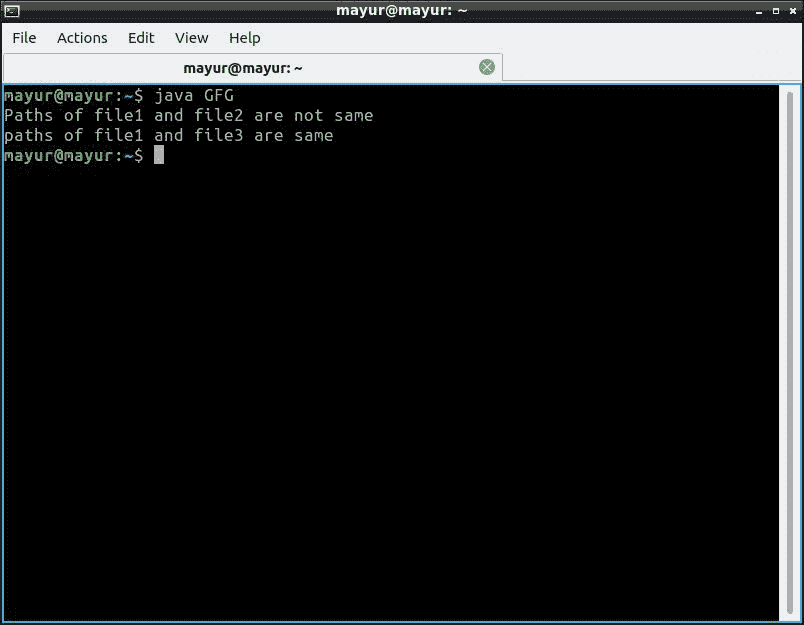

# 比较 Java 中两个文件的路径

> 原文:[https://www . geesforgeks . org/比较 java 中两个文件的路径/](https://www.geeksforgeeks.org/comparing-path-of-two-files-in-java/)

两个文件的路径可以使用 **java.io.file.compareTo()方法**在 Java 中进行字典式的比较。当程序正在请求另一个程序已经在使用的文件修改访问时，操作系统发出一个红色标志是很有用的。

为了比较文件的路径，使用了文件类的 compareTo()方法。compareTo() 方法按字典顺序比较两个抽象路径名。此方法定义的顺序取决于操作系统。

**参数:** 该方法需要一个参数，即要比较的抽象路径名。

**返回值:**如果参数等于该抽象路径名，则该方法返回 0；如果抽象路径名在字典序上小于参数，则返回负值；如果抽象路径名在字典序上大于参数，则返回大于 0 的值。

**示例:**

## Java 语言(一种计算机语言，尤用于创建网站)

```java
// Comparing path of two files in Java

import java.io.File;

public class GFG {

    public static void main(String[] args)
    {

        File file1 = new File("/home/mayur/GFG.java");
        File file2 = new File("/home/mayur/file.txt");
        File file3 = new File("/home/mayur/GFG.java");

        // Path comparision
        if (file1.compareTo(file2) == 0) {
            System.out.println(
                "paths of file1 and file2 are same");
        }
        else {
            System.out.println(
                "Paths of file1 and file2 are not same");
        }

        // Path comparision
        if (file1.compareTo(file3) == 0) {
            System.out.println(
                "paths of file1 and file3 are same");
        }
        else {
            System.out.println(
                "Paths of file1 and file3 are not same");
        }
    }
}
```

**输出:**

