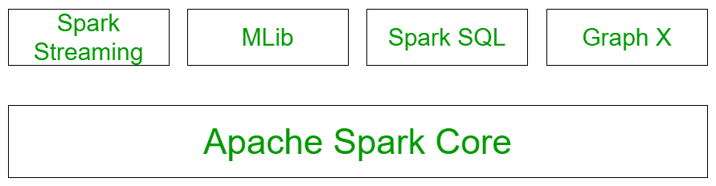

# 阿帕奇火花

组件

> 原文:[https://www.geeksforgeeks.org/components-of-apache-spark/](https://www.geeksforgeeks.org/components-of-apache-spark/)

**Spark** 是一个集群计算系统。与其他集群计算系统(如 Hadoop)相比，它更快。它提供了 Python、Scala 和 Java 中的高级 API。平行作业在 Spark 中很容易写。在本文中，我们将讨论 Apache Spark 的不同组件。

Spark 处理大量数据集，是当前最活跃的 Apache 项目。Spark 用 [Scala](https://www.geeksforgeeks.org/scala-programming-language/) 编写，提供 [Python](https://www.geeksforgeeks.org/python-programming-language/) 、 [Scala](https://www.geeksforgeeks.org/scala-programming-language/) 、 [Java](https://www.geeksforgeeks.org/java/) 、 [R](https://www.geeksforgeeks.org/introduction-to-r-programming-language/) 中的 [API](https://www.geeksforgeeks.org/rest-api-introduction/) 。Apache Spark 最重要的特性是其内存中的集群计算，它扩展了数据处理的速度。Spark 是一个额外的通用和更快的处理平台。它帮助我们运行程序的速度比 Hadoop(即)在内存上快一百倍，甚至在磁盘上也快十倍。火花的主要特点是:

1.  **多语言支持:** Apache Spark 支持多种语言；它提供用 Scala、Java、Python 或 r 编写的 API。它允许用户用几种语言编写应用程序。
2.  **速度快:**Apache Spark 最重要的特点是处理速度快。它允许应用程序在 T2 Hadoop 集群 T3 上运行，内存快 100 倍，磁盘快 10 倍。
3.  **随处运行:** Spark 将在多个平台上运行，同时不移动处理速度。它将在 Hadoop、Kubernetes、Mesos、Standalone 上运行，甚至在云中运行。
4.  **通用:**在 Spark Streaming 和 GraphX 端，它由用于[机器学习](https://www.geeksforgeeks.org/machine-learning/)(即) [MLlib](https://www.geeksforgeeks.org/pyspark-linear-regression-using-apache-mllib/) 、[数据帧](https://www.geeksforgeeks.org/python-pandas-dataframe/)和 [SQL](https://www.geeksforgeeks.org/sql-tutorial/) 的过多库提供动力。允许混合使用那些与应用程序相关联的库。同一应用程序中混合流、SQL 和复杂分析的特性使 Spark 成为一个通用框架。
5.  **高级分析:** Apache Spark 还支持前面提到的“地图”和“减少”。然而，在 MapReduce 方面，它支持流数据、SQL 查询、图形算法和机器学习。因此，Apache Spark 可用于执行高级分析。

<u>**星火组件:**</u>

上图说明了所有的火花组件。让我们详细了解每个组件:

1.  **Spark Core:**Apache Spark 提供的所有功能都建立在最高的 Spark Core 之上。它通过提供内存计算能力来提高速度。Spark Core 是巨型数据集[并行分布式处理](https://www.geeksforgeeks.org/difference-between-parallel-computing-and-distributed-computing/)的基础。它是基本输入/输出功能的主要支柱，对于编程和观察火花簇的作用非常重要。它包含与调度、分发和监控集群上的作业、任务调度、故障恢复相关的所有组件。该组件的功能有:
    1.  它包含了 spark 的基本功能。(任务调度、内存管理、故障恢复、与存储系统交互)。
    2.  定义关系数据库的应用编程接口之家。
2.  **Spark SQL 结构化数据:**Spark SQL 组件构建在 Spark 核心之上，用于提供对数据的结构化处理。它提供了对一系列数据源的标准访问。它包括 Hive、JSON 和 JDBC。它支持通过 SQL 或配置单元语言查询数据。这也适用于访问结构化和半结构化信息。它还跨流和历史数据提供强大的交互式分析应用程序。Spark SQL 可能是 Spark 中的一个新模块，它将相关流程与 spark 编程应用编程接口集成在一起。本模块的主要功能是:
    1.  这是一个用于处理结构化数据的 Spark 包。
    2.  它支持许多数据源，包括蜂巢平板电脑、拼花地板、json。
    3.  它允许开发人员将 SQK 与 python、scala 和 java 中 RDDs 支持的编程数据操作混合在一起。
3.  **火花流:**火花流允许实时知识流的可提升、高吞吐量、容错的流处理。Spark 可以从水槽、TCP 套接字等来源访问数据。它将运行不同的算法，接收文件系统、数据库和实时仪表板中的数据。Spark 使用微批处理进行实时流传输。微批处理是一种技术，它允许一种方法或一项任务将一个流视为一系列小批量的信息。因此，spark streaming 将实时数据分成小批量。它会将其传送到批处理系统进行处理。该模块的功能是:
    1.  支持处理实时数据流，如生产 web 服务生成的日志文件。
    2.  本模块中定义的应用编程接口与 spark core RDD 应用编程接口非常相似。
4.  **Mlib 机器学习:**spark 中的 MLlib 是一个可扩展的机器学习库，包含各种机器学习算法。MLlib 创建背后的动机是使机器学习的实现变得简单。它包含机器学习库和各种算法的实现。例如[聚类](https://www.geeksforgeeks.org/clustering-in-machine-learning/)、[回归](https://www.geeksforgeeks.org/types-of-regression-techniques/)、[分类](https://www.geeksforgeeks.org/ml-classification-vs-regression/)和[协同过滤](https://www.geeksforgeeks.org/collaborative-filtering-ml/)。
5.  **GraphX 图形处理:**是一个图形和图形并行执行的 API。我们在网络分析中存储数据。聚类、分类、遍历、搜索和寻路在图中也是可能的。它通常优化了我们在图中表示顶点和边的方式。GraphX 还优化了当顶点和边是基本数据类型时，我们如何表示它们。为了支持图形计算，它支持像子图、连接顶点和聚合消息这样的基本操作，以及 Pregel API 的优化变体。

**Apache Spark 的用途:**Spark 框架的主要应用有:

1.  系统生成的数据不够一致，无法混合进行分析。为了从系统中获取一致的信息，我们将使用提取、转换和加载等过程，这减少了时间和成本，因为它们在 spark 中非常有效地实现。
2.  很难处理日志文件等时间生成的数据。Spark 能够很好地处理信息流和重用操作。
3.  由于 spark 能够将信息存储在内存中，并可能快速运行连续查询，因此可以很容易地找出可用于特定类型数据的机器学习算法。