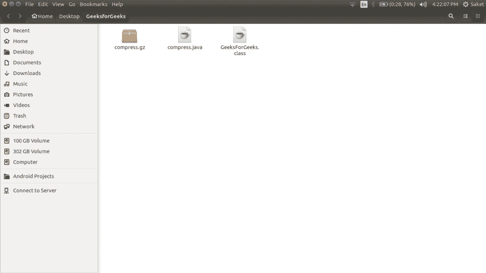
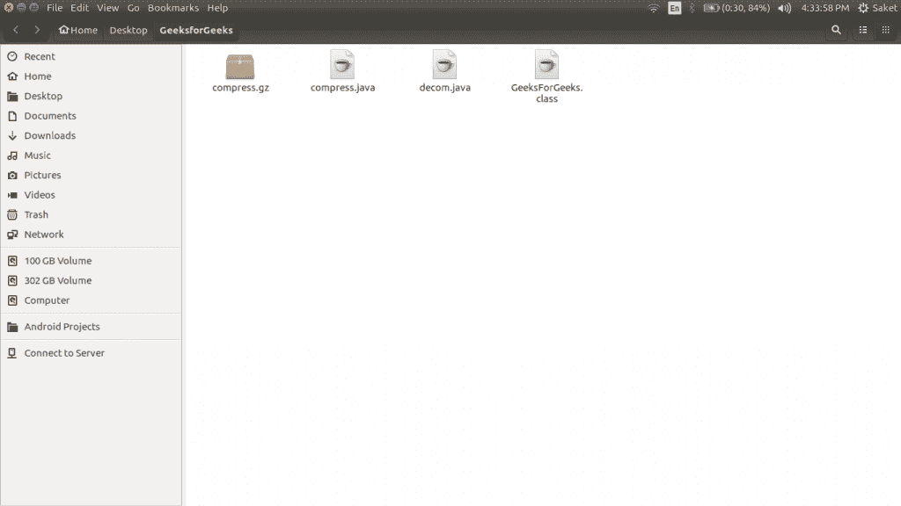
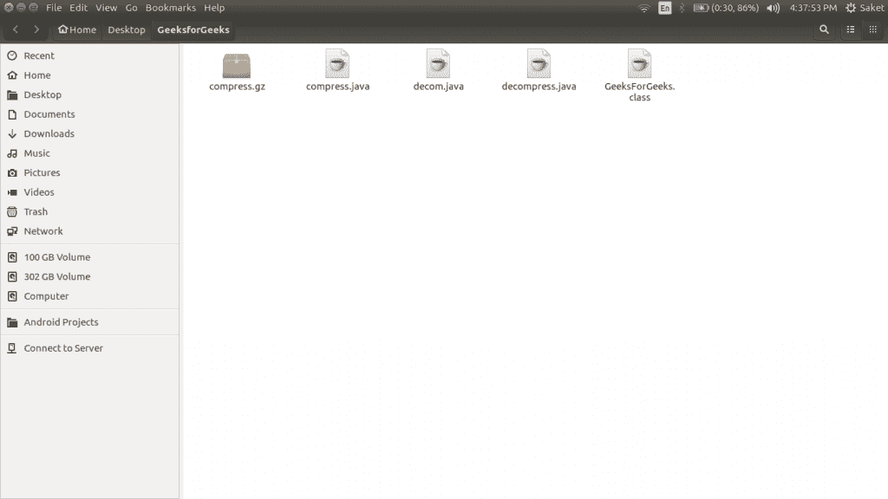

# 在 java 中使用 GZIP 格式压缩和解压缩文件

> 原文:[https://www . geesforgeks . org/compressing-解压-file-use-gzip-format-Java/](https://www.geeksforgeeks.org/compressing-decompressing-files-using-gzip-format-java/)

java.util.zip 包提供压缩和解压缩文件内容的类。Java 中提供了 FileInputStream、FileOutputStream 和 GZIPOutputStream 类来压缩和解压缩文件。

**使用 GZIPOutputStream 压缩文件**

**程序中使用的方法**

1.  **read():** 读取一个字节的数据。存在于文件输入流中。

    ```
    int read()
    ```

2.  **write():** 写入一个字节的数据，出现在文件输出流中。

    ```
    void write(int b) 
    ```

在这个例子中，我们有一个文本文件在**/home/saket/Desktop/GeeksforGeeks/compress . Java**驱动下的“geeks forgeeks”文件夹中，我们正在压缩和生成同一个文件夹中的 GZip 文件。
T3】

```
// Java program to compress a File
// using GZIPOutputStream class
import java.io.FileInputStream;
import java.io.FileOutputStream;
import java.io.IOException;
import java.util.zip.GZIPOutputStream;

public class GeeksForGeeks
{
    static final String OUTPUT_FILE
            = "/home/saket/Desktop/GeeksforGeeks/compress.gz";
    static final String INPUT_FILE
            = "/home/saket/Desktop//GeeksforGeeks/compress.java";

    static void compress()
    {
        byte[] buffer = new byte[1024];
        try
        {
            GZIPOutputStream os = 
                    new GZIPOutputStream(new FileOutputStream(OUTPUT_FILE));

            FileInputStream in =
                    new FileInputStream(INPUT_FILE);

            int totalSize;
            while((totalSize = in.read(buffer)) > 0 )
            {
                os.write(buffer, 0, totalSize);
            }

            in.close();
            os.finish();
            os.close();

            System.out.println("File Successfully compressed");
        }
        catch (IOException e)
        {
            e.printStackTrace();
        }

    }

    public static void main (String[] args)
    {
        compress();

    }
}
```

输出:

```
File Successfully compressed

```

**运行上述程序后，会压缩 compress.java 文件:**


**使用 GZIPOutputStream 解压缩文件**

```
// Java program to illustrate 
// Decompressing a File using GZIPOutputStream
import java.io.FileInputStream;
import java.io.FileOutputStream;
import java.io.IOException;
import java.util.zip.GZIPInputStream;

class GeeksForGeeks
{
    static final String INPUT_FILE 
            = "/home/saket/Desktop/GeeksforGeeks/compress.gz";
    static final String OUTPUT_FILE 
            = "/home/saket/Desktop//GeeksforGeeks/decompress.java";

    static void decompress()
    {
        byte[] buffer = new byte[1024];
        try
        {
            GZIPInputStream is = 
                    new GZIPInputStream(new FileInputStream(INPUT_FILE));

            FileOutputStream out =
                    new FileOutputStream(OUTPUT_FILE);

            int totalSize;
            while((totalSize = is.read(buffer)) > 0 )
            {
                out.write(buffer, 0, totalSize);
            }

            out.close();
            is.close();

            System.out.println("File Successfully decompressed");
        }
        catch (IOException e)
        {
            e.printStackTrace();
        }

    }

    public static void main (String[] args)
    {
        decompress();

    }
}
```

输出:

```
File Successfully decompressed

```

编译后的当前状态:



**注:**此处 decom.java 包含上述代码。
运行上述程序后，将解压 compress.gz，并创建一个名为**decompress.java**的文件。


本文由 **[Saket Kumar](https://www.facebook.com/saketkumar95)** 供稿。如果你喜欢 GeeksforGeeks 并想投稿，你也可以使用[contribute.geeksforgeeks.org](http://www.contribute.geeksforgeeks.org)写一篇文章或者把你的文章邮寄到 contribute@geeksforgeeks.org。看到你的文章出现在极客博客主页上，帮助其他极客。

如果你发现任何不正确的地方，或者你想分享更多关于上面讨论的话题的信息，请写评论。