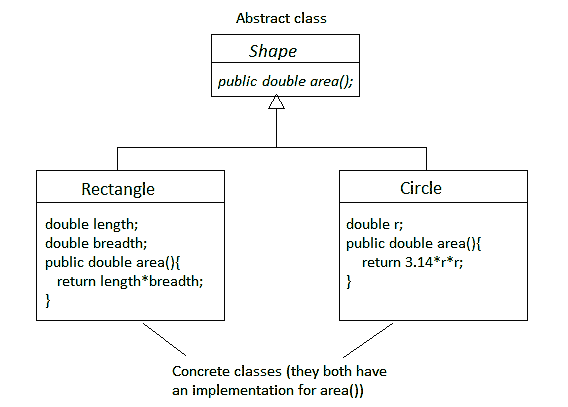

# Java 中的具体类

> 原文:[https://www.geeksforgeeks.org/concrete-class-in-java/](https://www.geeksforgeeks.org/concrete-class-in-java/)

一个**具体类**是一个对其所有方法都有实现的类。它们不能有任何未实现的方法。它也可以扩展一个[抽象类](https://www.geeksforgeeks.org/abstract-classes-in-java/)或者实现一个[接口](https://www.geeksforgeeks.org/interfaces-in-java/)，只要它实现了他们所有的方法。它是一个完整的类，可以被实例化。

换句话说，我们可以说任何不是抽象的类都是具体的类。

**具体类的必要条件:**每一个方法都要有实现。

**示例:**下图显示了形状、矩形和圆形三个类。形状是抽象的，而矩形和圆形是具体的，继承了形状。这是因为矩形和圆形实现了 area()方法。



**示例 1:** 下面的代码显示了一个简单的具体类:

```
// Java program to illustrate concrete class

// Concrete Class
class Main {

    // this method calculates
    // product of two numbers
    static int product(int a, int b)
    {
        return a * b;
    }

    // this method calculates
    // sum of two numbers
    static int sum(int a, int b)
    {
        return a + b;
    }

    // main method
    public static void main(String args[])
    {
        int p = product(5, 10);
        int s = sum(5, 10);

        // print product
        System.out.println("Product: " + p);

        // print sum
        System.out.println("Sum: " + s);
    }
}
```

**Output:**

```
Product: 50
Sum: 15

```

**示例 2:** 下面的代码说明了一个扩展抽象类的具体类。接口 X 中的方法 product()由类 Product 实现，但它不实现方法 sum()，因此它必须是抽象的。而类 Main 实现了未实现的方法 sum()，因此没有未实现的方法。因此，它是一个具体的类。

```
// Java program to illustrate concrete class

// This is an interface
interface X {
    int product(int a, int b);
    int sum(int a, int b);
}

// This is an abstract class
abstract class Product implements X {

    // this method calculates
    // product of two numbers
    public int product(int a, int b)
    {
        return a * b;
    }
}

// This is a concrete class that implements
class Main extends Product {

    // this method calculates
    // sum of two numbers
    public int sum(int a, int b)
    {
        return a + b;
    }

    // main method
    public static void main(String args[])
    {
        Main ob = new Main();
        int p = ob.product(5, 10);
        int s = ob.sum(5, 10);

        // print product
        System.out.println("Product: " + p);

        // print sum
        System.out.println("Sum: " + s);
    }
}
```

**Output:**

```
Product: 50
Sum: 15

```