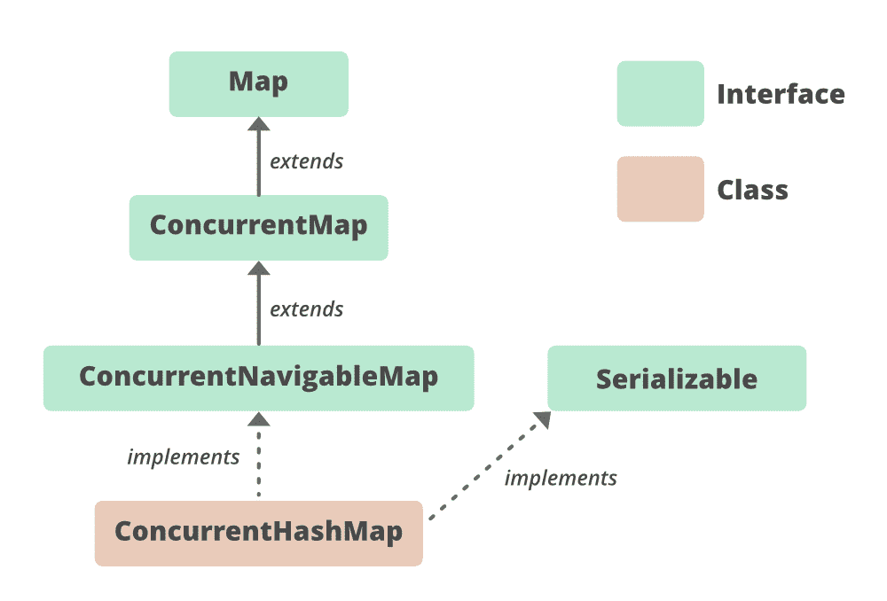

# Java 中的 ConcurrentHashMap

> 原文:[https://www.geeksforgeeks.org/concurrenthashmap-in-java/](https://www.geeksforgeeks.org/concurrenthashmap-in-java/)

**先决条件:** [同意地图](https://www.geeksforgeeks.org/concurrentmap-interface-java/)

在 JDK 1.5 中引入的 **ConcurrentHashMap** 类属于 **java.util.concurrent** 包，它实现了 ConcurrentMap，也实现了 Serializable 接口。ConcurrentHashMap 是 HashMap 的一个增强，因为我们知道在我们的应用程序中处理 Threads 的同时 HashMap 并不是一个好的选择，因为性能方面的 HashMap 并不达标。

**ConcurrentHashMap 的要点:**

*   ConcurrentHashMap 的下划线数据结构是[哈希表](https://www.geeksforgeeks.org/hashtable-in-java/)。
*   ConcurrentHashMap 类是线程安全的，即多个线程可以在单个对象上操作，没有任何复杂性。
*   任何时候，任何数量的线程都适用于读取操作，而不会锁定 HashMap 中不存在的 ConcurrentHashMap 对象。
*   在 ConcurrentHashMap 中，对象根据并发级别被分成多个段。
*   ConcurrentHashMap 的默认并发级别是 16。
*   在 ConcurrentHashMap 中，任何数量的线程都可以执行检索操作，但是要在对象中进行更新，线程必须锁定线程想要操作的特定段。这种锁定机构称为**分段锁定或铲斗锁定**。因此，一次可以由线程执行 16 个更新操作。
*   在 ConcurrentHashMap 中，不能将空对象作为键或值插入。

**申报:**

> 公共类 ConcurrentHashMap <k>扩展抽象映射<k>实现 ConcurrentMap <k>，Serializable</k></k></k>

这里 **K** 为关键对象类型， **V** 为值对象类型。

**并发哈希表的层次结构**



它实现了 **Serializable** 、 [ConcurrentMap < K、V>T3、](https://www.geeksforgeeks.org/concurrentmap-interface-java/) [Map < K、V>T5 接口，扩展了 **AbstractMap < K、V>T7】类。**](https://www.geeksforgeeks.org/map-interface-java-examples/)

**ConcurrentHashMap 的构造函数**

*   **并发级别:**是并发更新映射的线程数。该实现执行内部调整以尝试容纳这么多线程。
*   **负载系数:**这是一个阈值，用于控制调整大小。
*   **初始容量:**容纳最初由实现提供的一定数量的元素。如果这张地图的容量是 10。这意味着它可以存储 10 个条目。

**1。ConcurrentHashMap()** :创建一个新的空映射，默认初始容量(16)、负载系数(0.75)和 concurrencyLevel (16)。

> ConcurrentHashMap<k v="">CHM = new ConcurrentHashMap<>()；</k>

**2。ConcurrentHashMap(int initial capacity)**:使用指定的初始容量、默认负载系数(0.75)和并发级别(16)创建一个新的空映射。

> ConcurrentHashMap<k v="">CHM = new ConcurrentHashMap<>(int initial capacity)；</k>

**3。ConcurrentHashMap(int initial capacity，float loadFactor)** :使用指定的初始容量和加载因子以及默认的 concurrencyLevel (16)创建一个新的空映射。

> ConcurrentHashMap<k v="">CHM = new ConcurrentHashMap<>(int initial capacity，float load factor)；</k>

**4。**(int initial capacity，float loadFactor，int concurrencyLevel) :使用指定的初始容量、加载因子和并发级别创建一个新的空映射。

> ConcurrentHashMap<k v="">CHM = new ConcurrentHashMap<>(int initial capacity，float loadFactor，int concurrency level)；</k>

**5。ConcurrentHashMap(Map m)** :创建一个新的映射，其映射与给定的映射相同。

> ConcurrentHashMap<k v="">CHM = new ConcurrentHashMap<>(地图 m)；</k>

**示例:**

## Java 语言(一种计算机语言，尤用于创建网站)

```
// Java program to demonstrate working of ConcurrentHashMap

import java.util.concurrent.*;

class ConcurrentHashMapDemo {

    public static void main(String[] args)
    {
        // create an instance of
        // ConcurrentHashMap
        ConcurrentHashMap<Integer, String> m
            = new ConcurrentHashMap<>();

        // Insert mappings using
        // put method
        m.put(100, "Hello");
        m.put(101, "Geeks");
        m.put(102, "Geeks");

        // Here we cant add Hello because 101 key
        // is already present in ConcurrentHashMap object
        m.putIfAbsent(101, "Hello");

        // We can remove entry because 101 key
        // is associated with For value
        m.remove(101, "Geeks");

        // Now we can add Hello
        m.putIfAbsent(103, "Hello");

        // We cant replace Hello with For
        m.replace(101, "Hello", "For");
        System.out.println(m);
    }
}
```

**Output**

```
{100=Hello, 102=Geeks, 103=Hello}

```