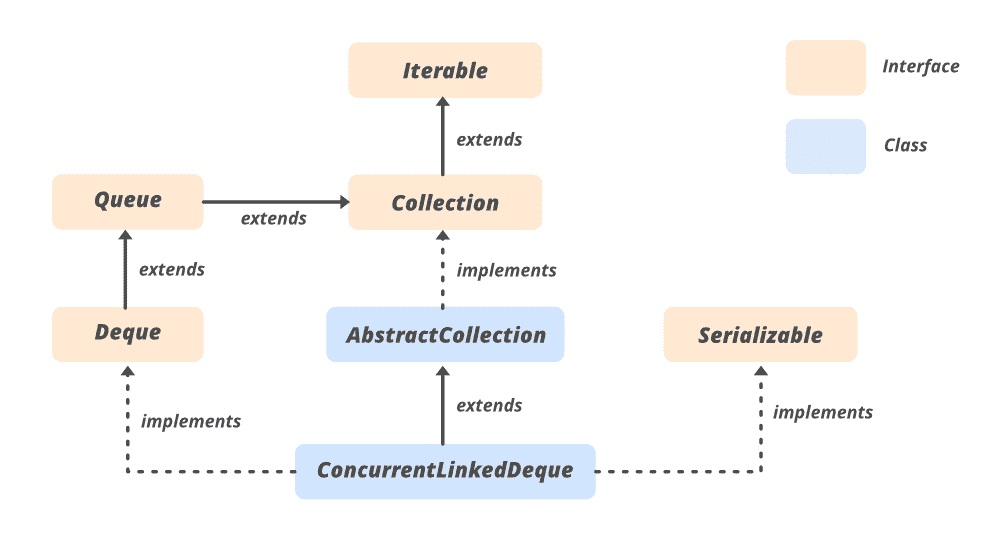

# Java 中的 ConcurrentLinkedDeque 附带示例

> 原文:[https://www . geeksforgeeks . org/concurrentlinkedeque-in-Java-with-examples/](https://www.geeksforgeeks.org/concurrentlinkeddeque-in-java-with-examples/)

Java 中的**concurrentlinkedeque**类是 [Java 集合框架](https://www.geeksforgeeks.org/collections-in-java-2/)的一部分，实现了*集合接口*和*抽象集合类*。属于 **java.util.concurrent** 包。用于同时借助[链接表](https://www.geeksforgeeks.org/linked-list-set-1-introduction/)实现[德清](https://www.geeksforgeeks.org/deque-set-1-introduction-applications/)。

**并发链接请求的特征**

*   迭代器和分割器弱一致。
*   并发的插入、移除和访问操作跨多个线程安全地执行。
*   它不允许空元素。
*   size()方法不是在恒定时间内实现的。由于这些元素的异步特性，确定当前的元素数量需要遍历这些元素。

**等级等级:**



**申报:**

```
public abstract class ConcurrentLinkedDeque<E>
   extends AbstractCollection<E>
      implements Deque<E>, Serializable

Here, E is the type of elements maintained by this collection.

```

它实现了 Serializable、Iterable <e>、Collection <e>、 [Deque < E >](https://www.geeksforgeeks.org/deque-interface-java-example/) 、 [Queue < E >](https://www.geeksforgeeks.org/queue-interface-java/) 接口。</e></e>

### ConcurrentLinkedDeque 的构造函数:

**1。concurrentlinkedeque()**:这个构造函数是用来构造一个空的 deque。

> concurrentlked deque<e>【荒漠化公约=新的 concurrentleddeque】<e>)；</e></e>

**2。concurrentlinkedeque(Collection)<E>c)**:这个构造函数用来构造一个 deque，集合的元素作为参数传递。

> concurrentlked deque<e>【荒漠化公约=新的 concurrentleddeque】<e>(集合<e>【c】；</e></e></e>

下面是用 Java 说明 ConcurrentLinkedDeque 的示例程序:

## Java 语言(一种计算机语言，尤用于创建网站)

```
// Java Program to demonstrate ConcurrentLinkedDeque

import java.util.concurrent.*;

class ConcurrentLinkedDequeDemo {

    public static void main(String[] args)
    {
        // Create a ConcurrentLinkedDeque
        // using ConcurrentLinkedDeque() 
        // constructor
        ConcurrentLinkedDeque<Integer>
            cld = new ConcurrentLinkedDeque<Integer>();

          // add element to the front
          // using addFirst() method
        cld.addFirst(12);
        cld.addFirst(70);
        cld.addFirst(1009);
        cld.addFirst(475);

        // Displaying the existing ConcurrentLinkedDeque
        System.out.println("ConcurrentLinkedDeque: "
                           + cld);

        // Create a ConcurrentLinkedDeque
        // using ConcurrentLinkedDeque(Collection c) 
        // constructor
        ConcurrentLinkedDeque<Integer>
            cld1 = new ConcurrentLinkedDeque<Integer>(cld);

        // Displaying the existing ConcurrentLinkedDeque
        System.out.println("ConcurrentLinkedDeque1: "
                           + cld1);
    }
}
```

**Output:** 

```
ConcurrentLinkedDeque: [475, 1009, 70, 12]
ConcurrentLinkedDeque1: [475, 1009, 70, 12]
```