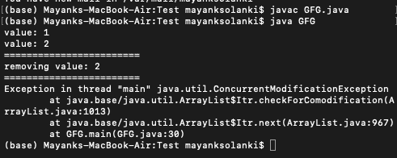
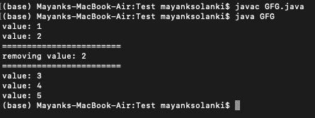

# 在 Java 中使用迭代器时的并发修改异常

> 原文:[https://www . geeksforgeeks . org/concurrentmodificationexception-while-use-iterator-in-Java/](https://www.geeksforgeeks.org/concurrentmodificationexception-while-using-iterator-in-java/)

**ConcurrentModificationException**由检测到不允许并发修改对象的方法引发。如果一个线程在用快速失败迭代器迭代集合时直接修改集合，迭代器将抛出这个**ConcurrentModificationException**。在这里，我们将通过一个例子来理解这个异常，这个例子说明了它为什么会发生，以及如何同时进行更改，这是这个异常的根本原因。在后面的部分，我们将了解如何修复它。

**例 1:** 并发编码异常

## Java 语言(一种计算机语言，尤用于创建网站)

```
// Java Program to ConcurrentModificationException while
// using Iterator

// Importing ArrayList and Iterator classes from java.util
// package
import java.util.ArrayList;
import java.util.Iterator;

// Main class
public class GFG {

    // Main driver method
    public static void main(String[] args)
    {
        // Creating an object of ArrayList class
        // Declaring object of Integer type
        ArrayList<Integer> list = new ArrayList<>();

        // Adding custom integer elements to the object
        list.add(1);
        list.add(2);
        list.add(3);
        list.add(4);
        list.add(5);

        // Iterating over object elements using iterator
        Iterator<Integer> iterator = list.iterator();

        // Condition check
        // It holds true till there is single element
        // remainin in the List
        while (iterator.hasNext()) {

            // Rolling over to next element using next()
            // method
            Integer value = iterator.next();

            // Print the element value
            System.out.println("value: " + value);

            // If element equals certain value
            if (value.equals(2)) {

                // Display command for better readability
                System.out.println(
                    "========================");

                // Removing entered value in object
                System.out.println("removing value: "
                                   + value);

                // Making changes simultaneously
                System.out.println(
                    "========================");
                list.remove(value);
            }
        }
    }
}
```

**输出:**



**输出说明:**

当迭代器迭代列表时调用***【next()***方法时，抛出 ConcurrentModificationException，我们同时在其中进行修改。现在为了避免这个异常，让我们讨论一下直接使用迭代器的方法，如下所示:

**示例 2:** 解决并发修改异常

## Java 语言(一种计算机语言，尤用于创建网站)

```
// Java Program to Avoid ConcurrentModificationException by
// directly using Iterator

// Importing ArrayList and Iterator classes
// from java.util package
import java.util.ArrayList;
import java.util.Iterator;

// Main class
public class Main {

    // Mai driver method
    public static void main(String[] args)
    {
        // Creating an ArrayList object of integer type
        ArrayList<Integer> list = new ArrayList<>();

        // Custom integer elements are added
        list.add(1);
        list.add(2);
        list.add(3);
        list.add(4);
        list.add(5);

        // Iterating directly over elements of object
        Iterator<Integer> iterator = list.iterator();

        // Condition check
        // It holds true till there is single element
        // remaining in the List using hasNext() method
        while (iterator.hasNext()) {

            // Rolling over elements using next() method
            Integer value = iterator.next();

            // print the values
            System.out.println("value: " + value);

            // If value equals certain integer element
            // entered Say it be 2
            if (value.equals(2)) {

                // Display command only
                System.out.println(
                    "========================");

                // Removing the entered value 
                System.out.println("removing value: "
                                   + value);

                // Display command only
                System.out.println(
                    "========================");

                // Removing current value in Collection
                // using remove() method 
                iterator.remove();
            }
        }
    }
}
```

**输出:**



**输出说明:**

不会引发 ConcurrentModificationException，因为 remove()方法不会导致 ConcurrentModificationException。