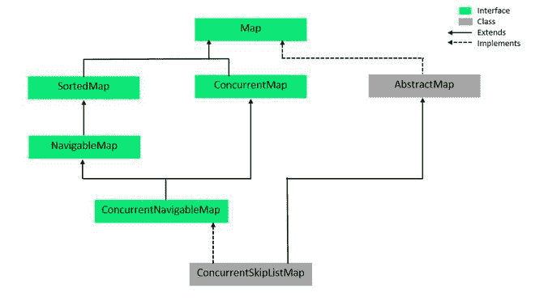

# Java 中的 ConcurrentNavigableMap 接口

> 原文:[https://www . geeksforgeeks . org/concurrentnaviglamblap-interface-in-Java/](https://www.geeksforgeeks.org/concurrentnavigablemap-interface-in-java/)

**ConcurrentNavigableMap** 接口是 [Java 集合框架](https://www.geeksforgeeks.org/collections-in-java-2/)的成员。它从[导航地图](https://www.geeksforgeeks.org/navigablemap-interface-in-java-with-example/)界面和[并发地图](https://www.geeksforgeeks.org/concurrentmap-interface-java/)界面扩展而来。ConcurrentNavigableMap 提供了对地图元素的线程安全访问，并提供了方便的导航方法。属于 **java.util.concurrent** 包。

**申报:**

```
public interface ConcurrentNavigableMap<K,V> extends ConcurrentMap<K,V>, NavigableMap<K,V>
```

这里 **K** 为关键对象类型， **V** 为值对象类型。

### 并发导航的层次结构



它实现了 [ConcurrentMap < K，V >](https://www.geeksforgeeks.org/concurrentmap-interface-java/) ， [Map < K，V >](https://www.geeksforgeeks.org/map-interface-java-examples/) ，[navigatablemap<K，V>T5，](https://www.geeksforgeeks.org/navigablemap-interface-in-java-with-example/#:~:text=NavigableMap%20is%20an%20extension%20of,than%20specified%20key%2C%20tailMap%20whose) [SortedMap < K，V>T7】接口。 **ConcurrentSkipListMap** 实现了 ConcurrentNavigableMap。](https://www.geeksforgeeks.org/sortedmap-java-examples/)

### 示例:

## Java 语言(一种计算机语言，尤用于创建网站)

```
// Java Program to demonstrate the
// ConcurrentNavigableMap Interface
import java.util.concurrent.ConcurrentNavigableMap;
import java.util.concurrent.ConcurrentSkipListMap;

public class GFG {

    public static void main(String[] args)
    {

        // Instantiate an object
        // Since ConcurrentNavigableMap
        // is an interface so We use
        // ConcurrentSkipListMap
        ConcurrentNavigableMap<Integer, String> cnmap
            = new ConcurrentSkipListMap<Integer, String>();

        // Add elements using put() method
        cnmap.put(1, "First");
        cnmap.put(2, "Second");
        cnmap.put(3, "Third");
        cnmap.put(4, "Fourth");

        // Print the contents on the console
        System.out.println(
            "Mappings of ConcurrentNavigableMap : "
            + cnmap);

        System.out.println("HeadMap(3): "
                           + cnmap.headMap(3));
        System.out.println("TailMap(3): "
                           + cnmap.tailMap(3));
        System.out.println("SubMap(1, 3): "
                           + cnmap.subMap(1, 3));
    }
}
```

**输出:**

```
Mappings of ConcurrentNavigableMap : {1=First, 2=Second, 3=Third, 4=Fourth}
HeadMap(3): {1=First, 2=Second}
TailMap(3): {3=Third, 4=Fourth}
SubMap(1, 3): {1=First, 2=Second}
```

### 实现类

ConcurrentNavigableMap 有一个实现类 ***ConcurrentSkipListMap 类*** 。ConcurrentSkipListMap 是 ConcurrentNavigableMap 接口的可扩展实现。ConcurrentSkipListMap 中的键是按照自然顺序排序的，或者是在构建对象时使用[比较器](https://www.geeksforgeeks.org/comparator-interface-java/)排序的。ConcurrentSkipListMap 具有用于插入、删除和搜索操作的**日志(n)** 的预期时间成本。它是一个线程安全的类，因此，所有的基本操作都可以同时完成。

**语法:**

```
ConcurrentSkipListMap< ? , ? > objectName = new ConcurrentSkipListMap< ? , ? >();
```

***示例*** :在下面给出的代码中，我们简单地实例化了名为 cslmap 的 ConcurrentSkipListMap 类的一个对象。put()方法用于添加元素，remove()用于删除元素。对于 remove()方法，语法是*对象名. remove(对象键)*。keySet()显示了映射中的所有键(上面给出的方法表中的描述)。

## Java 语言(一种计算机语言，尤用于创建网站)

```
// Java Program to demonstrate the ConcurrentSkipListMap
import java.util.concurrent.*;

public class ConcurrentSkipListMapExample {

    public static void main(String[] args)
    {

        // Instantiate an object of
        // ConcurrentSkipListMap named cslmap
        ConcurrentSkipListMap<Integer, String> cslmap
            = new ConcurrentSkipListMap<Integer, String>();

        // Add elements using put()
        cslmap.put(1, "Geeks");
        cslmap.put(2, "For");
        cslmap.put(3, "Geeks");

        // Print the contents on the console
        System.out.println(
            "The ConcurrentSkipListMap contains: "
            + cslmap);

        // Print the key set using keySet()
        System.out.println(
            "\nThe ConcurrentSkipListMap key set: "
            + cslmap.keySet());

        // Remove elements using remove()
        cslmap.remove(3);

        // Print the contents on the console
        System.out.println(
            "\nThe ConcurrentSkipListMap contains: "
            + cslmap);
    }
}
```

**输出:**

```
The ConcurrentSkipListMap contains: {1=Geeks, 2=For, 3=Geeks}

The ConcurrentSkipListMap key set: [1, 2, 3]

The ConcurrentSkipListMap contains: {1=Geeks, 2=For}
```

### 并发导航上的基本操作

#### 1.添加元素

要向并发导航地图添加元素，我们可以使用地图界面的任何方法。下面的代码展示了如何使用它们。您可以在代码中观察到，当在构建时没有提供比较器时，遵循自然顺序。

## Java 语言(一种计算机语言，尤用于创建网站)

```
// Java Program for adding elements to a
// ConcurrentNavigableMap
import java.util.concurrent.*;

public class AddingElementsExample {

    public static void main(String[] args)
    {

        // Instantiate an object
        // Since ConcurrentNavigableMap is an interface
        // We use ConcurrentSkipListMap
        ConcurrentNavigableMap<Integer, String> cnmap
            = new ConcurrentSkipListMap<Integer, String>();

        // Add elements using put()
        cnmap.put(8, "Third");
        cnmap.put(6, "Second");
        cnmap.put(3, "First");

        // Print the contents on the console
        System.out.println(
            "Mappings of ConcurrentNavigableMap : "
            + cnmap);
    }
}
```

**输出:**

```
Mappings of ConcurrentNavigableMap : {3=First, 6=Second, 8=Third}
```

#### 2.移除元素

为了移除元素，我们还使用了地图接口的方法，因为 ConcurrentNavigableMap 是地图的一个后代。

## Java 语言(一种计算机语言，尤用于创建网站)

```
// Java Program for deleting
// elements from ConcurrentNavigableMap

import java.util.concurrent.*;

public class RemovingElementsExample {

    public static void main(String[] args)
    {

        // Instantiate an object
        // Since ConcurrentNavigableMap
        // is an interface
        // We use ConcurrentSkipListMap
        ConcurrentNavigableMap<Integer, String> cnmap
            = new ConcurrentSkipListMap<Integer, String>();

        // Add elements using put()
        cnmap.put(8, "Third");
        cnmap.put(6, "Second");
        cnmap.put(3, "First");
        cnmap.put(11, "Fourth");

        // Print the contents on the console
        System.out.println(
            "Mappings of ConcurrentNavigableMap : "
            + cnmap);

        // Remove elements using remove()
        cnmap.remove(6);
        cnmap.remove(8);

        // Print the contents on the console
        System.out.println(
            "\nConcurrentNavigableMap, after remove operation : "
            + cnmap);

        // Clear the entire map using clear()
        cnmap.clear();
        System.out.println(
            "\nConcurrentNavigableMap, after clear operation : "
            + cnmap);
    }
}
```

**输出:**

```
Mappings of ConcurrentNavigableMap : {3=First, 6=Second, 8=Third, 11=Fourth}

ConcurrentNavigableMap, after remove operation : {3=First, 11=Fourth}

ConcurrentNavigableMap, after clear operation : {}
```

#### 3.访问元素

我们可以使用 get()方法访问 ConcurrentNavigableMap 的元素，下面给出了这个例子。

## Java 语言(一种计算机语言，尤用于创建网站)

```
// Java Program for accessing
// elements in a ConcurrentNavigableMap

import java.util.concurrent.*;

public class AccessingElementsExample {

    public static void main(String[] args)
    {
        // Instantiate an object
        // Since ConcurrentNavigableMap is an interface
        // We use ConcurrentSkipListMap
        ConcurrentNavigableMap<Integer, String> cnmap
            = new ConcurrentSkipListMap<Integer, String>();

        // Add elements using put()
        cnmap.put(8, "Third");
        cnmap.put(6, "Second");
        cnmap.put(3, "First");
        cnmap.put(11, "Fourth");

        // Accessing the elements using get()
        // with key as a parameter
        System.out.println(cnmap.get(3));
        System.out.println(cnmap.get(6));
        System.out.println(cnmap.get(8));
        System.out.println(cnmap.get(11));

        // Display the set of keys using keySet()
        System.out.println(
            "\nThe ConcurrentNavigableMap key set: "
            + cnmap.keySet());
    }
}
```

**输出:**

```
First
Second
Third
Fourth

The ConcurrentNavigableMap key set: [3, 6, 8, 11]
```

#### 4.横越

我们可以使用迭代器接口遍历集合框架的任何结构。因为迭代器处理我们使用的一种类型的数据。条目< ? , ? >将两个独立的类型解析为兼容的格式。然后使用 next()方法打印 ConcurrentNavigableMap 的元素。

## Java 语言(一种计算机语言，尤用于创建网站)

```
// Java Program for traversing a ConcurrentNavigableMap

import java.util.concurrent.*;
import java.util.*;

public class TraversalExample {

    public static void main(String[] args)
    {

        // Instantiate an object
        // Since ConcurrentNavigableMap is an interface
        // We use ConcurrentSkipListMap
        ConcurrentNavigableMap<Integer, String> cnmap
            = new ConcurrentSkipListMap<Integer, String>();

        // Add elements using put()
        cnmap.put(8, "Third");
        cnmap.put(6, "Second");
        cnmap.put(3, "First");
        cnmap.put(11, "Fourth");

        // Create an Iterator over the
        // ConcurrentNavigableMap
        Iterator<ConcurrentNavigableMap
                     .Entry<Integer, String> > itr
            = cnmap.entrySet().iterator();

        // The hasNext() method is used to check if there is
        // a next element The next() method is used to
        // retrieve the next element
        while (itr.hasNext()) {
            ConcurrentNavigableMap
                .Entry<Integer, String> entry
                = itr.next();
            System.out.println("Key = " + entry.getKey()
                               + ", Value = "
                               + entry.getValue());
        }
    }
}
```

**输出:**

```
Key = 3, Value = First
Key = 6, Value = Second
Key = 8, Value = Third
Key = 11, Value = Fourth
```

**注意:**每次我们说‘concurrentnaviglamblemap 的元素’时，必须注意的是，这些元素实际上存储在 concurrentnaviglamblemap 的实现类的对象中，在本例中是 ConcurrentSkipListMap。

### 并发导航的方法

ConcurrentNavigableMap 继承了 [Map](https://www.geeksforgeeks.org/map-interface-java-examples/) 接口、 [SortedMap](https://www.geeksforgeeks.org/sortedmap-java-examples/) 接口、 [ConcurrentMap](https://www.geeksforgeeks.org/concurrentmap-interface-java/) 接口、 [NavigableMap](https://www.geeksforgeeks.org/navigablemap-interface-in-java-with-example/) 接口的方法。父接口给出了添加元素、移除元素和遍历的基本方法。下表给出了 ConcurrentNavigableMap 的方法。在这里，

*   **K**–地图中按键的类型。
*   **V**–映射图中映射的值的类型。

<figure class="table">

| 

**方法**

 | 

**描述**

 |
| --- | --- |
| 下行键集() | 返回地图中包含的键的反向导航集合视图。 |
| 下行映射() | 返回映射中映射的逆序视图。 |
| 热图 | 返回地图中键小于 toKey 的部分的视图。 |
| 热图 | 返回地图中键小于 toKey 的部分的视图，如果包含为真，则等于 toKey。 |
| 密钥集() | 返回此地图中包含的键的导航集合视图。 |
| navigableKeySet() | 返回此地图中包含的键的导航集合视图。 |
| 子映射(从键，从包含，从包含，从包含，从包含) | 返回地图部分的视图，键的范围从“关键点”到“关键点”。 |
| 子密钥 | 返回地图部分的视图，键的范围从“包含”到“不包含”。 |
| 大小映射(K fromKey) | 返回其中键大于 fromKey 的地图视图。 |
| 大小映射(K fromKey，包括布尔型) | 返回地图视图，其中的键大于“从键”，如果“包含”为真，则等于。 |

</figure>

### 接口 Java . util . concurrent map 中声明的方法

<figure class="table">

| 

方法

 | 

描述

 |
| --- | --- |
| 计算(K 键，双功能​?超级 V，？扩展 V > remappingFunction) | 尝试计算指定键及其当前映射值的映射(如果没有当前映射，则为空)。 |
| 计算不存在(K 键，函数？扩展 V >映射函数) | 如果指定的键尚未与值关联(或映射为空)，会尝试计算其值使用给定的映射函数并将其输入到该映射中，除非为 null。 |
| computeIfPresent (K 键，双功能超级 V，？扩展 V > remappingFunction)

 | 如果指定键的值存在且不为空，将尝试计算给定键及其当前映射值的新映射。 |
| forEach(双消费者〔t0〕行动) | 对此映射中的每个条目执行给定的操作，直到所有条目都已处理完毕或该操作引发异常。 |
| getOrDefault（Object key， V defaultValue） | 返回指定键映射到的值，如果此映射不包含键映射，则返回默认值。 |
| 合并(K 键，V 值，双功能,​?超级 V，？扩展 V > remappingFunction) | 如果指定的键尚未与值相关联或与 null 相关联，则将其与给定的非 null 值相关联。 |
| 莆田(K key，V value) | 如果指定的键尚未与值相关联，则将它与给定值相关联。 |
| 移除(对象键，对象值) | 仅当当前映射到给定值时，才移除项。 |
| 更换(K 键，V 值) | 仅当当前映射到某个值时，才替换项。 |
| 更换(K 键、旧值、新值) | 仅当当前映射到给定值时，替换项。 |
| replaceAll (BiFunction,​?扩展 V >功能) | 将每个条目的值替换为对该条目调用给定函数的结果，直到所有条目都已处理完毕或函数引发异常。 |

</figure>

### 接口 java.util.Map 中声明的方法

<figure class="table">

| 

方法

 | 

描述

 |
| --- | --- |
| [晴()](https://www.geeksforgeeks.org/map-clear-method-in-java-with-example/) | 从此映射中移除所有映射(可选操作)。 |
| 包含密钥(对象密钥) | 如果此映射包含指定键的映射，则返回 true。 |
| [包含值(对象值)](https://www.geeksforgeeks.org/map-containsvalue-method-in-java-with-examples/) | 如果此映射将一个或多个键映射到指定值，则返回 true。 |
| [等于(对象 o)](https://www.geeksforgeeks.org/map-equals-method-in-java-with-examples/) | 将指定的对象与此映射进行比较，看是否相等。 |
| 获取(对象键) | 返回指定键映射到的值，如果此映射不包含键映射，则返回 null。 |
| [hashCode()](https://www.geeksforgeeks.org/map-hashcode-method-in-java-with-examples/) | 返回此映射的哈希代码值。 |
| [【isempty()](https://www.geeksforgeeks.org/map-isempty-method-in-java-with-examples/) | 如果此映射不包含键值映射，则返回 true。 |
| [放(K 键，V 值)](https://www.geeksforgeeks.org/map-put-method-in-java-with-examples/) | 将指定值与此映射中的指定键相关联(可选操作)。 |
| [普塔尔(地图<？延伸 K，？延伸 V > m)](https://www.geeksforgeeks.org/map-putall-method-in-java-with-examples/) | 将所有映射从指定映射复制到此映射(可选操作)。 |
| [移除(对象键)](https://www.geeksforgeeks.org/map-remove-method-in-java-with-examples/) | 从该映射中删除键的映射(如果存在)(可选操作)。 |
| 大小() | 返回此映射中键值映射的数量。 |

</figure>

### 在接口 Java . util . navigliblemap 中声明的方法

<figure class="table">

| 

方法

 | 

描述

 |
| --- | --- |
| [ceilingEntry (K 键)](https://www.geeksforgeeks.org/navigablemap-ceilingentry-method-in-java/#:~:text=The%20cielingEntry()%20method%20of,is%20no%20such%20key%20exists.) | 返回与大于或等于给定键的最小键相关联的键值映射，如果没有这样的键，则返回 null。 |
| [ceilingKey (K 键)](https://www.geeksforgeeks.org/navigablemap-ceilingkey-method-in-java/) | 返回大于或等于给定键的最小键，如果没有这样的键，则返回 null。 |
| [firstEntry()](https://www.geeksforgeeks.org/navigablemap-firstentry-method-in-java/) | 返回与此映射中最小键相关联的键值映射，如果映射为空，则返回 null。 |
| [洪水(k 键)](https://www.geeksforgeeks.org/navigablemap-floorentry-method-in-java/) | 返回与小于或等于给定键的最大键相关联的键值映射，如果没有这样的键，则返回 null。 |
| [地板键(K 键)](https://www.geeksforgeeks.org/navigablemap-floorkey-method-in-java/) | 返回小于或等于给定键的最大键，如果没有这样的键，则返回 null。 |
| [【k 键】](https://www.geeksforgeeks.org/navigablemap-higherentry-method-in-java/) | 返回与严格大于给定键的最小键相关联的键值映射，如果没有这样的键，则返回 null。 |
| [高电平(K 键)](https://www.geeksforgeeks.org/navigablemap-higherkey-method-in-java/) | 返回严格大于给定键的最小键，如果没有这样的键，则返回 null。 |
| 负荷试验() | 返回与此映射中最大键相关联的键值映射，如果映射为空，则返回 null。 |
| [低租金(k 键)](https://www.geeksforgeeks.org/navigablemap-lowerentry-method-in-java/) | 返回与严格小于给定键的最大键相关联的键值映射，如果没有这样的键，则返回 null。 |
| [降下钥匙(K 键)](https://www.geeksforgeeks.org/navigablemap-lowerkey-method-in-java/) | 返回严格小于给定键的最大键，如果没有这样的键，则返回 null。 |
| [pollFirstEntry()](https://www.geeksforgeeks.org/navigablemap-pollfirstentry-method-in-java/) | 移除并返回与此映射中最小键关联的键值映射，如果映射为空，则返回 null。 |
| [花粉试验()](https://www.geeksforgeeks.org/navigablemap-polllastentry-method-in-java/) | 移除并返回与此映射中最大键关联的键值映射，如果映射为空，则返回 null。 |

</figure>

### 在接口 java.util.SortedMap 中声明的方法

<figure class="table">

| 

方法

 | 

描述

 |
| --- | --- |
| [比较器()](https://www.geeksforgeeks.org/sortedmap-comparator-method-in-java-with-examples/) | 返回用于对该映射中的键进行排序的比较器，如果该映射使用其键的自然排序，则返回 null。 |
| [输入 ySet()](https://www.geeksforgeeks.org/sortedmap-entryset-method-in-java-with-examples/) | 返回此映射中包含的映射的集合视图。 |
| [firstKey()](https://www.geeksforgeeks.org/sortedmap-firstkey-method-in-java/) | 返回当前地图中的第一个(最低的)键。 |
| [负载力()](https://www.geeksforgeeks.org/sortedmap-lastkey-method-in-java/) | 返回当前地图中的最后一个(最高的)键。 |
| [值()](https://www.geeksforgeeks.org/sortedmap-values-method-in-java-with-examples/) | 返回此地图中包含的值的集合视图。 |

</figure>