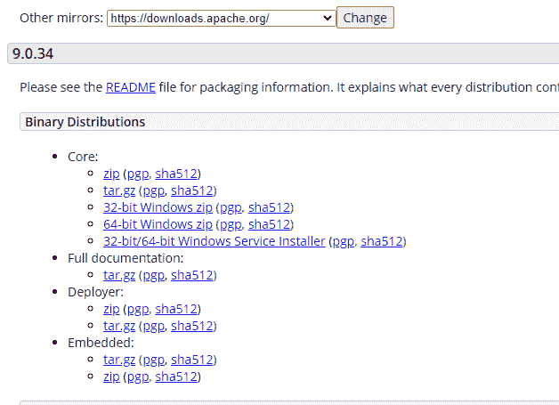
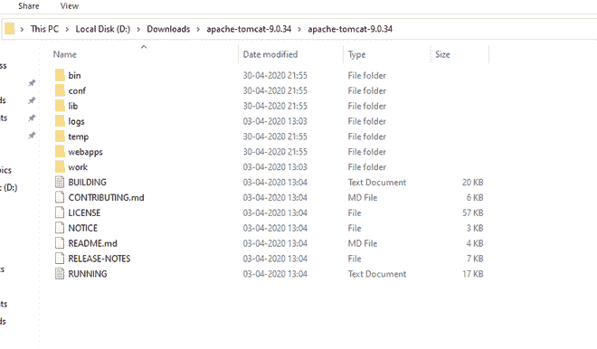
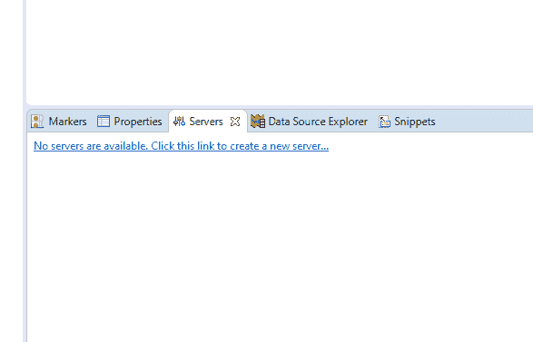
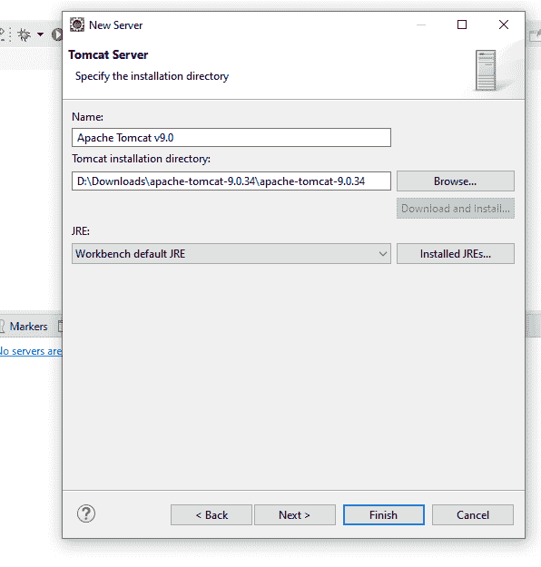
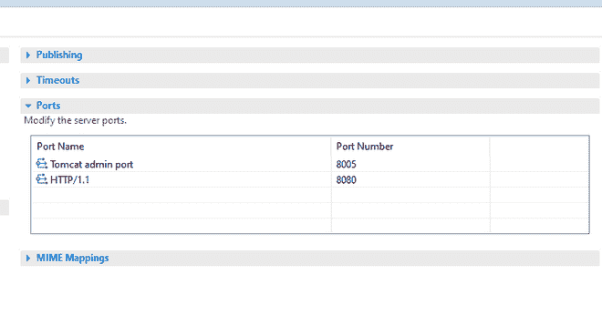
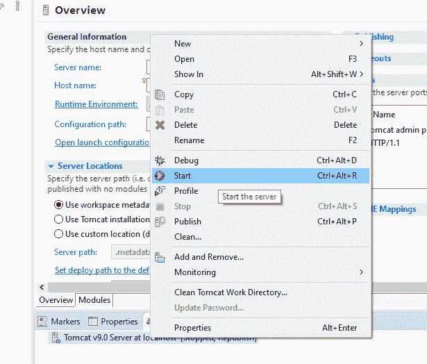
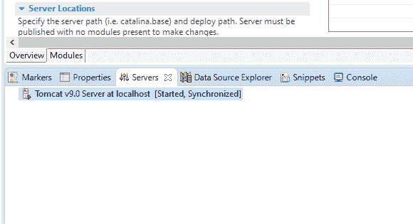

# 用 Eclipse IDE 配置 Apache Tomcat 服务器

> 原文:[https://www . geeksforgeeks . org/configuration-of-Apache-Tomcat-server-with-eclipse-ide/](https://www.geeksforgeeks.org/configuration-of-apache-tomcat-server-with-eclipse-ide/)

在本文中，我们将讨论在 [Eclipse IDE](https://www.geeksforgeeks.org/what-will-be-the-best-java-ides-in-2020/) 中设置 [Apache Tomcat 服务器](https://www.geeksforgeeks.org/difference-between-apache-tomcat-server-and-apache-web-server/)的分步指南。

**Eclipse IDE:** Eclipse 是一个开源的集成开发环境，流行于 Java 应用程序开发(Java SE 和 Java EE)和 Android 应用程序。它还通过可扩展插件支持 C/C++、PHP、Python、Perl 和其他网络项目开发。
**Tomcat Server:** Tomcat 是最好的 web 服务器之一，也是 Apache 软件基金会(ASF)开发的开源 Jave Servlet 容器，很多开发人员在项目工作中都会用到它。它升华到如此大的程度仅仅是因为它的经典性和速度，并且实现了主要包括 servlets、JSP 和表达式语言的 J2EE 规范。有了这些重要功能，Tomcat 服务器仍然是市场上最好的网络服务器之一。

**注意:**使用[**这个链接**](https://www.eclipse.org/downloads/packages/release/2020-03/r/eclipse-ide-enterprise-java-developers-includes-incubating-components) 下载最新版本的 eclipse IDE，并且还要配置 java 环境。

默认情况下，当下载 Eclipse IDE 时，它不会附带安装的 Tomcat。让我们回顾一下在 Eclipse 环境中配置 Apache Tomcat 的所有详细步骤。
**第一步:**根据你的平台从[这个链接](https://tomcat.apache.org/download-90.cgi)下载最新版本的 apache tomcat 服务器(9.0.34)。

**步骤 2:** 从 zip 文件夹中提取文件。文件夹的结构应该如下:

**第三步:**打开 Eclipse Java EE(企业版)环境。点击底部的*服务器*标签。点击*没有服务器可用。单击此处创建服务器。*

**第四步:**出现对话框。选择 *Tomcat 9.0 服务器*文件夹。点击*下一步。*

**第五步:**浏览至 *Apache Tomcat 9.0* 文件夹选择。点击*完成。*

**第 6 步:**
您应该会在*服务器*选项卡下的【本地主机【已停止，重新发布】看到 *Tomcat v9.0 服务器。双击它并验证 HTTP 端口。默认情况下，HTTP/1.1 端口为 8080。如果有任何应用程序在默认端口 8080 上运行，请将其更改为任何其他端口。
*

**第 7 步:**现在右键点击服务器，点击*开始。*

**第 8 步:**服务器将被启动，并在本地主机【已启动，已同步】显示如下 *Tomcat v9.0 服务器。*

以下服务器运行在本地主机上的[端口 8080，我们可以使用网址*http://本地主机:8080/* 访问该网页](https://www.geeksforgeeks.org/what-is-local-host/)