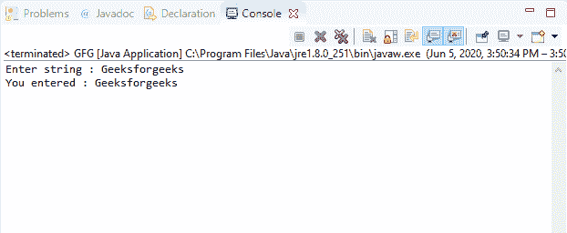

# Java 中的控制台刷新()方法，示例

> 原文:[https://www . geesforgeks . org/console-flush-in-Java-method-with-examples/](https://www.geeksforgeeks.org/console-flush-method-in-java-with-examples/)

Java 中 **Console** 类的 **flush()** 方法用于刷新控制台，并强制立即写入任何缓冲输出。

**语法:**

```
public void flush()

```

**指定者:**该方法由**可冲**界面的冲()方法指定。

**参数:**此方法不接受任何参数。

**返回值:**此方法不返回值。

**异常:**这个方法不抛出任何异常。

**注意:** System.console()在联机 IDE 中返回 null。

以下程序说明了 IO 包中控制台类的 flush()方法:

**程序 1:**

```
// Java program to illustrate
// Console flush() method

import java.io.*;

public class GFG {
    public static void main(String[] args)
    {
        // Create the console object
        Console cnsl
            = System.console();

        if (cnsl == null) {
            System.out.println(
                "No console available");
            return;
        }
        String str = cnsl.readLine(
            "Enter string : ");

        System.out.println(
            "You entered : " + str);

        // Revoke flush() method
        cnsl.flush();
    }
}
```

**Output:**

**程序 2:**

```
// Java program to illustrate
// Console flush() method

import java.io.*;

public class GFG {
    public static void main(String[] args)
    {
        // Create the console object
        Console cnsl
            = System.console();

        if (cnsl == null) {
            System.out.println(
                "No console available");
            return;
        }
        String str = cnsl.readLine(
            "Enter string : ");

        System.out.println(
            "You entered : " + str);

        // Revoke flush() method
        cnsl.flush();
    }
}
```

**Output:**

**参考文献:**
[https://docs . Oracle . com/javase/10/docs/API/Java/io/console . html # flush()](https://docs.oracle.com/javase/10/docs/api/java/io/Console.html#flush())