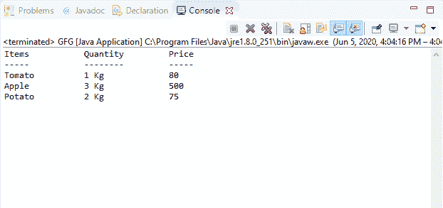

# Java 中控制台格式(字符串、对象)方法，示例

> 原文:[https://www . geesforgeks . org/console-format string-object-method-in-Java-with-examples/](https://www.geeksforgeeks.org/console-formatstring-object-method-in-java-with-examples/)

Java 中**控制台**类的**格式(字符串，对象)**方法用于将格式化的字符串写入控制台的输出流。它使用指定的格式字符串和参数。

**语法:**

```java
public Console format(String fmt,
                      Object... args)

```

**参数:**该方法接受两个参数:

*   **fmt**–表示字符串的格式。
*   **参数**–表示字符串格式中格式说明符引用的参数。

**返回值:**此方法返回控制台。

**异常:**如果字符串格式包含非法语法，或者格式说明符与给定参数不兼容，或者给定格式字符串的参数不足，或者其他条件非法，则此方法抛出 **IllegalFormatException** 。

**注意:** System.console()在联机 IDE 中返回 null。

以下程序说明了输入输出包中控制台类的格式(字符串、对象)方法:

**程序 1:**

```java
// Java program to illustrate
// Console format(String, Object) method

import java.io.*;

public class GFG {
    public static void main(String[] args)
    {
        // Create the console object
        Console cnsl
            = System.console();

        if (cnsl == null) {
            System.out.println(
                "No console available");
            return;
        }

        String fmt = "%1$4s %2$10s %3$10s%n";

        cnsl.format(fmt, "Books", "Author", "Price");
        cnsl.format(fmt, "-----", "------", "-----");
        cnsl.format(fmt, "DBMS", "Navathe", "800");
        cnsl.format(fmt, "Algorithm", "Cormen", "925");
        cnsl.format(fmt, "Operating System", "Rajib Mall", "750");
    }
}
```

**Output:**

**程序 2:**

```java
// Java program to illustrate
// Console format(String, Object) method

import java.io.*;

public class GFG {
    public static void main(String[] args)
    {
        // Create the console object
        Console cnsl
            = System.console();

        if (cnsl == null) {
            System.out.println(
                "No console available");
            return;
        }

        String fmt = "%1$4s %2$10s %3$10s%n";

        cnsl.format(fmt, "Items", "Quantity", "Price");
        cnsl.format(fmt, "-----", "------", "-----");
        cnsl.format(fmt, "Tomato", "1 Kg", "80");
        cnsl.format(fmt, "Apple", "3 Kg", "500");
        cnsl.format(fmt, "Potato", "2 Kg", "75");
    }
}
```

**Output:**

**参考文献:**
[https://docs . Oracle . com/javase/10/docs/API/Java/io/console . html #格式(java.lang.String、Java . lang . object……)](https://docs.oracle.com/javase/10/docs/api/java/io/Console.html#format(java.lang.String, java.lang.Object...))