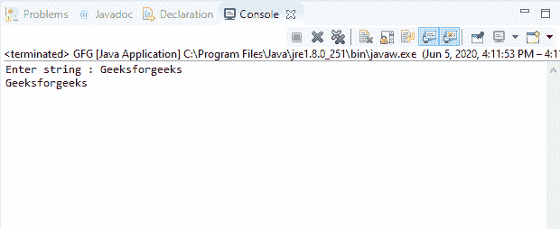
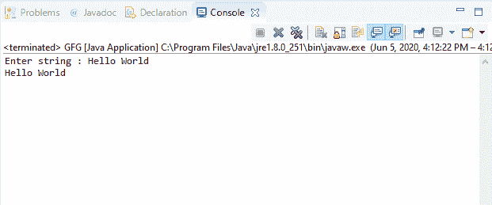

# Java 中的控制台阅读器()方法，带示例

> 原文:[https://www . geesforgeks . org/console-reader-method-in-Java-with-examples/](https://www.geeksforgeeks.org/console-reader-method-in-java-with-examples/)

Java 中**控制台**类的 **reader()** 方法用于检索与控制台关联的唯一 reader 对象。这种 reader()方法通常由复杂的应用程序使用。只需要面向行读取的简单应用程序，通常使用 readLine()方法而不是 reader()方法。

**语法:**

```
public Reader reader()

```

**参数:**此方法不接受任何参数。

**返回值:**此方法返回与控制台关联的**阅读器**。

**异常:**这个方法不抛出任何异常。

**注意:** System.console()在联机 IDE 中返回 null。

下面的程序说明了输入输出包中控制台类的 reader()方法:

**程序 1:**

```
// Java program to illustrate
// Console reader() method

import java.io.*;

public class GFG {
    public static void main(String[] args)
    {
        // Create the console object
        Console cnsl
            = System.console();

        if (cnsl == null) {
            System.out.println(
                "No console available");
            return;
        }

        String str = cnsl.readLine(
            "Enter string : ");

        // Create scanner object
        scan = new Scanner(cnsl.reader());

        while (scan.hasNext()) {
            // Read
            String str = scan.next();

            // Print
            System.out.println(str);
        }
    }
```

**Output:**

**程序 2:**

```
// Java program to illustrate
// Console reader() method

import java.io.*;

public class GFG {
    public static void main(String[] args)
    {
        // Create the console object
        Console cnsl
            = System.console();

        if (cnsl == null) {
            System.out.println(
                "No console available");
            return;
        }

        String str = cnsl.readLine(
            "Enter string : ");

        // Create scanner object
        scan = new Scanner(cnsl.reader());

        while (scan.hasNext()) {
            // Read
            String str = scan.next();

            // Print
            System.out.println(str);
        }
    }
```

**Output:**

**参考文献:**
[https://docs . Oracle . com/javase/10/docs/API/Java/io/console . html # reader()](https://docs.oracle.com/javase/10/docs/api/java/io/Console.html#reader())