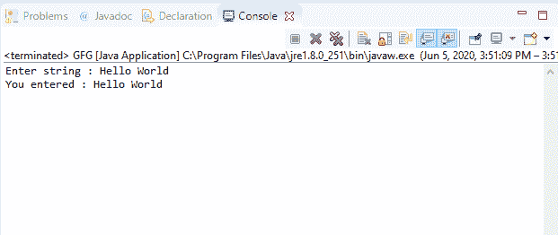

# Java 中的控制台 readLine()方法，带示例

> 原文:[https://www . geesforgeks . org/console-readline-method-in-Java-with-examples/](https://www.geeksforgeeks.org/console-readline-method-in-java-with-examples/)

Java 中**控制台**类的 **readLine()** 方法有两种类型:

1.Java 中**控制台**类的 **readLine()** 方法用于从控制台读取单行文本。

**语法:**

```java
public String readLine()

```

**参数:**此方法不接受任何参数。

**返回值:**该方法返回包含从控制台读取的行的字符串。如果流已经结束，它将返回 null。

**异常:**如果出现输入输出错误，该方法将抛出**错误**。

**注意:** System.console()在联机 IDE 中返回 null。

以下程序说明了 IO 包中控制台类的 readLine()方法:

**程序 1:**

```java
// Java program to illustrate
// Console readLine() method

import java.io.*;

public class GFG {
    public static void main(String[] args)
    {
        // Create the console object
        Console cnsl
            = System.console();

        if (cnsl == null) {
            System.out.println(
                "No console available");
            return;
        }

        // Read line
        String str = cnsl.readLine(
            "Enter string : ");

        // Print
        System.out.println(
            "You entered : " + str);
    }
}
```

**Output:**

**程序 2:**

```java
// Java program to illustrate
// Console readLine() method

import java.io.*;

public class GFG {
    public static void main(String[] args)
    {
        // Create the console object
        Console cnsl
            = System.console();

        if (cnsl == null) {
            System.out.println(
                "No console available");
            return;
        }

        // Read line
        String str = cnsl.readLine(
            "Enter string : ");

        // Print
        System.out.println(
            "You entered : " + str);
    }
}
```

**Output:**

2.Java 中**控制台**类的 **readLine(String，Object)** 方法用于通过提供格式化提示从控制台读取单行文本。

**语法:**

```java
public String readLine(String fmt,
                      Object... args)

```

**参数:**该方法接受两个参数:

*   **fmt**–表示字符串的格式。
*   **参数**–表示字符串格式中格式说明符引用的参数。

**返回值:**该方法返回包含从控制台读取的行的字符串。如果流结束，它将返回 null。

**异常:**

*   **illegalformatException**–如果字符串格式包含非法语法，或者格式说明符与给定参数不兼容，或者给定格式字符串的参数不足，或者其他条件非法，则此方法抛出 **IllegalFormatException** 。
*   **IOError**–如果出现输入/输出错误，该方法将抛出 **IOError** 。

下面的程序说明了输入输出包中控制台类的 readLine(字符串，对象)方法:

**程序 1:**

```java
// Java program to illustrate
// Console readLine(String, Object) method

import java.io.*;

public class GFG {
    public static void main(String[] args)
    {
        // Create the console object
        Console cnsl
            = System.console();

        if (cnsl == null) {
            System.out.println(
                "No console available");
            return;
        }

        String fmt = "%1$4s %2$10s %3$10s%n";

        // Read line
        String str
            = cnsl.readLine(
                fmt, "Enter", "string : ");

        // Print line
        System.out.println(
            "You entered : " + str);
    }
}
```

**Output:**

**程序 2:**

```java
// Java program to illustrate
// Console readLine(String, Object) method

import java.io.*;

public class GFG {
    public static void main(String[] args)
    {
        // Create the console object
        Console cnsl
            = System.console();

        if (cnsl == null) {
            System.out.println(
                "No console available");
            return;
        }

        String fmt = "%1$4s %2$10s %3$10s%n";

        // Read line
        String str
            = cnsl.readLine(
                fmt, "Enter", "string : ");

        // Print line
        System.out.println(
            "You entered : " + str);
    }
}
```

**Output:**

**参考文献:**
1。[https://docs . Oracle . com/javase/10/docs/API/Java/io/console . html # readLine()](https://docs.oracle.com/javase/10/docs/api/java/io/Console.html#readLine())
2。[https://docs . Oracle . com/javase/10/docs/API/Java/io/console . html # readLine(Java . lang . string，java.lang.Object…)](https://docs.oracle.com/javase/10/docs/api/java/io/Console.html#readLine(java.lang.String, java.lang.Object...))