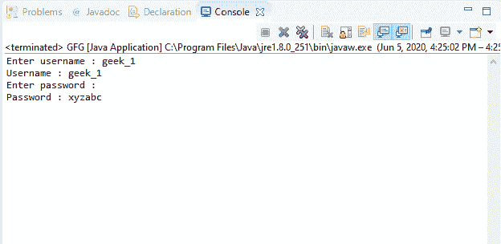
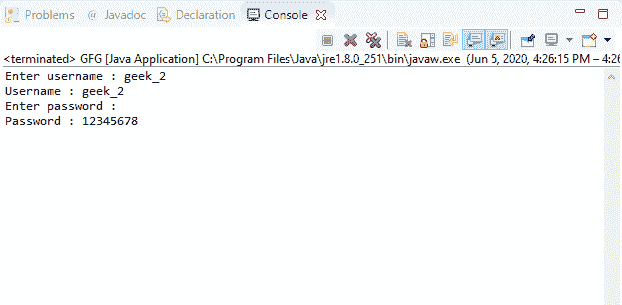
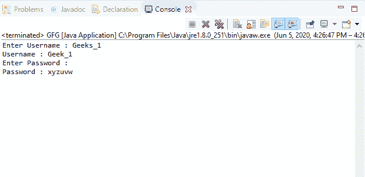

# Java 中的控制台读取密码()方法，示例

> 原文:[https://www . geesforgeks . org/console-read password-in-Java-method-with-examples/](https://www.geeksforgeeks.org/console-readpassword-method-in-java-with-examples/)

Java 中**控制台**类的 **readPassword()** 方法有两种类型:

1.Java 中**控制台**类的 **readPassword()** 方法用于在禁用回显的情况下从控制台读取密码或密码短语。

**语法:**

```java
public char[] readPassword()

```

**参数:**此方法不接受任何参数。

**返回值:**此方法返回一个字符数组，其中包含从控制台读取的密码或密码短语。如果流结束，它将返回 null。

**异常:**如果出现输入输出错误，该方法将抛出**错误**。

**注意:** System.console()在联机 IDE 中返回 null。

以下程序说明了 IO 包中控制台类的 readPassword()方法:

**程序 1:**

```java
// Java program to illustrate
// Console readPassword() method

import java.io.*;

public class GFG {
    public static void main(String[] args)
    {
        // Create the console object
        Console cnsl
            = System.console();

        if (cnsl == null) {
            System.out.println(
                "No console available");
            return;
        }

        // Read line
        String str = cnsl.readLine(
            "Enter username : ");

        // Print username
        System.out.println(
            "Username : " + str);

        // Read password
        // into character array
        char[] ch = cnsl.readPassword(
            "Enter password : ");

        // Print password
        System.out.println(
            "Password : " + ch);
    }
}
```

**Output:**

**程序 2:**

```java
// Java program to illustrate
// Console readPassword() method

import java.io.*;

public class GFG {
    public static void main(String[] args)
    {
        // Create the console object
        Console cnsl
            = System.console();

        if (cnsl == null) {
            System.out.println(
                "No console available");
            return;
        }

        // Read line
        String str = cnsl.readLine(
            "Enter username : ");

        // Print username
        System.out.println(
            "Username : " + str);

        // Read password
        // into character array
        char[] ch = cnsl.readPassword(
            "Enter password : ");

        // Print password
        System.out.println(
            "Password : " + ch);
    }
}
```

**Output:**

2.Java 中**控制台**类的 **readPassword(String，Object)** 方法用于通过提供格式化的提示从控制台读取密码或密码短语。它返回字符数组中的密码。

**语法:**

```java
public char[] readPassword(String fmt,
                      Object... args)

```

**参数:**该方法接受两个参数:

*   **fmt**–表示字符串的格式。
*   **参数**–它表示字符串格式中由格式说明符引用的参数。

**返回值:**该方法返回包含从控制台读取的密码或密码短语的字符数组。如果流结束，它将返回 null。

**异常:**

*   **illegalformatException**–如果字符串格式包含非法语法，或者格式说明符与给定参数不兼容，或者给定格式字符串的参数不足，或者其他条件非法，则此方法抛出 **IllegalFormatException** 。
*   **IOError**–如果出现输入/输出错误，该方法将抛出 **IOError** 。

以下程序说明了输入输出包中控制台类的读取密码(字符串，对象)方法:

**程序 1:**

```java
// Java program to illustrate
// Console readPassword(String, Object) method

import java.io.*;

public class GFG {
    public static void main(String[] args)
    {
        // Create the console object
        Console cnsl
            = System.console();

        if (cnsl == null) {
            System.out.println(
                "No console available");
            return;
        }

        String fmt = "%2$5s %3$10s%n";

        // Read line
        String un = cnsl.readLine(
            fmt, "Enter", "Username : ");

        // Print username
        System.out.println(
            "Username : " + un);

        // Read password
        // into character array
        char[] pwd = cnsl.readPassword(
            fmt, "Enter", "Password : ");

        // Print password
        System.out.println(
            "Password : " + pwd);
    }
}
```

**Output:**

**程序 2:**

```java
// Java program to illustrate
// Console readPassword(String, Object) method

import java.io.*;

public class GFG {
    public static void main(String[] args)
    {
        // Create the console object
        Console cnsl
            = System.console();

        if (cnsl == null) {
            System.out.println(
                "No console available");
            return;
        }

        String fmt = "%2$5s %3$10s%n";

        // Read line
        String un = cnsl.readLine(
            fmt, "Enter", "Username : ");

        // Print username
        System.out.println(
            "Username : " + un);

        // Read password
        // into character array
        char[] pwd = cnsl.readPassword(
            fmt, "Enter", "Password : ");

        // Print password
        System.out.println(
            "Password : " + pwd);
    }
}
```

**Output:**

**参考文献:**
1。[https://docs . Oracle . com/javase/10/docs/API/Java/io/console . html # readPassword()](https://docs.oracle.com/javase/10/docs/api/java/io/Console.html#readPassword())
2。[https://docs . Oracle . com/javase/10/docs/API/Java/io/console . html # read password(Java . lang . string，java.lang.Object…)](https://docs.oracle.com/javase/10/docs/api/java/io/Console.html#readPassword(java.lang.String, java.lang.Object...))