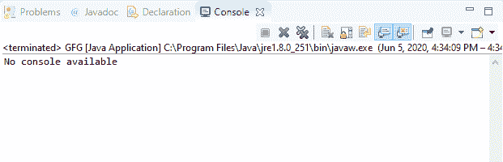

# Java 中控制台编写器()方法，带示例

> 原文:[https://www . geesforgeks . org/console-writer-method-in-Java-with-examples/](https://www.geeksforgeeks.org/console-writer-method-in-java-with-examples/)

Java 中**控制台**类的 **writer()** 方法用于检索与控制台关联的唯一 PrintWriter 对象。

**语法:**

```java
public PrintWriter writer()

```

**参数:**此方法不接受任何参数。

**返回值:**该方法返回与控制台关联的 **PrintWriter** 。

**异常:**这个方法不抛出任何异常。

**注意:** System.console()在联机 IDE 中返回 null。

以下程序说明了 IO 包中控制台类的 writer()方法:

**程序 1:**

```java
// Java program to illustrate
// Console writer() method

import java.io.*;

public class GFG {
    public static void main(String[] args)
    {
        // Create the console object
        Console cnsl
            = System.console();

        if (cnsl == null) {
            System.out.println(
                "No console available");
            return;
        }

        // Create PrintWriter
        PrintWriter pw = cnsl.writer();

        System.out.println(
            "PrintWriter is created and returned");
    }
}
```

**Output:**

**程序 2:**

```java
// Java program to illustrate
// Console writer() method

import java.io.*;

public class GFG {
    public static void main(String[] args)
    {
        // Create the console object
        Console cnsl
            = System.console();

        if (cnsl == null) {
            System.out.println(
                "No console available");
            return;
        }

        // Create PrintWriter
        PrintWriter pw = cnsl.writer();

        System.out.println(
            "PrintWriter is created and returned");
    }
}
```

**Output:**

**参考文献:**
[https://docs . Oracle . com/javase/10/docs/API/Java/io/console . html # writer()](https://docs.oracle.com/javase/10/docs/api/java/io/Console.html#writer())