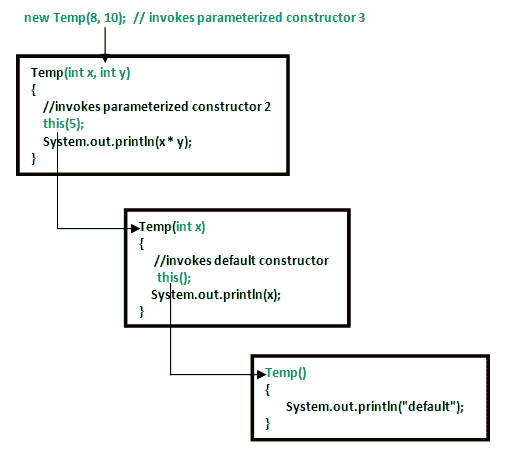

# Java 中的构造函数链接示例

> 原文:[https://www . geesforgeks . org/constructor-chaining-Java-examples/](https://www.geeksforgeeks.org/constructor-chaining-java-examples/)

先决条件–[Java 中的构造函数](https://www.geeksforgeeks.org/constructor-in-java/)
构造函数链接是从另一个构造函数调用当前对象的一个构造函数的过程。
构造函数链接有两种方式:

*   **同类**内:同类构造函数可以使用 **this()** 关键字完成
*   **从基类:**通过使用 **super()** 关键字从基类调用构造函数。

构造函数链接通过**继承**发生。子类构造函数的任务是首先调用超类的构造函数。这确保了子类对象的创建从超类数据成员的初始化开始。继承链中可以有任意数量的类。每个构造函数都会调用这个链，直到到达顶部的类。
**为什么我们需要构造函数链接？**
当我们想要在单个构造函数中执行多个任务时，使用这个过程，而不是在单个构造函数中为每个任务创建一个代码，我们为每个任务创建一个单独的构造函数，并使它们的链更具可读性。

**使用此()关键字在同一类中链接构造函数:**



## Java 语言(一种计算机语言，尤用于创建网站)

```
// Java program to illustrate Constructor Chaining
// within same class Using this() keyword
class Temp
{
    // default constructor 1
    // default constructor will call another constructor
    // using this keyword from same class
    Temp()
    {
        // calls constructor 2
        this(5);
        System.out.println("The Default constructor");
    }

    // parameterized constructor 2
    Temp(int x)
    {
        // calls constructor 3
        this(5, 15);
        System.out.println(x);
    }

    // parameterized constructor 3
    Temp(int x, int y)
    {
        System.out.println(x * y);
    }

    public static void main(String args[])
    {
        // invokes default constructor first
        new Temp();
    }
}
```

**输出:**

```
75
5
The Default constructor
```

**构造函数链接规则:**

1.  **this()** 表达式应该始终是构造函数的第一行。
2.  应该至少有一个不带 this()关键字的构造函数(上面示例中的构造函数 3)。
3.  构造函数链接可以以任何顺序实现。

**如果我们改变构造函数的顺序会发生什么？**
没什么，构造函数链接可以任何顺序实现

## Java 语言(一种计算机语言，尤用于创建网站)

```
// Java program to illustrate Constructor Chaining
// within same class Using this() keyword
// and changing order of constructors
class Temp
{
    // default constructor 1
    Temp()
    {
        System.out.println("default");
    }

    // parameterized constructor 2
    Temp(int x)
    {
        // invokes default constructor
        this();
        System.out.println(x);
    }

    // parameterized constructor 3
    Temp(int x, int y)
    {
        // invokes parameterized constructor 2
        this(5);
        System.out.println(x * y);
    }

    public static void main(String args[])
    {
        // invokes parameterized constructor 3
        new Temp(8, 10);
    }
}
```

**输出:**

```
default
5
80
```

注意:在示例 1 中，默认构造函数在最后被调用，但是在示例 2 中，默认构造函数首先被调用。因此，构造函数链接的顺序并不重要。

**构造函数使用 super()关键字链接到其他类:**

## Java 语言(一种计算机语言，尤用于创建网站)

```
// Java program to illustrate Constructor Chaining to
// other class using super() keyword
class Base
{
    String name;

    // constructor 1
    Base()
    {
        this("");
        System.out.println("No-argument constructor of" +
                                           " base class");
    }

    // constructor 2
    Base(String name)
    {
        this.name = name;
        System.out.println("Calling parameterized constructor"
                                              + " of base");
    }
}

class Derived extends Base
{
    // constructor 3
    Derived()
    {
        System.out.println("No-argument constructor " +
                           "of derived");
    }

    // parameterized constructor 4
    Derived(String name)
    {
        // invokes base class constructor 2
        super(name);
        System.out.println("Calling parameterized " +
                           "constructor of derived");
    }

    public static void main(String args[])
    {
        // calls parameterized constructor 4
        Derived obj = new Derived("test");

        // Calls No-argument constructor
        // Derived obj = new Derived();
    }
}
```

**输出:**

```
Calling parameterized constructor of base
Calling parameterized constructor of derived
```

注意:类似于同一个类中的构造函数链接， **super()** 应该是构造函数的第一行，因为 super 类的构造函数在子类的构造函数之前被调用。
**替代方法:使用 Init 块** :
当我们希望某些公共资源被每个构造函数执行时，我们可以将代码放在 [**init 块**](https://www.geeksforgeeks.org/g-fact-26-the-initializer-block-in-java/) 中。每当构造函数用于创建新对象时，Init 块总是在任何构造函数之前执行。
实施例 1:

## Java 语言(一种计算机语言，尤用于创建网站)

```
class Temp
{
    // block to be executed before any constructor.
    {
        System.out.println("init block");
    }

    // no-arg constructor
    Temp()
    {
        System.out.println("default");
    }

    // constructor with one argument.
    Temp(int x)
    {
        System.out.println(x);
    }

    public static void main(String[] args)
    {
        // Object creation by calling no-argument
        // constructor.
        new Temp();

        // Object creation by calling parameterized
        // constructor with one parameter.
        new Temp(10);
    }
}
```

**输出:**

```
init block
default
init block
10
```

注意:如果有多个块，它们将按照在同一类中定义的顺序执行。见前任。
示例:

## Java 语言(一种计算机语言，尤用于创建网站)

```
class Temp
{
    // block to be executed first
    {
        System.out.println("init");
    }
    Temp()
    {
        System.out.println("default");
    }
    Temp(int x)
    {
        System.out.println(x);
    }

    // block to be executed after the first block
    // which has been defined above.
    {
        System.out.println("second");
    }
    public static void main(String args[])
    {
        new Temp();
        new Temp(10);
    }
}
```

**输出:**

```
init
second
default
init
second
10
```

本文由**阿朴瓦·辛格**供稿。如果你喜欢 GeeksforGeeks 并想投稿，你也可以使用[write.geeksforgeeks.org](https://write.geeksforgeeks.org)写一篇文章或者把你的文章邮寄到 review-team@geeksforgeeks.org。看到你的文章出现在极客博客主页上，帮助其他极客。
如果你发现任何不正确的地方，或者你想分享更多关于上面讨论的话题的信息，请写评论。