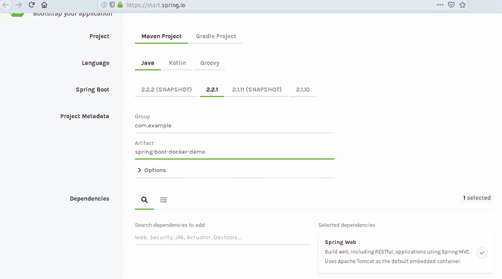
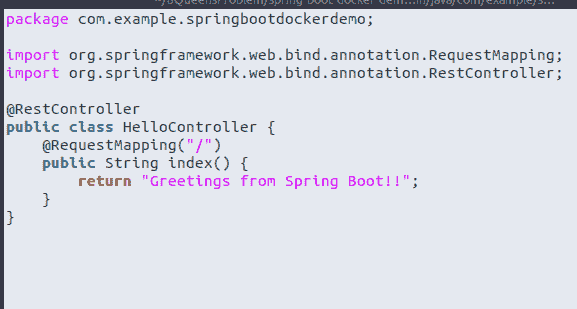
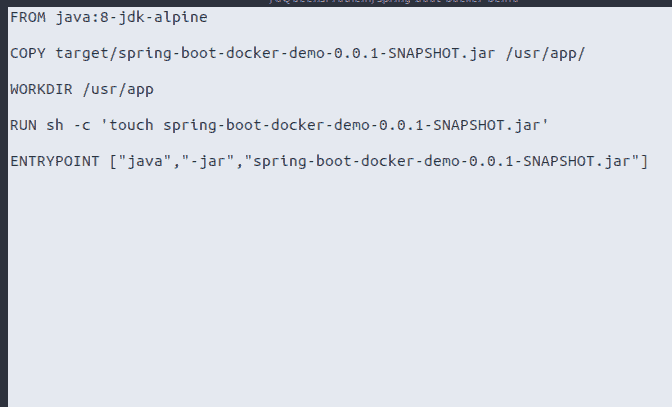
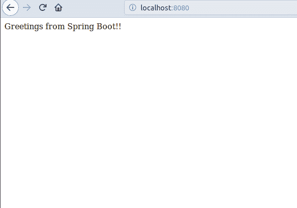

# 容器化 Java 应用程序|使用 Dockerfile 创建 Spring Boot 应用程序

> 原文:[https://www . geesforgeks . org/containing-Java-applications-creating-a-spring-boot-app-using-docker file/](https://www.geeksforgeeks.org/containerizing-java-applications-creating-a-spring-boot-app-using-dockerfile/)

本文的目标是通过使用 [Dockerfile](https://www.geeksforgeeks.org/containerization-using-docker/) 创建一个 [Spring Boot 应用程序](https://www.geeksforgeeks.org/introduction-to-spring-boot/)，轻松地将一个 Java 应用程序容器化。

步骤如下

1.  设置春季开机应用程序
2.  创建 dockerfile
3.  构建项目 jar
4.  使用 dockerfile 构建 docker 映像
5.  运行图像

让我们详细检查一下上面的步骤:

1.  **Setting up spring-boot app:** So first of all, use [spring initializer](https://start.spring.io/) to have a very basic spring-boot greetings project with the help of a web dependency.

    [](https://media.geeksforgeeks.org/wp-content/uploads/20191113144456/Setting-up-spring-boot-app.png)

    该项目包括一个简单的休息控制器和一个简单的问候信息。

    [](https://media.geeksforgeeks.org/wp-content/uploads/20191113144454/simple-rest-controller-with-a-simple-greeting-message.png)

    要运行此应用程序，请使用命令:

    ```
    mvn spring-boot:run
    ```

2.  **Creating A Dockerfile**: A dockerfile is a text document which contains commands read by docker and is executed in order to build a container image.

    [](https://media.geeksforgeeks.org/wp-content/uploads/20191113144452/Dockerfile1.png)

    *   **FROM** :关键字 FROM 告诉 Docker 使用给定的基础图像作为构建基础。在这种情况下，Java8 被用作基础图像，而 **jdk-alpine** 被用作标签。标签可以被认为是一个版本。
    *   **复制**:复制**。jar 文件**到 **/usr/app** 内的构建映像。
    *   **工作目录**:**工作目录**指令为 Dockerfile 中的任何 **RUN** 、 **CMD** 、 **ENTRYPOINT** 、 **COPY** 和 **ADD** 指令设置工作目录。这里工作目录切换到 **/usr/app**
    *   **运行**:**运行**指令运行任何提到的命令。
    *   **ENTRYPOINT** :告诉 Docker 如何运行应用程序。制作数组作为 **java -jar 运行春季开机应用程序。罐子**。
3.  **建造工程罐**:现在运行 **mvn 安装**建造一个**。目标目录中的 jar 文件**。
4.  **Building Docker Image**: Execute command **docker build -t spring-boot-docker-demo .**

    [](https://media.geeksforgeeks.org/wp-content/uploads/20191113144451/Building-Docker-Image.png)

5.  **Run the image build**: Execute command **docker run spring-boot-docker-demo**

    [](https://media.geeksforgeeks.org/wp-content/uploads/20191113144449/Output98.png)

**Github 存储库:** [Spring Boot Docker 演示](https://github.com/theexplorist/Spring-Boot-Docker-Demo)