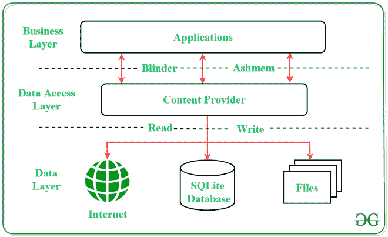
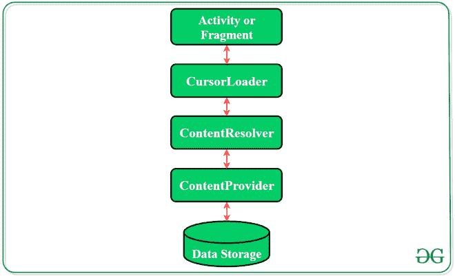

# 安卓中的内容提供商示例

> 原文:[https://www . geeksforgeeks . org/安卓内容提供商示例/](https://www.geeksforgeeks.org/content-providers-in-android-with-example/)

在[安卓](https://www.geeksforgeeks.org/introduction-to-android-development/)中，内容提供商是一个非常重要的[组件](https://www.geeksforgeeks.org/components-android-application/)，它服务于关系数据库的目的，存储应用程序的数据。内容提供商在安卓系统中的角色就像一个存储应用程序数据的中央存储库，它便于其他应用程序根据用户需求安全地访问和修改数据。安卓系统允许内容提供商以多种方式存储应用数据。用户可以将图像、音频、视频和个人联系信息等应用数据存储在 [**SQLite 数据库**](https://www.geeksforgeeks.org/introduction-to-sqlite/) **中，存储在文件****中，甚至存储在网络**中。为了共享数据，内容提供商拥有某些权限，用于授予或限制其他应用程序干预数据的权限。



### **内容 URI**

**内容 URI(统一资源标识符)**是内容提供商的关键概念。为了访问来自内容提供商的数据，URI 被用作查询字符串。

> **内容 URI 的结构:**内容://权限/选项路径/选项有效

**内容 URI 不同部分详情:**

*   **内容://–**URI 的强制部分，因为它表示给定的 URI 是内容 URI。
*   **权限–**表示内容提供商的名称，如联系人、浏览器等。对于每个内容提供商，这一部分必须是唯一的。
*   **选项路径–**指定内容提供商提供的数据类型。这一部分非常重要，因为它有助于内容提供商支持不同类型的数据，这些数据彼此不相关，如音频和视频文件。
*   **选项有效–**这是一个数值，在需要访问特定记录时使用。

**如果在 URI 提到一个 id，那么它是基于 ID 的 URI，否则是基于目录的 URI。**

### **内容提供商的运营**

内容提供商中有四个基本操作，即**创建**、**读取**、**更新**和**删除**。这些操作通常被称为 **CRUD 操作**。

*   **创建:**在内容提供商中创建数据的操作。
*   **Read:** 用于从内容提供商处获取数据。
*   **更新:**修改已有数据。
*   **删除:**从存储中删除现有数据。

### **内容提供商的工作**

像 [Activity](https://www.geeksforgeeks.org/activity-lifecycle-in-android-with-demo-app/) 和 [Fragments](https://www.geeksforgeeks.org/introduction-fragments-android/) 这样的安卓应用的 UI 组件使用一个对象 **CursorLoader** 向 **ContentResolver 发送查询请求。**content resolver 对象作为客户端向 **ContentProvider** 发送请求(如创建、读取、更新和删除)。收到请求后，ContentProvider 会对其进行处理并返回所需的结果。下面是一个图表，以图形的形式表示这些过程。



### **创建内容提供商**

以下是创建内容提供商必须遵循的步骤:

*   在 **MainActivity** 文件所在的目录中创建一个类，该类必须扩展 ContentProvider 基类。
*   要访问内容，请定义内容提供商 URI 地址。
*   创建一个数据库来存储应用程序数据。
*   实现 ContentProvider 类的**六个抽象方法**。
*   使用 **<提供者>标签**在 **AndroidManifest.xml** 文件中注册内容提供者。

**以下是作为 ContenProvider 类的一部分必须覆盖的六种抽象方法及其描述:**

<figure class="table">

| 

抽象方法

 | 

描述

 |
| --- | --- |
| query | 一种接受参数并从所需表中获取数据的方法。数据作为游标对象退出。 |
| insert | 在内容提供者的数据库中插入新的一行。返回插入行的内容 URI。 |
| update | 此方法用于更新现有行的字段。返回更新的行数。 |
| delete | 此方法用于删除现有行。返回删除的行数。 |
| getType() | 此方法将多用途互联网邮件扩展(MIME)

类型的数据返回给给定的 Content URI。 |
| onCreate() | 随着内容提供商的创建，安卓系统调用这个方法立即对提供商进行初始化。 |

</figure>

### 例子

内容提供商的主要目的是充当数据的中央存储库，用户可以在其中存储和获取数据。为了满足用户的不同需求，其他应用程序也可以安全地访问这个存储库。以下是实现内容提供者所涉及的步骤。在该内容提供商中，用户可以存储人名，并可以获取存储的数据。此外，另一个应用程序也可以访问存储的数据并显示数据。

> **注意:**在 Android Studio 版本上执行以下步骤

**创建内容提供商:**

**第一步:创建新项目**

1.  单击文件，然后单击新建= >新建项目。
2.  选择语言为 Java/Kotlin。
3.  选择空活动作为模板
4.  根据您的需要选择最小的软件开发工具包。

**第二步:修改 strings.xml 文件**

活动中使用的所有字符串都存储在这里。

## 可扩展标记语言

```java
<resources>
    <string name="app_name">Content_Provider_In_Android</string>
    <string name="hintText">Enter User Name</string>
    <string name="heading">Content Provider In Android</string>
    <string name="insertButtontext">Insert Data</string>
    <string name="loadButtonText">Load Data</string>
</resources>
```