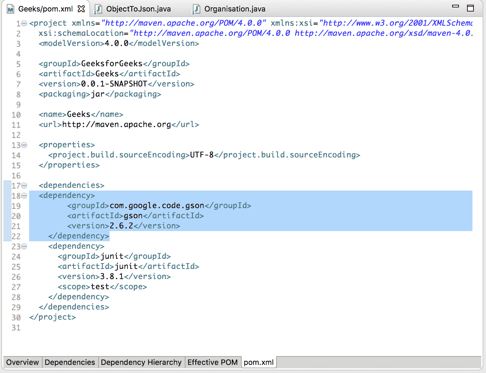
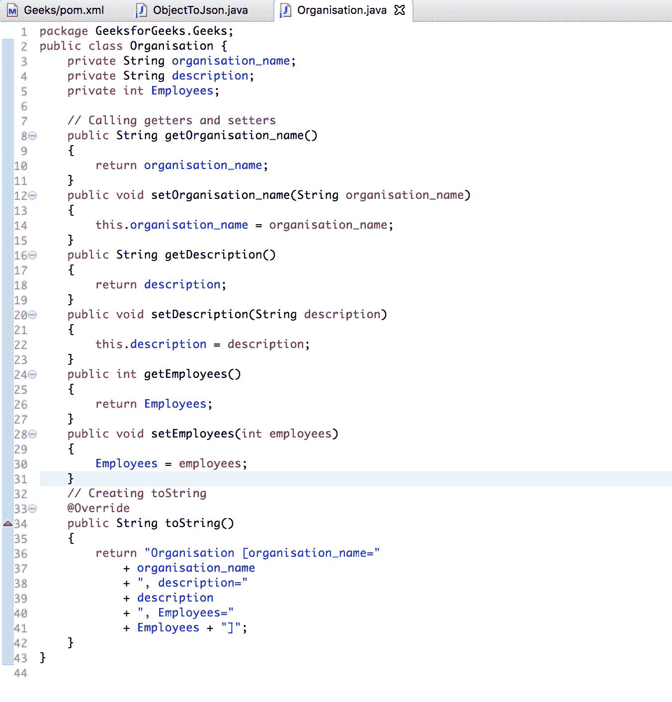
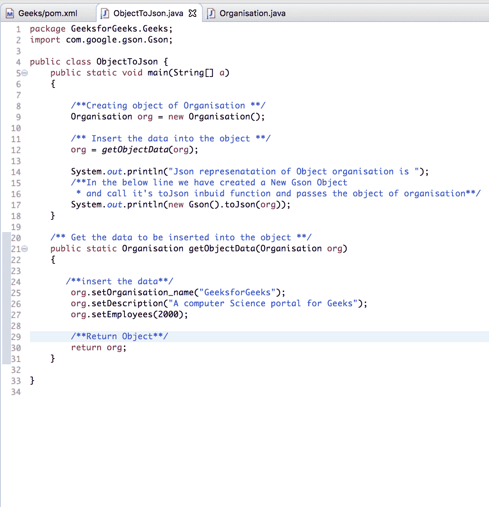

# 使用 GSON

将 Java 对象转换为 Json 字符串

> 原文:[https://www . geesforgeks . org/convert-Java-object-to-JSON-string-using-gson/](https://www.geeksforgeeks.org/convert-java-object-to-json-string-using-gson/)

[JSON](https://www.geeksforgeeks.org/tag/json/) 代表 **JavaScript 对象符号**。这是一种标准的基于文本的格式，显示基于 JavaScript 对象语法的结构化数据。它通常用于在 web 应用程序中传输数据。强烈建议在服务器和 web 应用程序之间传输数据。

要将 Java 对象转换为 JSON，可以使用以下方法:

*   **GSON:** 是一个开源的 Java 库，用于将 Java 对象序列化和反序列化为 JSON。
*   [杰克逊原料药](https://www.geeksforgeeks.org/convert-java-object-to-json-string-using-jackson-api/)

在本文中，使用 GSON 将 Java 对象转换为 JSON:

**进行此操作的步骤如下:**

1.  **Add jar files of Jackson (in case of Maven project add Gson dependencies in the pom.xml file)**

    ```java
    <dependency>
           <groupId>com.google.code.gson</groupId>
           <artifactId>gson</artifactId>
           <version>2.6.2</version>
       </dependency>
    ```

    下面是显示该步骤的截图:-
    

2.  **Create a POJO (Plain Old Java Object) to be converted into JSON**

    ```java
    package GeeksforGeeks.Geeks;

    public class Organisation {
        private String organisation_name;
        private String description;
        private int Employees;

        // Calling getters and setters
        public String getOrganisation_name()
        {
            return organisation_name;
        }

        public void setOrganisation_name(String organisation_name)
        {
            this.organisation_name = organisation_name;
        }

        public String getDescription()
        {
            return description;
        }

        public void setDescription(String description)
        {
            this.description = description;
        }

        public int getEmployees()
        {
            return Employees;
        }

        public void setEmployees(int employees)
        {
            Employees = employees;
        }

        // Creating toString
        @Override
        public String toString()
        {
            return "Organisation [organisation_name="
                + organisation_name
                + ", description="
                + description
                + ", Employees="
                + Employees + "]";
        }
    }
    ```

    下面是显示该步骤的截图:-
    

3.  **Create a Java class for converting the Organisation object into JSON.**

    ```java
    package GeeksforGeeks.Geeks;

    import com.google.gson.Gson;

    public class ObjectToJson {
        public static void main(String[] a)
        {

            /**Creating object of Organisation **/
            Organisation org = new Organisation();

            /** Insert the data into the object **/
            org = getObjectData(org);

            System.out.println("Json represenatation"
                               + " of Object organisation is ");
            // In the below line
            // we have created a New Gson Object
            // and call it's toJson inbuid function
            // and passes the object of organisation
            System.out.println(new Gson().toJson(org));
        }

        /** Get the data to be inserted into the object **/
        public static Organisation getObjectData(Organisation org)
        {

            /**insert the data**/
            org.setOrganisation_name("GeeksforGeeks");
            org.setDescription("A computer Science portal for Geeks");
            org.setEmployees(2000);

            /**Return Object**/
            return org;
        }
    }
    ```

    下面是显示该步骤的截图:-
    

4.  **执行流程**
5.  **输出 Json**

    ```java
    Output
    {
      "organisation_name" : "GeeksforGeeks",
      "description" : "A computer Science portal for Geeks",
      "Employee" : "2000"
    }
    ```

下面是显示控制台输出的截图:
[](https://media.geeksforgeeks.org/wp-content/uploads/Screen-Shot-2018-12-05-at-1.55.28-PM.png)