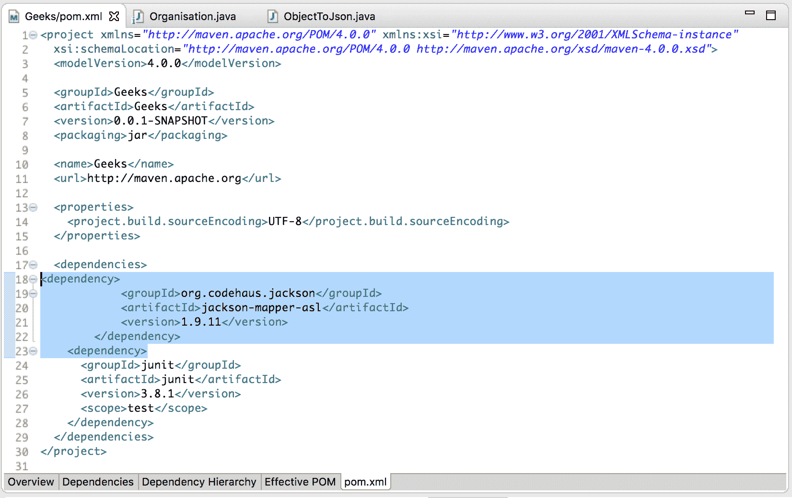
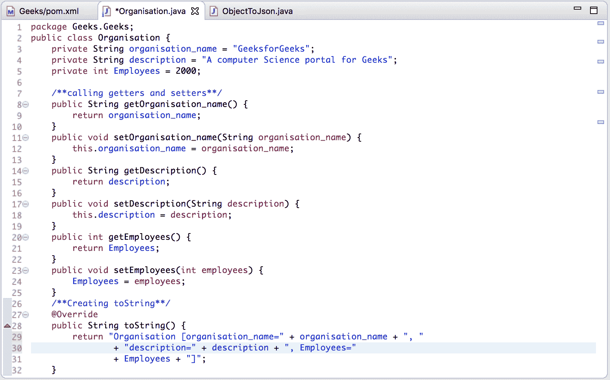
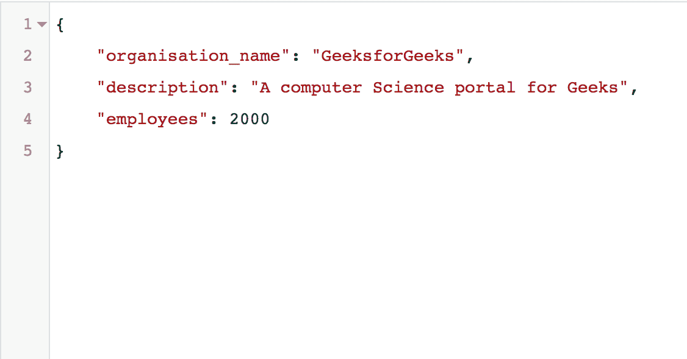

# 使用 Jackson API 将 Java 对象转换为 Json 字符串

> 原文:[https://www . geesforgeks . org/convert-Java-object-to-JSON-string-using-Jackson-API/](https://www.geeksforgeeks.org/convert-java-object-to-json-string-using-jackson-api/)

[JSON](https://www.geeksforgeeks.org/tag/json/) 代表 **JavaScript 对象符号**。这是一种标准的基于文本的格式，显示基于 JavaScript 对象语法的结构化数据。它通常用于在 web 应用程序中传输数据。强烈建议在服务器和 web 应用程序之间传输数据。
要将一个 Java 对象转换成 JSON，可以使用以下方法:

*   GSON 先生
*   杰克逊原料药

在本文中，使用 Jackson API 将 Java 对象转换为 JSON:
**这样做的步骤如下:**

*   **添加 Jackson 的 jar 文件(在 Maven 项目的情况下，在 pom.xml 文件中添加 Jackson 依赖项)**

## 超文本标记语言

```
<dependency>
        <groupId>com.fasterxml.jackson.core</groupId>
        <artifactId>jackson-databind</artifactId>
        <version>2.5.3</version>
</dependency>
```

*   下面是显示该步骤的截图:



*   **创建一个 POJO(普通旧 Java 对象)转换成 JSON**
    **Java 类**

## Java 语言(一种计算机语言，尤用于创建网站)

```
package com.Geeks;

public class Organisation {
    private String organisation_name;
    private String description;
    private int Employees;

    // Calling getters and setters
    public String getOrganisation_name()
    {
        return organisation_name;
    }

    public void setOrganisation_name(String organisation_name)
    {
        this.organisation_name = organisation_name;
    }

    public String getDescription()
    {
        return description;
    }

    public void setDescription(String description)
    {
        this.description = description;
    }

    public int getEmployees()
    {
        return Employees;
    }

    public void setEmployees(int employees)
    {
        Employees = employees;
    }

    // Creating toString
    @Override
    public String toString()
    {
        return "Organisation [organisation_name="
            + organisation_name
            + ", description="
            + description
            + ", Employees="
            + Employees + "]";
    }
}
```

*   下面是显示该步骤的截图:



*   **创建一个 Java 类，用于将 Organisation 对象转换为 JSON。**使用 Jackson API 的 ObjectMapper 类将对象转换为 JSON。

## Java 语言(一种计算机语言，尤用于创建网站)

```
package com.Geeks;

import java.io.IOException;
import org.codehaus.jackson.map.ObjectMapper;
import com.Geeks.Organisation;

public class ObjectToJson {
    public static void main(String[] a)
    {

        // Creating object of Organisation
        Organisation org = new Organisation();

        // Insert the data into the object
        org = getObjectData(org);

        // Creating Object of ObjectMapper define in Jakson Api
        ObjectMapper Obj = new ObjectMapper();

        try {

            // get Oraganisation object as a json string
            String jsonStr = Obj.writeValueAsString(org);

            // Displaying JSON String
            System.out.println(jsonStr);
        }

        catch (IOException e) {
            e.printStackTrace();
        }
    }

    // Get the data to be inserted into the object
    public static Organisation getObjectData(Organisation org)
    {

        // Insert the data
        org.setName("GeeksforGeeks");
        org.setDescription("A computer Science portal for Geeks");
        org.setEmployees(2000);

        // Return the object
        return org;
    }
```

*   **执行流程。**
*   **JSON 中的输出如下:**

```
Output
{
  "organisation_name" : "GeeksforGeeks",
  "description" : "A computer Science portal for Geeks",
  "Employee" : "2000"
}

```

*   下面是显示该输出的截图:

